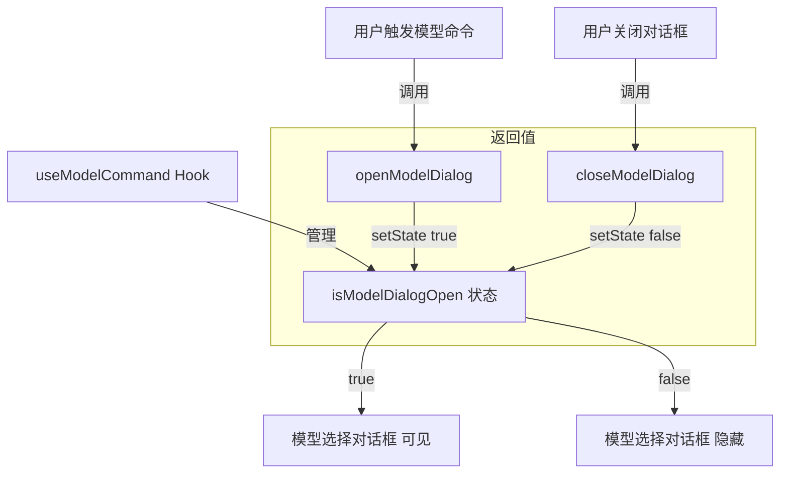

# useModelCommand.ts

## 概述

`useModelCommand` 是一个 React 自定义 Hook，用于管理模型选择对话框的打开/关闭状态。它提供了一个简洁的布尔状态 (`isModelDialogOpen`) 以及对应的打开 (`openModelDialog`) 和关闭 (`closeModelDialog`) 操作方法。

该 Hook 是一个典型的 UI 状态管理 Hook，职责单一：仅控制模型选择对话框的可见性。当用户在 CLI 中执行切换模型的命令（如 `/model`）时，上层组件会调用 `openModelDialog` 打开对话框；用户选择完成或取消后，调用 `closeModelDialog` 关闭对话框。

## 架构图（Mermaid）

## 核心组件

### `useModelCommand()` 函数签名

该 Hook 不接受任何参数。

### `UseModelCommandReturn` 接口（返回值）

| 字段 | 类型 | 说明 |
|------|------|------|
| `isModelDialogOpen` | `boolean` | 模型选择对话框是否处于打开状态 |
| `openModelDialog` | `() => void` | 打开模型选择对话框的函数 |
| `closeModelDialog` | `() => void` | 关闭模型选择对话框的函数 |

### 内部状态

| 状态名 | 类型 | 初始值 | 说明 |
|--------|------|--------|------|
| `isModelDialogOpen` | `boolean` | `false` | 对话框默认关闭 |

### 方法详解

#### `openModelDialog()`

- 使用 `useCallback` 包裹，依赖数组为空 `[]`，引用永远稳定
- 调用 `setIsModelDialogOpen(true)` 将状态设为打开

#### `closeModelDialog()`

- 使用 `useCallback` 包裹，依赖数组为空 `[]`，引用永远稳定
- 调用 `setIsModelDialogOpen(false)` 将状态设为关闭

## 依赖关系

### 内部依赖

无内部依赖。该 Hook 不引用项目中的任何其他模块。

### 外部依赖

| 依赖包 | 导入项 | 用途 |
|--------|--------|------|
| `react` | `useState` | 管理 `isModelDialogOpen` 布尔状态 |
| `react` | `useCallback` | 稳定化 `openModelDialog` 和 `closeModelDialog` 的函数引用 |

## 关键实现细节

1. **极简设计**：整个 Hook 仅包含一个布尔状态和两个操作函数，是一个经典的「开关模式」（Toggle Pattern）实现。这种设计使得模型对话框的状态管理与对话框的具体 UI 实现完全解耦。

2. **`useCallback` 稳定引用**：`openModelDialog` 和 `closeModelDialog` 都通过 `useCallback` 包裹且依赖数组为空 `[]`，确保在组件的整个生命周期中这两个函数的引用保持不变。这对于将它们作为 props 传递给子组件时避免不必要的重渲染尤为重要。

3. **无副作用**：该 Hook 不包含任何 `useEffect`，不涉及事件订阅、定时器或外部系统交互。它是一个纯粹的状态容器，所有状态变更都由外部显式调用触发。

4. **默认关闭**：`useState(false)` 确保对话框在初始渲染时处于关闭状态，这符合用户预期 -- 只有在明确执行模型切换命令后才应显示对话框。

5. **类型导出策略**：`UseModelCommandReturn` 接口虽然定义了，但没有使用 `export` 关键字导出（仅作为函数返回类型使用）。这表明该类型仅为内部类型契约，外部消费者通过 TypeScript 的类型推断即可获取正确的类型信息。
