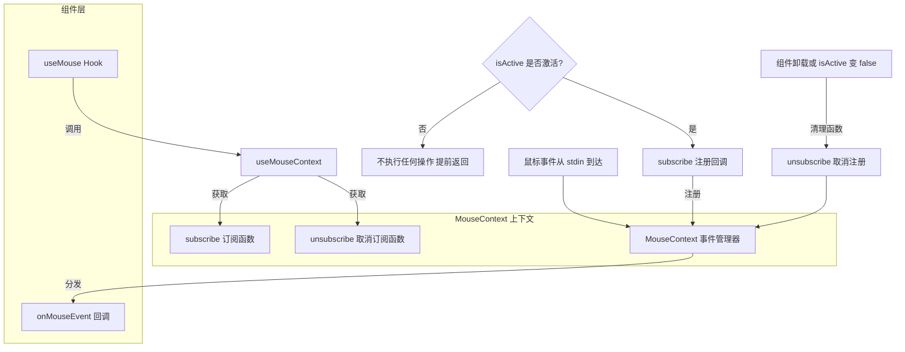

# useMouse.ts

## 概述

`useMouse` 是一个 React 自定义 Hook，用于监听来自标准输入（stdin）的鼠标事件。它通过 `MouseContext` 上下文提供的订阅/取消订阅机制，将鼠标事件回调注册到全局鼠标事件管理器中。该 Hook 支持通过 `isActive` 选项动态控制是否监听鼠标事件。

在终端 CLI 应用中，鼠标事件通常用于实现滚动、点击选择等交互功能。该 Hook 提供了一种声明式的方式让 React 组件订阅鼠标事件，同时确保在组件卸载或变为非活跃状态时自动清理订阅。

## 架构图（Mermaid）



## 核心组件

### `useMouse(onMouseEvent, options)` 函数签名

| 参数 | 类型 | 说明 |
|------|------|------|
| `onMouseEvent` | `MouseHandler` | 鼠标事件回调函数，每次鼠标事件触发时被调用 |
| `options` | `{ isActive: boolean }` | 控制选项对象 |
| `options.isActive` | `boolean` | 是否激活监听。为 `false` 时不订阅任何事件 |

### 类型导出

该模块重新导出了 `MouseEvent` 类型：

```typescript
export type { MouseEvent };
```

这使得消费该 Hook 的模块可以直接从此文件导入 `MouseEvent` 类型，而无需了解其底层来源（`MouseContext.js`）。

### 运行流程

1. 通过 `useMouseContext()` 从 React Context 中获取 `subscribe` 和 `unsubscribe` 方法
2. 在 `useEffect` 中根据 `isActive` 决定是否订阅：
   - `isActive === false`：直接返回，不订阅任何事件，也不设置清理函数
   - `isActive === true`：调用 `subscribe(onMouseEvent)` 注册回调
3. 清理函数中调用 `unsubscribe(onMouseEvent)` 移除注册

## 依赖关系

### 内部依赖

| 依赖模块 | 导入项 | 用途 |
|----------|--------|------|
| `../contexts/MouseContext.js` | `useMouseContext` | 获取 MouseContext 上下文中的 `subscribe` 和 `unsubscribe` 方法 |
| `../contexts/MouseContext.js` | `MouseHandler`（类型） | 鼠标事件回调函数的类型定义 |
| `../contexts/MouseContext.js` | `MouseEvent`（类型） | 鼠标事件对象的类型定义，被重新导出 |

### 外部依赖

| 依赖包 | 导入项 | 用途 |
|--------|--------|------|
| `react` | `useEffect` | 管理订阅/取消订阅的生命周期 |

## 关键实现细节

1. **条件订阅（isActive 门控）**：`useEffect` 内部首先检查 `isActive`，如果为 `false` 则直接 `return` 而不执行任何订阅操作。由于此时没有返回清理函数，React 不会在下次 effect 执行前调用任何清理逻辑。这种模式实现了"按需监听"——组件可以根据自身状态（如是否获得焦点、是否处于特定 UI 模式）动态开启或关闭鼠标事件监听。

2. **发布-订阅模式**：该 Hook 是发布-订阅模式的消费者端。`MouseContext` 维护了一个全局的鼠标事件订阅者列表，`subscribe` 和 `unsubscribe` 负责管理该列表。当 stdin 收到鼠标事件时，所有已注册的 `MouseHandler` 回调都会被依次调用。

3. **类型重导出**：`export type { MouseEvent }` 从 `MouseContext.js` 重新导出 `MouseEvent` 类型。这是一种常见的"门面模式"（Facade Pattern）用法，使得 Hook 的消费者可以从同一个导入路径获取 Hook 函数和相关类型，而不需要直接依赖底层的 Context 模块。

4. **`useEffect` 依赖数组的完整性**：依赖数组 `[isActive, onMouseEvent, subscribe, unsubscribe]` 包含了所有在 effect 中使用的外部值，符合 React 的 `exhaustive-deps` 规则。这意味着：
   - 当 `isActive` 从 `false` 变为 `true` 时，effect 重新执行，开始订阅
   - 当 `isActive` 从 `true` 变为 `false` 时，先执行上一次的清理（`unsubscribe`），然后重新执行 effect，但由于 `isActive` 为 `false` 直接返回
   - 当 `onMouseEvent` 引用变化时，先取消旧回调的订阅，再注册新回调

5. **回调引用稳定性要求**：由于 `onMouseEvent` 被列入 `useEffect` 的依赖数组，调用方需要注意确保回调函数引用的稳定性（通常使用 `useCallback` 包裹）。如果每次渲染都传入新的函数引用，会导致频繁的取消订阅和重新订阅。

6. **终端鼠标事件的特殊性**：在终端环境中，鼠标事件是通过特定的转义序列（如 xterm 的 SGR 模式）从 stdin 读取的。这与浏览器的 DOM 鼠标事件完全不同——终端鼠标事件需要显式启用鼠标报告模式，且事件数据以字节流形式到达。`MouseContext` 负责解析这些底层数据并封装为 `MouseEvent` 对象，而 `useMouse` Hook 屏蔽了这些底层细节，提供了与浏览器事件处理类似的声明式 API。
