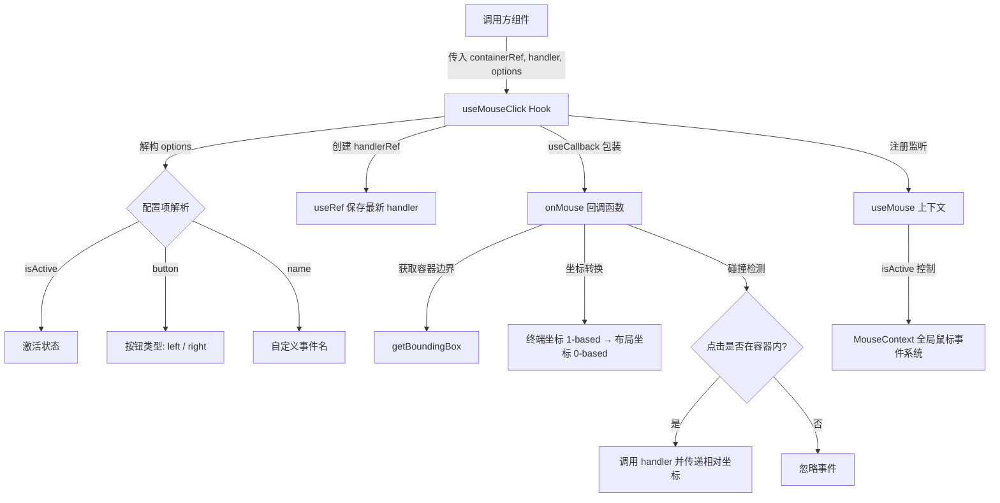

# useMouseClick.ts

## 概述

`useMouseClick` 是一个自定义 React Hook，用于在终端 UI（基于 Ink 框架）中检测鼠标点击事件。它将鼠标事件与指定的 DOM 容器元素绑定，仅当鼠标点击发生在容器的边界范围内时才触发回调函数，并向回调传递相对于容器左上角的坐标。

该 Hook 封装了终端鼠标坐标系（1-based）到 Ink 布局坐标系（0-based）的转换逻辑，以及边界碰撞检测，使上层组件只需关注业务逻辑。

## 架构图（Mermaid）



## 核心组件

### 函数签名

```typescript
export const useMouseClick = (
  containerRef: React.RefObject<DOMElement | null>,
  handler: (event: MouseEvent, relativeX: number, relativeY: number) => void,
  options: {
    isActive?: boolean;
    button?: 'left' | 'right';
    name?: MouseEventName;
  } = {},
) => { ... }
```

### 参数说明

| 参数 | 类型 | 默认值 | 说明 |
|------|------|--------|------|
| `containerRef` | `React.RefObject<DOMElement \| null>` | 必填 | 目标容器的 Ink DOM 元素引用，用于获取边界框 |
| `handler` | `(event: MouseEvent, relativeX: number, relativeY: number) => void` | 必填 | 点击回调，接收原始鼠标事件和相对于容器左上角的 x/y 坐标 |
| `options.isActive` | `boolean` | `true` | 是否激活鼠标监听 |
| `options.button` | `'left' \| 'right'` | `'left'` | 监听的按钮类型 |
| `options.name` | `MouseEventName` | 自动推断 | 自定义鼠标事件名称，若未提供则根据 `button` 推断：左键为 `'left-press'`，右键为 `'right-release'` |

### 核心逻辑：onMouse 回调

`onMouse` 是通过 `useCallback` 创建的记忆化回调，其执行流程如下：

1. **事件名匹配**：根据 `name` 或 `button` 确定目标事件名（`eventName`），只处理匹配的事件
2. **获取边界框**：通过 Ink 的 `getBoundingBox(containerRef.current)` 获取容器的绝对位置 `{x, y, width, height}`
3. **坐标转换**：终端鼠标事件的 `col` 和 `row` 是 1-based 的，减 1 转为 0-based 的 Ink 布局坐标
4. **计算相对坐标**：`relativeX = mouseX - x`，`relativeY = mouseY - y`
5. **边界检测**：确保相对坐标在 `[0, width)` 和 `[0, height)` 范围内
6. **触发回调**：通过 `handlerRef.current` 调用最新的 handler

### handlerRef 模式

使用 `useRef` 来保存 `handler` 的最新引用：

```typescript
const handlerRef = useRef(handler);
handlerRef.current = handler;
```

这是 React 中常见的"最新回调引用"模式，确保 `onMouse` 回调（由 `useCallback` 记忆化）始终能调用到最新传入的 `handler`，而无需将 `handler` 加入 `useCallback` 的依赖数组（避免回调频繁重建）。

## 依赖关系

### 内部依赖

| 模块 | 导入项 | 说明 |
|------|--------|------|
| `../contexts/MouseContext.js` | `useMouse` | 底层鼠标事件注册 Hook，将回调注册到全局 MouseContext |
| `../contexts/MouseContext.js` | `MouseEvent` (type) | 鼠标事件类型定义，包含 `name`、`col`、`row` 等字段 |
| `../contexts/MouseContext.js` | `MouseEventName` (type) | 鼠标事件名称类型，如 `'left-press'`、`'right-release'` 等 |

### 外部依赖

| 包 | 导入项 | 说明 |
|----|--------|------|
| `ink` | `getBoundingBox` | Ink 框架提供的工具函数，获取 DOM 元素在终端中的绝对边界框 |
| `ink` | `DOMElement` (type) | Ink 框架的 DOM 元素类型 |
| `react` | `React` (type) | React 类型，用于 `RefObject` 泛型 |
| `react` | `useCallback`, `useRef` | React 标准 Hooks |

## 关键实现细节

1. **坐标系转换**：终端鼠标事件使用 1-based 坐标系（`event.col`、`event.row`），而 Ink 布局使用 0-based 坐标系。Hook 内部通过 `mouseX = event.col - 1` 和 `mouseY = event.row - 1` 进行统一转换。

2. **事件名推断策略**：当未显式指定 `name` 时，左键对应 `'left-press'`（按下即触发），右键对应 `'right-release'`（释放时触发）。这是因为在终端环境中，右键按下通常由终端模拟器本身拦截（用于上下文菜单），因此监听释放事件更可靠。

3. **边界碰撞检测**：采用严格的半开区间 `[0, width)` 和 `[0, height)` 进行判断，确保只有真正落在容器可见区域内的点击才会触发回调。

4. **useCallback 依赖项**：`onMouse` 的依赖数组为 `[containerRef, button, name]`，不包含 `handler`（通过 `handlerRef` 间接访问），保证回调仅在配置项变化时才重建，减少不必要的重注册。

5. **激活控制**：通过 `useMouse(onMouse, { isActive })` 将激活状态传递给底层 MouseContext，可以在组件不需要监听鼠标时完全禁用监听，避免不必要的事件处理开销。
