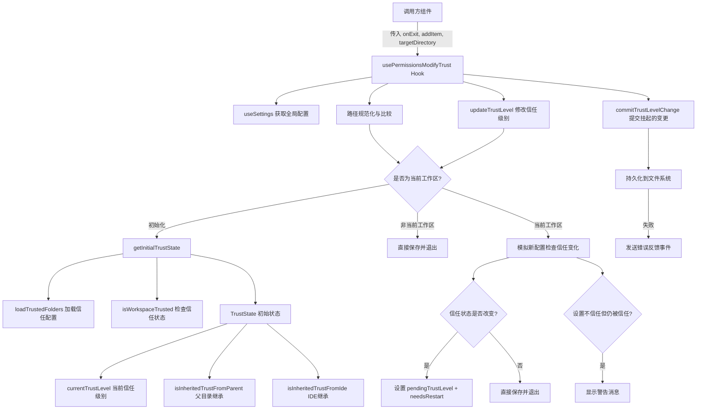

# usePermissionsModifyTrust.ts

## 概述

`usePermissionsModifyTrust` 是一个自定义 React Hook，用于管理工作区文件夹的信任级别（Trust Level）。它是 Gemini CLI 权限系统的核心组成部分，负责：

1. **读取**当前工作目录的信任状态（显式设置、父目录继承、IDE 继承）
2. **修改**信任级别，并处理各种边界情况（如父目录覆盖、IDE 覆盖）
3. **检测**信任状态变更是否需要重启 CLI
4. **持久化**信任配置到本地存储

该 Hook 同时支持编辑当前工作区和其他目录的信任设置，针对两种场景有不同的处理逻辑。

## 架构图（Mermaid）



## 核心组件

### 接口定义：TrustState

```typescript
interface TrustState {
  currentTrustLevel: TrustLevel | undefined;      // 当前显式设置的信任级别
  isInheritedTrustFromParent: boolean;             // 是否从父目录继承信任
  isInheritedTrustFromIde: boolean;                // 是否从 IDE 继承信任
}
```

### 辅助函数：getInitialTrustState

```typescript
function getInitialTrustState(
  settings: LoadedSettings,
  cwd: string,
  isCurrentWorkspace: boolean,
): TrustState
```

该函数计算目标目录的初始信任状态：

- **非当前工作区**：仅返回显式信任级别，不计算继承关系
- **当前工作区**：
  1. 调用 `isWorkspaceTrusted()` 获取综合信任状态和来源（`'file'` 或 `'ide'`）
  2. 判断是否为"继承信任"：即工作区受信任，但自身没有显式信任设置（或显式设为不信任）
  3. 根据 `source` 区分是父目录继承还是 IDE 继承

### 主 Hook 函数

```typescript
export const usePermissionsModifyTrust = (
  onExit: () => void,
  addItem: UseHistoryManagerReturn['addItem'],
  targetDirectory: string,
) => { ... }
```

#### 参数说明

| 参数 | 类型 | 说明 |
|------|------|------|
| `onExit` | `() => void` | 退出信任编辑界面的回调 |
| `addItem` | `UseHistoryManagerReturn['addItem']` | 向历史记录/消息列表添加条目的函数，用于显示警告 |
| `targetDirectory` | `string` | 目标目录路径 |

#### 返回值

| 字段 | 类型 | 说明 |
|------|------|------|
| `cwd` | `string` | 目标目录路径 |
| `currentTrustLevel` | `TrustLevel \| undefined` | 当前显式信任级别 |
| `isInheritedTrustFromParent` | `boolean` | 是否从父目录继承信任 |
| `isInheritedTrustFromIde` | `boolean` | 是否从 IDE 继承信任 |
| `needsRestart` | `boolean` | 变更是否需要重启 CLI |
| `updateTrustLevel` | `(trustLevel: TrustLevel) => Promise<void>` | 更新信任级别 |
| `commitTrustLevelChange` | `() => Promise<boolean>` | 提交挂起的信任变更 |
| `isFolderTrustEnabled` | `boolean` | 文件夹信任功能是否启用 |

### 核心方法：updateTrustLevel

该方法是信任级别修改的主要入口，处理逻辑分两种情况：

**非当前工作区（简单路径）：**
- 直接加载信任配置 → 保存新值 → 调用 `onExit()` 退出

**当前工作区（复杂路径）：**
1. 获取变更前的信任状态 `wasTrusted`
2. 创建模拟配置（不实际写入），用新的信任级别检查变更后的状态
3. 如果用户将目录设为"不信任"但由于父目录或 IDE 的信任覆盖导致目录仍被信任，则显示相应的警告消息
4. 如果信任状态确实发生了变化（`wasTrusted !== isTrusted`），设置 `pendingTrustLevel` 并标记 `needsRestart = true`，延迟提交以便 UI 展示重启提示
5. 如果信任状态未变化，直接保存并退出

### 核心方法：commitTrustLevelChange

该方法用于在用户确认重启后，实际持久化挂起的信任级别变更：

- 若存在 `pendingTrustLevel`，调用 `folders.setValue()` 写入
- 保存成功返回 `true`，失败则通过 `coreEvents.emitFeedback` 发送错误通知，重置状态并返回 `false`
- 若无挂起变更，直接返回 `true`

## 依赖关系

### 内部依赖

| 模块 | 导入项 | 说明 |
|------|--------|------|
| `../../config/trustedFolders.js` | `loadTrustedFolders` | 加载信任文件夹配置（读写本地配置文件） |
| `../../config/trustedFolders.js` | `TrustLevel` | 信任级别枚举 |
| `../../config/trustedFolders.js` | `isWorkspaceTrusted` | 综合判断工作区是否受信任（含继承逻辑） |
| `../contexts/SettingsContext.js` | `useSettings` | 获取全局设置上下文 |
| `../types.js` | `MessageType` | 消息类型枚举，使用 `MessageType.WARNING` |
| `./useHistoryManager.js` | `UseHistoryManagerReturn` (type) | 历史管理器返回类型，取其 `addItem` 方法类型 |
| `../../config/settings.js` | `LoadedSettings` (type) | 已加载的设置类型 |

### 外部依赖

| 包 | 导入项 | 说明 |
|----|--------|------|
| `react` | `useState`, `useCallback` | React 标准 Hooks |
| `node:process` | `process` | Node.js 进程模块，用于获取 `process.cwd()` |
| `node:path` | `path` | Node.js 路径模块，用于 `path.resolve()` 进行路径规范化 |
| `@google/gemini-cli-core` | `coreEvents` | 核心事件总线，用于发送错误反馈 |

## 关键实现细节

1. **路径规范化与大小写处理**：使用 `path.resolve().toLowerCase()` 进行路径比较，兼容 macOS 和 Windows 等大小写不敏感的文件系统，确保 `targetDirectory` 和 `process.cwd()` 的比较准确。

2. **延迟写入模式（两阶段提交）**：当信任状态变更会导致需要重启时，不立即写入配置文件，而是将新值暂存在 `pendingTrustLevel` 状态中，由 UI 展示重启确认后再调用 `commitTrustLevelChange()` 实际写入。这避免了用户取消操作时产生不一致状态。

3. **模拟配置检查**：在 `updateTrustLevel` 中，通过创建临时配置对象 `{ ...currentConfig, [cwd]: trustLevel }` 并传给 `isWorkspaceTrusted` 的第三个参数，实现"不写入即预览"的效果，提前判断变更后的信任状态。

4. **信任继承覆盖警告**：当用户设置"不信任"但父目录或 IDE 覆盖了该设置时，通过 `addItem` 向 UI 添加警告消息，告知用户实际的信任状态并未改变。区分两种来源：
   - `source === 'file'`：父目录的信任配置文件覆盖
   - `source === 'ide'`：IDE 连接的工作区信任覆盖

5. **错误容错**：`folders.setValue()` 的调用都包裹在 try-catch 中，写入失败时通过 `coreEvents.emitFeedback('error', ...)` 通知用户，避免因文件系统异常导致 UI 崩溃。

6. **初始状态惰性计算**：使用 `useState(() => getInitialTrustState(...))` 惰性初始化模式，确保初始信任状态只在组件首次渲染时计算一次，避免后续重渲染的性能开销。

7. **文件夹信任开关**：通过 `settings.merged.security.folderTrust.enabled` 判断功能是否启用，默认值为 `true`（使用 `?? true` 空值合并），返回给调用方以便 UI 层面做功能可用性判断。
