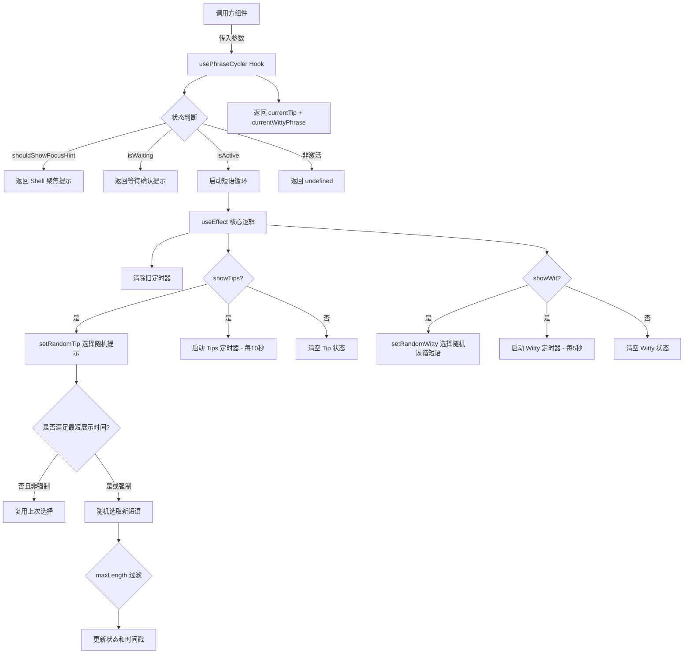

# usePhraseCycler.ts

## 概述

`usePhraseCycler` 是一个自定义 React Hook，用于在 Gemini CLI 的加载/等待状态下循环展示提示短语（Tips）和诙谐短语（Witty Phrases）。它管理两组独立的短语轮播：

- **信息提示（Tips）**：每 10 秒切换一次，来自 `INFORMATIVE_TIPS` 常量
- **诙谐短语（Witty Phrases）**：每 5 秒切换一次，来自 `WITTY_LOADING_PHRASES` 常量或自定义短语列表

该 Hook 支持多种特殊状态：交互式 Shell 等待聚焦提示、用户确认等待提示，以及正常的循环展示模式。它还内置了最短展示时间保护和可选的最大长度过滤功能。

## 架构图（Mermaid）



## 核心组件

### 导出常量

| 常量 | 值 | 说明 |
|------|---|------|
| `PHRASE_CHANGE_INTERVAL_MS` | `10000` (10秒) | 信息提示切换间隔 |
| `WITTY_PHRASE_CHANGE_INTERVAL_MS` | `5000` (5秒) | 诙谐短语切换间隔 |
| `INTERACTIVE_SHELL_WAITING_PHRASE` | `'! Shell awaiting input (Tab to focus)'` | 交互式 Shell 等待聚焦时的提示文本 |

### 函数签名

```typescript
export const usePhraseCycler = (
  isActive: boolean,
  isWaiting: boolean,
  shouldShowFocusHint: boolean,
  showTips: boolean = true,
  showWit: boolean = true,
  customPhrases?: string[],
  maxLength?: number,
) => { currentTip, currentWittyPhrase }
```

### 参数说明

| 参数 | 类型 | 默认值 | 说明 |
|------|------|--------|------|
| `isActive` | `boolean` | 必填 | 短语循环是否激活（通常在模型响应加载时为 true） |
| `isWaiting` | `boolean` | 必填 | 是否正在等待用户确认 |
| `shouldShowFocusHint` | `boolean` | 必填 | 是否显示 Shell 聚焦提示（优先级最高） |
| `showTips` | `boolean` | `true` | 是否显示信息提示 |
| `showWit` | `boolean` | `true` | 是否显示诙谐短语 |
| `customPhrases` | `string[]` | `undefined` | 自定义诙谐短语列表，替代内置的 `WITTY_LOADING_PHRASES` |
| `maxLength` | `number` | `undefined` | 短语最大长度过滤，超过此长度的短语不会被选中 |

### 返回值

| 字段 | 类型 | 说明 |
|------|------|------|
| `currentTip` | `string \| undefined` | 当前显示的信息提示 |
| `currentWittyPhrase` | `string \| undefined` | 当前显示的诙谐短语 |

### 内部状态管理

Hook 使用多个 `useState` 和 `useRef` 来管理状态：

| 状态/引用 | 类型 | 说明 |
|-----------|------|------|
| `currentTipState` | `useState<string \| undefined>` | 当前选中的提示短语 |
| `currentWittyPhraseState` | `useState<string \| undefined>` | 当前选中的诙谐短语 |
| `tipIntervalRef` | `useRef<NodeJS.Timeout>` | 提示定时器引用 |
| `wittyIntervalRef` | `useRef<NodeJS.Timeout>` | 诙谐短语定时器引用 |
| `lastTipChangeTimeRef` | `useRef<number>` | 上次提示切换的时间戳 |
| `lastWittyChangeTimeRef` | `useRef<number>` | 上次诙谐短语切换的时间戳 |
| `lastSelectedTipRef` | `useRef<string>` | 上次选中的提示 |
| `lastSelectedWittyPhraseRef` | `useRef<string>` | 上次选中的诙谐短语 |

### 核心内部函数

#### setRandomTip(force: boolean)

随机选择一条信息提示：

1. 若 `showTips` 为 false，清空状态并返回
2. 非强制模式下，若距上次切换不足 `MIN_TIP_DISPLAY_TIME_MS`（10秒）且已有选中短语，则复用上次选择
3. 若指定了 `maxLength`，过滤掉超长的短语
4. 从过滤后的列表中随机选取一条，更新状态和时间戳

#### setRandomWitty(force: boolean)

随机选择一条诙谐短语，逻辑与 `setRandomTip` 完全对称：

1. 若 `showWit` 为 false，清空状态并返回
2. 非强制模式下，若距上次切换不足 `MIN_WIT_DISPLAY_TIME_MS`（5秒）且已有选中短语，则复用上次选择
3. 支持 `customPhrases` 替代默认列表
4. 从过滤后的列表中随机选取一条，更新状态和时间戳

### 返回值优先级逻辑

```typescript
if (shouldShowFocusHint) {
  currentTip = INTERACTIVE_SHELL_WAITING_PHRASE;  // 最高优先级
} else if (isWaiting) {
  currentTip = 'Waiting for user confirmation...'; // 次高优先级
} else if (isActive) {
  currentTip = currentTipState;                    // 正常循环
  currentWittyPhrase = currentWittyPhraseState;
}
// 否则全部为 undefined
```

## 依赖关系

### 内部依赖

| 模块 | 导入项 | 说明 |
|------|--------|------|
| `../constants/tips.js` | `INFORMATIVE_TIPS` | 信息提示短语常量数组 |
| `../constants/wittyPhrases.js` | `WITTY_LOADING_PHRASES` | 诙谐加载短语常量数组 |

### 外部依赖

| 包 | 导入项 | 说明 |
|----|--------|------|
| `react` | `useState`, `useEffect`, `useRef` | React 标准 Hooks |

## 关键实现细节

1. **双轨独立轮播**：信息提示和诙谐短语使用完全独立的定时器、状态和时间戳进行管理。两者拥有不同的切换频率（10秒 vs 5秒），互不干扰。

2. **最短展示时间保护**：通过 `lastTipChangeTimeRef` 和 `lastWittyChangeTimeRef` 记录上次切换时间，在非强制模式下，若未达到最短展示时间（`MIN_TIP_DISPLAY_TIME_MS` = 10秒，`MIN_WIT_DISPLAY_TIME_MS` = 5秒），则复用上次选中的短语。这防止了因 `useEffect` 重新执行（如依赖项变化）导致短语过于频繁地切换。

3. **优雅的定时器清理**：`useEffect` 的清理函数 `clearTimers` 在每次重新执行和组件卸载时被调用，确保不会出现定时器泄漏。同时在 effect 开头也主动调用 `clearTimers()`，保证旧定时器被清除后再创建新的。

4. **特殊状态的短路返回**：当 `shouldShowFocusHint` 或 `isWaiting` 为 true 时，`useEffect` 提前清除定时器并返回，不启动循环。返回值直接使用固定文本而非循环状态，确保特殊状态下的即时响应。

5. **maxLength 过滤**：支持通过 `maxLength` 参数过滤短语长度，适用于终端宽度有限的场景。过滤后如果没有合适的短语（`filteredTips.length === 0`），则不更新状态，保持之前的短语或 `undefined`。

6. **自定义短语支持**：`customPhrases` 参数允许调用方提供自定义的诙谐短语列表，当传入非空数组时替代内置的 `WITTY_LOADING_PHRASES`。这使得不同场景（如不同的加载阶段）可以展示不同风格的短语。

7. **随机选择安全标注**：代码中标注了 `codeql[js/insecure-randomness]` 为误报，因为 `Math.random()` 仅用于非敏感的 UI 装饰文本选择，无需加密安全的随机数。

8. **useEffect 依赖数组**：包含所有影响循环行为的参数 `[isActive, isWaiting, shouldShowFocusHint, showTips, showWit, customPhrases, maxLength]`，任何参数变化都会重新评估是否需要启动/停止循环。
