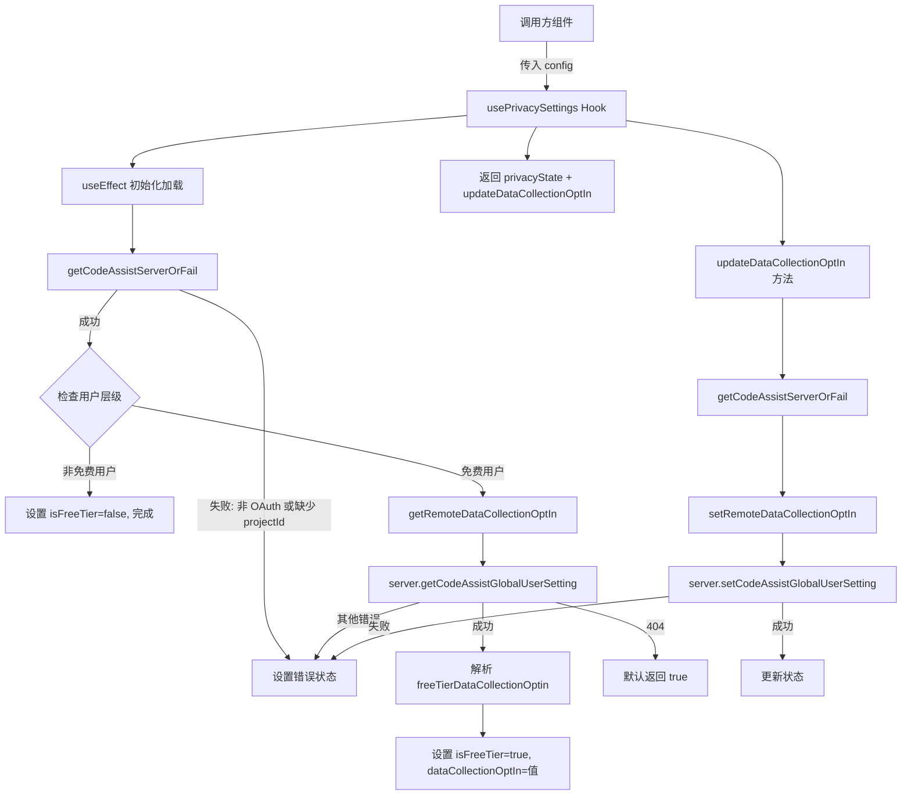

# usePrivacySettings.ts

## 概述

`usePrivacySettings` 是一个自定义 React Hook，用于管理 Gemini CLI 的隐私设置，特别是免费用户的数据收集同意（Data Collection Opt-In）状态。它通过 Code Assist API 与远端服务器通信，实现以下功能：

1. **加载**当前用户的隐私设置状态（用户层级、数据收集同意状态）
2. **更新**数据收集同意选项并持久化到远端

该 Hook 仅对免费层级（Free Tier）用户展示数据收集同意选项，付费用户的数据收集策略通过其他方式管理。

## 架构图（Mermaid）



## 核心组件

### 接口定义：PrivacyState

```typescript
export interface PrivacyState {
  isLoading: boolean;              // 是否正在加载
  error?: string;                  // 错误消息
  isFreeTier?: boolean;            // 是否为免费层级用户
  dataCollectionOptIn?: boolean;   // 数据收集同意状态
}
```

该接口通过可选字段的组合表达不同状态：

| 状态 | isLoading | error | isFreeTier | dataCollectionOptIn |
|------|-----------|-------|------------|---------------------|
| 加载中 | `true` | - | - | - |
| 非免费用户 | `false` | - | `false` | - |
| 免费用户已加载 | `false` | - | `true` | `true/false` |
| 错误 | `false` | 错误消息 | - | - |

### 主 Hook 函数

```typescript
export const usePrivacySettings = (config: Config) => {
  ...
  return { privacyState, updateDataCollectionOptIn };
}
```

#### 参数说明

| 参数 | 类型 | 说明 |
|------|------|------|
| `config` | `Config` | Gemini CLI 核心配置对象，用于获取 Code Assist 服务器信息 |

#### 返回值

| 字段 | 类型 | 说明 |
|------|------|------|
| `privacyState` | `PrivacyState` | 当前隐私设置状态 |
| `updateDataCollectionOptIn` | `(optIn: boolean) => Promise<void>` | 更新数据收集同意状态的方法 |

### 初始化流程（useEffect）

1. 设置加载状态 `{ isLoading: true }`
2. 调用 `getCodeAssistServerOrFail(config)` 获取 Code Assist 服务器实例
3. 检查 `server.userTier`：
   - 若为 `undefined`，抛出错误
   - 若非 `UserTierId.FREE`，设置 `{ isLoading: false, isFreeTier: false }` 并返回
   - 若为 `FREE`，调用 `getRemoteDataCollectionOptIn(server)` 获取远端同意状态
4. 设置完整状态 `{ isLoading: false, isFreeTier: true, dataCollectionOptIn: optIn }`

### 辅助函数

#### getCodeAssistServerOrFail(config: Config): CodeAssistServer

服务器获取的防御性包装函数，在以下情况抛出错误：
- `getCodeAssistServer(config)` 返回 `undefined`（未使用 OAuth 认证）
- 返回的服务器缺少 `projectId`

#### getRemoteDataCollectionOptIn(server: CodeAssistServer): Promise\<boolean\>

从远端获取数据收集同意状态：
- 调用 `server.getCodeAssistGlobalUserSetting()` API
- 若响应中 `freeTierDataCollectionOptin` 为 `undefined`，记录警告日志并默认返回 `true`
- 若 API 返回 404 状态码（用户设置不存在），默认返回 `true`（默认同意）
- 其他错误继续抛出

#### setRemoteDataCollectionOptIn(server: CodeAssistServer, optIn: boolean): Promise\<boolean\>

向远端更新数据收集同意状态：
- 调用 `server.setCodeAssistGlobalUserSetting()` API，传入 `cloudaicompanionProject` 和 `freeTierDataCollectionOptin`
- 若响应中 `freeTierDataCollectionOptin` 为 `undefined`，记录警告日志并回退到传入的 `optIn` 值
- 返回远端确认后的实际值

## 依赖关系

### 内部依赖

无直接的项目内部模块依赖（辅助函数均在同文件中定义）。

### 外部依赖

| 包 | 导入项 | 说明 |
|----|--------|------|
| `react` | `useState`, `useEffect`, `useCallback` | React 标准 Hooks |
| `@google/gemini-cli-core` | `Config` (type) | Gemini CLI 核心配置类型 |
| `@google/gemini-cli-core` | `CodeAssistServer` (type) | Code Assist 服务器接口类型 |
| `@google/gemini-cli-core` | `UserTierId` | 用户层级枚举，包含 `FREE` 等值 |
| `@google/gemini-cli-core` | `getCodeAssistServer` | 从配置中获取 Code Assist 服务器实例的函数 |
| `@google/gemini-cli-core` | `debugLogger` | 调试日志工具，用于记录警告信息 |

## 关键实现细节

1. **层级分流策略**：Hook 根据 `userTier` 进行分流处理。非免费用户直接跳过数据收集选项的获取，因为付费用户的数据收集策略通过订阅协议等其他方式管理，无需在 CLI 中单独设置。

2. **默认同意策略**：在多种异常情况下，数据收集同意状态默认为 `true`（同意）：
   - API 响应中 `freeTierDataCollectionOptin` 字段缺失时
   - API 返回 404（用户尚未设置过偏好）时
   这遵循了"默认同意"的产品策略。

3. **404 错误的特殊处理**：`getRemoteDataCollectionOptIn` 对 HTTP 404 错误做了特殊处理，将其视为"用户尚未创建设置记录"而非真正的错误，返回默认值 `true`。这是因为新用户首次使用时，远端可能尚未创建对应的设置资源。

4. **Gaxios 错误类型处理**：由于 `@google/gemini-cli-core` 使用 Gaxios HTTP 客户端，错误对象的类型检查采用鸭子类型（duck typing）方式：`error && typeof error === 'object' && 'response' in error`，然后进行类型断言获取 `response.status`。

5. **异步副作用的 ESLint 豁免**：`useEffect` 中调用异步函数 `fetchInitialState()` 时，使用了 `// eslint-disable-next-line @typescript-eslint/no-floating-promises` 豁免，因为 React 的 `useEffect` 不支持返回 Promise，内部异步操作的错误已通过 try-catch 处理。

6. **写入后读取验证**：`setRemoteDataCollectionOptIn` 使用 API 响应中返回的实际值（而非传入值）更新状态，实现"写入后读取"（write-then-read）模式，确保 UI 显示的是远端确认后的真实状态。仅在 API 未返回该字段时才回退到传入值。

7. **useCallback 稳定性**：`updateDataCollectionOptIn` 通过 `useCallback` 包装且仅依赖 `[config]`，确保 config 不变时回调引用稳定，避免下游组件不必要的重渲染。
