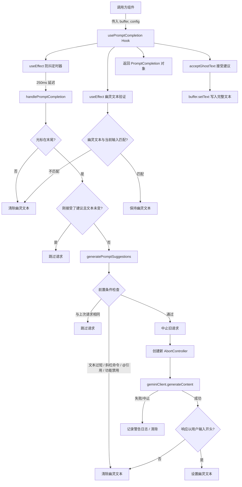

# usePromptCompletion.ts

## 概述

`usePromptCompletion` 是一个自定义 React Hook，用于实现 Gemini CLI 输入框的**提示词自动补全**（Prompt Completion / Ghost Text）功能。当用户在输入框中键入文本时，Hook 通过 Gemini LLM 生成补全建议，以灰色"幽灵文本"（Ghost Text）的形式显示在光标之后，用户可按快捷键接受建议。

核心特性包括：
- **防抖触发**：用户停止输入 250ms 后才请求补全
- **去重与中止**：避免重复请求，支持新请求自动中止旧请求
- **实时验证**：当用户继续输入时，若幽灵文本不再匹配当前输入则自动清除
- **光标位置检测**：仅在光标位于文本末尾时才触发补全
- **多种过滤条件**：斜杠命令、@引用、过短文本等情况下不触发

**注意**：当前版本中 `isPromptCompletionEnabled` 硬编码为 `false`，即该功能处于禁用状态，属于预备性实现。

## 架构图（Mermaid）



## 核心组件

### 导出常量

| 常量 | 值 | 说明 |
|------|---|------|
| `PROMPT_COMPLETION_MIN_LENGTH` | `5` | 触发补全的最短输入长度 |
| `PROMPT_COMPLETION_DEBOUNCE_MS` | `250` (毫秒) | 防抖延迟时间 |

### 接口定义

#### PromptCompletion（返回值类型）

```typescript
export interface PromptCompletion {
  text: string;                              // 当前幽灵文本内容
  isLoading: boolean;                        // 是否正在请求补全
  isActive: boolean;                         // 补全功能是否处于可用状态
  accept: () => void;                        // 接受当前建议
  clear: () => void;                         // 清除当前建议
  markSelected: (selectedText: string) => void;  // 标记外部选中的建议
}
```

#### UsePromptCompletionOptions（输入参数类型）

```typescript
export interface UsePromptCompletionOptions {
  buffer: TextBuffer;   // 文本缓冲区对象，包含当前文本、光标位置等
  config?: Config;      // Gemini CLI 配置，用于获取 Gemini 客户端
}
```

### 内部状态管理

| 状态/引用 | 类型 | 说明 |
|-----------|------|------|
| `ghostText` | `useState<string>` | 当前幽灵文本内容 |
| `isLoadingGhostText` | `useState<boolean>` | 是否正在加载补全 |
| `justSelectedSuggestion` | `useState<boolean>` | 是否刚刚接受了一个建议（防止立即再次请求） |
| `abortControllerRef` | `useRef<AbortController>` | 当前请求的中止控制器 |
| `lastSelectedTextRef` | `useRef<string>` | 上次接受的建议文本 |
| `lastRequestedTextRef` | `useRef<string>` | 上次发送请求的输入文本（去重） |
| `isPromptCompletionEnabled` | `const false` | 功能开关（当前硬编码关闭） |

### 核心方法

#### clearGhostText()

清除幽灵文本和加载状态：
```typescript
setGhostText('');
setIsLoadingGhostText(false);
```

#### acceptGhostText()

接受当前幽灵文本建议：
1. 检查幽灵文本存在且长度大于当前缓冲区文本
2. 调用 `buffer.setText(ghostText)` 将完整建议写入输入框
3. 清空幽灵文本
4. 标记 `justSelectedSuggestion = true` 防止立即再次请求
5. 记录 `lastSelectedTextRef` 以便后续比较

#### markSuggestionSelected(selectedText: string)

标记外部选中的建议（如通过下拉菜单选择的补全），设置 `justSelectedSuggestion` 和 `lastSelectedTextRef`，防止立即对刚选中的文本再次发起补全请求。

#### generatePromptSuggestions()

核心补全请求方法，执行流程：

1. **去重检查**：若 `trimmedText` 与 `lastRequestedTextRef` 相同，跳过
2. **中止旧请求**：调用 `abortControllerRef.current.abort()`
3. **前置条件检查**：
   - 文本长度 < 5 → 跳过
   - 无 Gemini 客户端 → 跳过
   - 以斜杠命令开头 → 跳过
   - 包含 `@` 字符 → 跳过
   - `isPromptCompletionEnabled` 为 false → 跳过
4. **发送请求**：
   - 构建系统提示词，要求 LLM 补全用户输入
   - 使用 `model: 'prompt-completion'` 模型
   - 角色为 `LlmRole.UTILITY_AUTOCOMPLETE`
   - 传入 `AbortSignal` 支持中止
5. **处理响应**：
   - 检查 `signal.aborted` 防止处理已中止请求的响应
   - 验证响应文本以用户输入开头（`startsWith(trimmedText)`）
   - 通过验证则设为幽灵文本，否则清除
6. **错误处理**：
   - `AbortError` 静默忽略
   - 其他错误记录警告日志并清除幽灵文本

#### isCursorAtEnd()

判断光标是否在文本末尾：
1. 检查光标行 `cursorRow` 是否为最后一行
2. 检查光标列 `cursorCol` 是否等于最后一行的长度

#### handlePromptCompletion()

补全触发入口，被防抖定时器调用：
1. 若光标不在末尾，清除幽灵文本
2. 若刚接受了建议且文本未变，跳过
3. 若文本已变化（不等于上次选中的文本），重置 `justSelectedSuggestion`
4. 调用 `generatePromptSuggestions()`

### useEffect 副作用

#### 防抖定时器

```typescript
useEffect(() => {
  const timeoutId = setTimeout(handlePromptCompletion, PROMPT_COMPLETION_DEBOUNCE_MS);
  return () => clearTimeout(timeoutId);
}, [buffer.text, buffer.cursor, handlePromptCompletion]);
```

每当文本或光标变化时，重置 250ms 定时器。用户停止输入 250ms 后才触发补全请求。

#### 幽灵文本验证

```typescript
useEffect(() => {
  // 光标不在末尾 → 清除
  // 幽灵文本不以当前文本开头 → 清除
}, [buffer.text, buffer.cursor, ghostText, clearGhostText, isCursorAtEnd]);
```

实时验证幽灵文本的有效性。当用户继续输入时，若新输入不再是幽灵文本的前缀，立即清除幽灵文本。

#### 卸载清理

```typescript
useEffect(() => () => abortControllerRef.current?.abort(), []);
```

组件卸载时中止所有正在进行的请求，防止内存泄漏和状态更新异常。

### isActive 计算（useMemo）

```typescript
const isActive = useMemo(() => {
  if (!isPromptCompletionEnabled) return false;
  if (!isCursorAtEnd()) return false;
  return (
    trimmedText.length >= PROMPT_COMPLETION_MIN_LENGTH &&
    !isSlashCommand(trimmedText) &&
    !trimmedText.includes('@')
  );
}, [buffer.text, isPromptCompletionEnabled, isCursorAtEnd]);
```

综合判断补全功能是否处于可用状态，用于 UI 层面决定是否显示补全相关的视觉元素。

## 依赖关系

### 内部依赖

| 模块 | 导入项 | 说明 |
|------|--------|------|
| `../components/shared/text-buffer.js` | `TextBuffer` (type) | 文本缓冲区类型，提供 `text`、`cursor`、`lines`、`setText` 等接口 |
| `../utils/commandUtils.js` | `isSlashCommand` | 判断文本是否为斜杠命令（如 `/help`、`/exit`），斜杠命令不触发补全 |

### 外部依赖

| 包 | 导入项 | 说明 |
|----|--------|------|
| `react` | `useState`, `useCallback`, `useRef`, `useEffect`, `useMemo` | React 标准 Hooks |
| `@google/gemini-cli-core` | `debugLogger` | 调试日志工具 |
| `@google/gemini-cli-core` | `getResponseText` | 从 LLM 响应中提取文本内容的工具函数 |
| `@google/gemini-cli-core` | `LlmRole` | LLM 角色枚举，使用 `UTILITY_AUTOCOMPLETE` |
| `@google/gemini-cli-core` | `Config` (type) | Gemini CLI 配置类型 |
| `@google/genai` | `Content` (type) | Gemini API 的消息内容类型 |

## 关键实现细节

1. **功能开关硬编码关闭**：`const isPromptCompletionEnabled = false;` 当前直接硬编码为 `false`，整个补全逻辑虽然完整实现，但不会实际执行。这是一种"功能门控"（Feature Gating）模式，便于后续通过配置或实验开关启用。

2. **三层防重复请求机制**：
   - **防抖**：250ms 防抖确保快速输入时不会频繁请求
   - **去重**：`lastRequestedTextRef` 确保相同文本不会重复请求
   - **中止**：新请求自动 `abort()` 旧请求，避免响应乱序

3. **"刚接受建议"保护**：`justSelectedSuggestion` 标志防止用户接受建议后立即对新文本再次触发补全。仅当用户修改了文本（`trimmedText !== lastSelectedTextRef.current`）后才重置此标志。

4. **响应验证策略**：LLM 的补全响应必须以用户当前输入的 `trimmedText` 开头（`suggestionText.startsWith(trimmedText)`），否则视为无效建议并丢弃。这确保了幽灵文本始终是用户输入的自然延续。

5. **提示词工程**：系统提示词（System Prompt）精心设计，要求 LLM：
   - 以用户原始输入开头（便于验证和展示）
   - 保持简洁（10-20字符）
   - 使用纯文本格式
   - 匹配用户语言
   - 聚焦于实用性而非创意性

6. **专用模型标识**：使用 `model: 'prompt-completion'` 作为模型标识，而非通用的聊天模型，可能对应一个专门针对补全场景优化的轻量级模型。

7. **AbortController 生命周期管理**：每次新请求创建新的 `AbortController`，并在新请求开始前、组件卸载时调用 `abort()`。`finally` 块中检查 `signal.aborted` 避免在已中止的请求上更新状态。

8. **TextBuffer 依赖**：Hook 深度依赖 `TextBuffer` 对象的多个属性：
   - `buffer.text`：完整文本内容
   - `buffer.cursor`：光标位置 `[row, col]`
   - `buffer.lines`：按行分割的文本数组
   - `buffer.setText()`：设置文本内容的方法

9. **排除条件设计**：
   - **斜杠命令**（`isSlashCommand`）：如 `/help`、`/exit` 等命令不需要 LLM 补全
   - **@引用**（`includes('@')`）：包含 `@` 的文本可能是在引用文件/上下文，补全逻辑不适用
   - **过短文本**（< 5 字符）：输入太短时 LLM 难以提供有意义的补全
