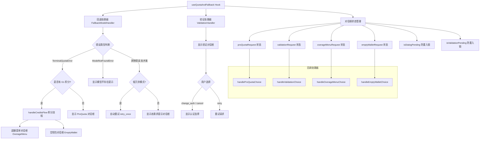

# useQuotaAndFallback.ts

## 概述

`useQuotaAndFallback` 是一个 React 自定义 Hook，负责处理 Gemini CLI 中的**配额超限与模型回退**逻辑。当用户使用的模型（如 Pro 模型）达到使用限制、遇到高并发容量问题、或模型不存在时，该 Hook 会：

1. 根据错误类型生成相应的提示信息；
2. 判断是否走 G1 AI Credits（积分超额消费）流程；
3. 弹出对话框让用户选择回退策略（切换到备用模型、重试、停止等）；
4. 处理 403 VALIDATION_REQUIRED 验证错误（需要用户完成额外验证）；
5. 管理多个对话框的生命周期和并发防护。

该 Hook 是 CLI UI 层面**错误恢复和用户引导**的核心组件，确保在配额耗尽或模型不可用时提供良好的用户体验。

## 架构图（Mermaid）



## 核心组件

### 1. 接口 `UseQuotaAndFallbackArgs`

Hook 的输入参数接口：

| 参数 | 类型 | 说明 |
|------|------|------|
| `config` | `Config` | 全局配置对象，用于获取内容生成器配置、计费设置，以及注册回退/验证处理器 |
| `historyManager` | `UseHistoryManagerReturn` | 历史记录管理器，用于在切换模型时添加信息提示 |
| `userTier` | `UserTierId \| undefined` | 用户等级标识 |
| `paidTier` | `GeminiUserTier \| null \| undefined` | 付费用户等级，包含 `availableCredits` 等信息 |
| `settings` | `LoadedSettings` | 已加载的用户设置 |
| `setModelSwitchedFromQuotaError` | `(value: boolean) => void` | 设置"因配额错误切换了模型"的标志 |
| `onShowAuthSelection` | `() => void` | 触发显示认证选择界面的回调 |
| `errorVerbosity` | `'low' \| 'full'` | 错误详细程度，默认 `'full'`。低冗余模式下，临时容量不足会自动重试而非弹对话框 |

### 2. 回退处理器（FallbackModelHandler）

通过 `useEffect` 注册到 `config.setFallbackModelHandler`，核心逻辑为：

- **TerminalQuotaError（配额耗尽）**：
  - 如果用户是 G1 订阅者（有可用积分）且模型支持超额消费，则走 `handleCreditsFlow` 积分流程；
  - 否则显示 ProQuota 对话框，提示用户配额已用完、重置时间等信息。
- **ModelNotFoundError（模型不存在）**：
  - 如果模型名在有效模型列表中，提示用户可能被管理员禁用了访问权限；
  - 否则提示模型名无效。
- **其他错误（高并发等）**：
  - 低冗余模式下直接返回 `'retry_once'` 自动重试；
  - 正常模式下显示高需求提示对话框。

### 3. 验证处理器（ValidationHandler）

通过另一个 `useEffect` 注册到 `config.setValidationHandler`，处理 403 VALIDATION_REQUIRED 错误：

- 使用 `isValidationPending` ref 防止并发弹出多个验证对话框；
- 弹出验证对话框，传递验证链接、描述和了解更多 URL；
- 返回用户的选择意图（`ValidationIntent`）。

### 4. 回调处理器

| 处理器 | 功能 |
|--------|------|
| `handleProQuotaChoice` | 处理 ProQuota 对话框的用户选择。若选择 `retry_always` 或 `retry_once`，重置配额错误标志；若选择 `retry_always`，还会在历史记录中添加"已切换到备用模型"的提示 |
| `handleValidationChoice` | 处理验证对话框的用户选择。若选择 `change_auth` 或 `cancel`，触发认证选择界面 |
| `handleOverageMenuChoice` | 处理 G1 积分超额菜单对话框的用户选择 |
| `handleEmptyWalletChoice` | 处理 G1 积分空钱包对话框的用户选择 |

### 5. 辅助函数 `getResetTimeMessage`

```typescript
function getResetTimeMessage(delayMs: number): string
```

根据传入的延迟毫秒数计算配额重置的具体时间，并使用 `Intl.DateTimeFormat` 格式化为用户友好的时间字符串（例如 `3:30 PM PST`）。

### 6. 返回值

Hook 返回以下对象：

```typescript
{
  proQuotaRequest,          // ProQuota 对话框请求状态
  handleProQuotaChoice,     // ProQuota 对话框选择处理器
  validationRequest,        // 验证对话框请求状态
  handleValidationChoice,   // 验证对话框选择处理器
  overageMenuRequest,       // G1 超额菜单对话框请求状态
  handleOverageMenuChoice,  // G1 超额菜单对话框选择处理器
  emptyWalletRequest,       // G1 空钱包对话框请求状态
  handleEmptyWalletChoice,  // G1 空钱包对话框选择处理器
}
```

## 依赖关系

### 内部依赖

| 模块 | 导入内容 | 用途 |
|------|----------|------|
| `@google/gemini-cli-core` | `AuthType`, `Config`, `FallbackModelHandler`, `FallbackIntent`, `ValidationHandler`, `ValidationIntent`, `TerminalQuotaError`, `ModelNotFoundError`, `UserTierId`, `VALID_GEMINI_MODELS`, `isProModel`, `isOverageEligibleModel`, `getDisplayString`, `GeminiUserTier` | 核心类型定义、错误类型、模型判断工具 |
| `./useHistoryManager.js` | `UseHistoryManagerReturn` | 历史记录管理器类型 |
| `../types.js` | `MessageType` | 消息类型枚举 |
| `../contexts/UIStateContext.js` | `ProQuotaDialogRequest`, `ValidationDialogRequest`, `OverageMenuDialogRequest`, `OverageMenuIntent`, `EmptyWalletDialogRequest`, `EmptyWalletIntent` | 各种对话框请求和意图类型 |
| `../../config/settings.js` | `LoadedSettings` | 已加载设置类型 |
| `./creditsFlowHandler.js` | `handleCreditsFlow` | G1 AI Credits 积分消费流程处理函数 |

### 外部依赖

| 包 | 导入内容 | 用途 |
|----|----------|------|
| `react` | `useCallback`, `useEffect`, `useRef`, `useState` | React Hooks 基础设施 |

## 关键实现细节

### 1. Promise-based 对话框模式

该 Hook 使用了一个巧妙的 **Promise + setState** 模式来实现异步对话框交互：

```typescript
const intent: FallbackIntent = await new Promise<FallbackIntent>((resolve) => {
  setProQuotaRequest({
    failedModel,
    fallbackModel,
    resolve,  // 将 resolve 函数存入 state
    message,
    ...
  });
});
```

当用户在 UI 中做出选择时，对应的 `handleXxxChoice` 回调会调用 `request.resolve(intent)` 来解析 Promise，从而将用户的选择传回异步等待的处理器。这种模式将命令式的"等待用户输入"与 React 的声明式状态管理优雅地结合在一起。

### 2. 防重入锁机制

使用 `useRef` 实现两个独立的防重入锁：

- `isDialogPending`: 防止 ProQuota / 超额 / 空钱包对话框并发弹出。当已有对话框活跃时，新的回退请求直接返回 `'stop'`。
- `isValidationPending`: 防止验证对话框并发弹出。当已有验证对话框活跃时，新的验证请求直接返回 `'cancel'`。

使用 `useRef` 而非 `useState` 是因为这些标志需要在异步回调中同步读取最新值，不受 React 渲染批处理影响。

### 3. G1 AI Credits 积分流程优先级

当发生 `TerminalQuotaError` 时，积分流程有明确的优先级判断：

1. 如果错误明确标识 `isInsufficientCredits`（积分不足），跳过积分流程；
2. 如果用户有可用积分（`paidTier?.availableCredits`）且模型支持超额消费（`isOverageEligibleModel`），则走 `handleCreditsFlow`；
3. 如果积分流程返回了结果，直接使用该结果；
4. 否则回退到默认的 ProQuota 对话框。

### 4. 低冗余模式（errorVerbosity = 'low'）

在低冗余模式下，非终端性错误（非配额耗尽、非模型不存在）会被静默处理：直接返回 `'retry_once'` 自动重试，避免用弹框打断用户工作流。这对于脚本化或自动化场景特别有用。

### 5. 模型错误消息的差异化

- 已知有效模型（在 `VALID_GEMINI_MODELS` 中）但不可用：提示用户联系管理员启用 Preview Release Channel；
- 未知模型名：提示模型名无效或不存在，并建议使用 `/model` 命令切换。

### 6. useEffect 依赖管理

两个 `useEffect` 有不同的依赖数组：

- 回退处理器的 Effect 依赖较多：`[config, historyManager, userTier, paidTier, settings, setModelSwitchedFromQuotaError, onShowAuthSelection, errorVerbosity]`，因为回退逻辑需要访问多个外部状态；
- 验证处理器的 Effect 仅依赖 `[config]`，因为验证逻辑相对独立。
