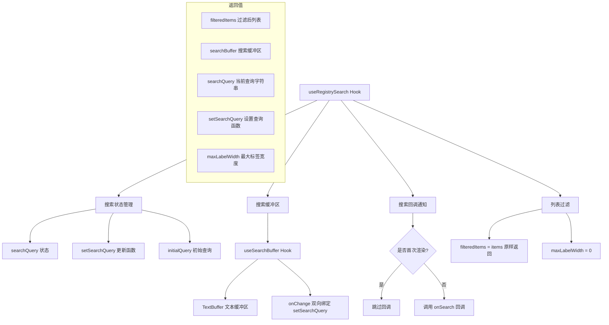

# useRegistrySearch.ts

## 概述

`useRegistrySearch` 是一个泛型 React 自定义 Hook，为**注册表/列表搜索**提供基础搜索功能。它封装了搜索查询状态管理、搜索缓冲区（TextBuffer）绑定以及搜索回调通知等逻辑。

该 Hook 接收一个泛型列表项数组，并返回过滤后的列表项、搜索状态和搜索缓冲区。目前的实现中，**过滤逻辑尚未实现**（`filteredItems` 直接返回原始 `items`，`maxLabelWidth` 硬编码为 0），这表明过滤功能可能由外部（如服务端搜索）处理，或是一个尚待完善的功能。

该 Hook 主要用于 CLI 的可搜索列表组件（如 MCP 工具注册表搜索、扩展搜索等场景）。

## 架构图（Mermaid）



## 核心组件

### 1. 泛型约束

```typescript
export function useRegistrySearch<T extends GenericListItem>(...)
```

使用泛型 `T extends GenericListItem` 确保列表项至少满足 `GenericListItem` 接口的约束，使该 Hook 可以用于不同类型的注册表/列表搜索场景。

### 2. 接口 `UseRegistrySearchResult<T>`

Hook 的返回类型接口：

| 字段 | 类型 | 说明 |
|------|------|------|
| `filteredItems` | `T[]` | 过滤后的列表项（当前实现直接返回原始列表） |
| `searchBuffer` | `TextBuffer \| undefined` | 搜索输入的文本缓冲区，用于终端 UI 中的文本输入处理 |
| `searchQuery` | `string` | 当前搜索查询字符串 |
| `setSearchQuery` | `(query: string) => void` | 设置搜索查询字符串的函数 |
| `maxLabelWidth` | `number` | 列表项标签的最大宽度（当前硬编码为 0） |

### 3. 输入参数

| 参数 | 类型 | 必填 | 默认值 | 说明 |
|------|------|------|--------|------|
| `items` | `T[]` | 是 | - | 需要搜索的列表项数组 |
| `initialQuery` | `string` | 否 | `''` | 初始搜索查询字符串 |
| `onSearch` | `(query: string) => void` | 否 | - | 搜索查询变化时的回调函数 |

### 4. 搜索缓冲区集成

通过 `useSearchBuffer` Hook 创建一个 `TextBuffer`，并与 `searchQuery` 状态双向绑定：

```typescript
const searchBuffer = useSearchBuffer({
  initialText: searchQuery,
  onChange: setSearchQuery,
});
```

`TextBuffer` 是终端 UI 中的文本缓冲区抽象，负责处理光标位置、字符插入/删除等底层文本编辑操作。当用户在搜索框中输入时，`TextBuffer` 的变化会通过 `onChange` 同步到 `searchQuery` 状态。

### 5. 返回值

```typescript
{
  filteredItems,    // 过滤后列表（当前 = 原始列表）
  searchBuffer,     // 文本缓冲区
  searchQuery,      // 当前查询字符串
  setSearchQuery,   // 设置查询函数
  maxLabelWidth,    // 最大标签宽度（当前 = 0）
}
```

## 依赖关系

### 内部依赖

| 模块 | 导入内容 | 用途 |
|------|----------|------|
| `../components/shared/text-buffer.js` | `TextBuffer` (类型) | 文本缓冲区类型定义，用于终端文本输入 |
| `../components/shared/SearchableList.js` | `GenericListItem` (类型) | 通用列表项接口，泛型约束的基础类型 |
| `./useSearchBuffer.js` | `useSearchBuffer` | 搜索缓冲区 Hook，创建并管理 TextBuffer 实例 |

### 外部依赖

| 包 | 导入内容 | 用途 |
|----|----------|------|
| `react` | `useState`, `useEffect`, `useRef` | React Hooks 基础设施 |

## 关键实现细节

### 1. 首次渲染跳过回调

```typescript
const isFirstRender = useRef(true);

useEffect(() => {
  if (isFirstRender.current) {
    isFirstRender.current = false;
    return;
  }
  onSearchRef.current?.(searchQuery);
}, [searchQuery]);
```

使用 `isFirstRender` ref 标志确保 `onSearch` 回调**不会**在组件首次挂载时被调用。只有在用户实际修改搜索查询后才会触发回调。这避免了初始化阶段的不必要的副作用（如不必要的 API 调用）。

### 2. useRef 保存最新回调

```typescript
const onSearchRef = useRef(onSearch);
onSearchRef.current = onSearch;
```

将 `onSearch` 回调存入 ref 中，确保 `useEffect` 内部始终调用的是最新版本的回调函数，而不需要将 `onSearch` 加入 `useEffect` 的依赖数组。这是一种常见的 React 模式，可以避免因回调引用变化导致 Effect 不必要地重新执行。

### 3. 过滤逻辑的占位实现

```typescript
const maxLabelWidth = 0;
const filteredItems = items;
```

当前的过滤逻辑是"透传"（pass-through）实现：
- `filteredItems` 直接等于输入的 `items`，没有根据 `searchQuery` 进行客户端过滤；
- `maxLabelWidth` 硬编码为 0，没有计算实际标签宽度。

这表明搜索过滤可能是在**服务端**完成的（通过 `onSearch` 回调触发远程搜索，父组件用新的 `items` 更新列表），或者这是一个后续需要补充的功能。

### 4. 设计模式：受控搜索

该 Hook 采用了受控模式：`searchQuery` 由 Hook 内部的 `useState` 管理，外部组件通过 `setSearchQuery` 可以程序化地修改搜索查询。同时，`searchBuffer` 通过 `onChange: setSearchQuery` 与状态保持同步，实现了**UI 输入 <-> 状态 <-> 缓冲区**的三方绑定。
