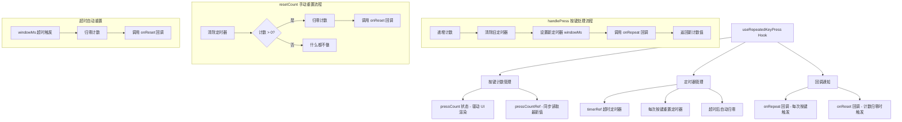

# useRepeatedKeyPress.ts

## 概述

`useRepeatedKeyPress` 是一个 React 自定义 Hook，用于检测和追踪**在指定时间窗口内的重复按键操作**。它实现了一个"快速连按"检测器：在用户每次按键时递增计数，如果在时间窗口（`windowMs`）内没有后续按键，计数器自动归零。

典型应用场景包括：
- 双击 Escape 键退出某种模式；
- 连续按 Enter 键确认危险操作；
- 三连击某个键触发特殊功能。

该 Hook 是一个纯通用的 UI 交互工具，不依赖任何业务逻辑。

## 架构图（Mermaid）



## 核心组件

### 1. 接口 `UseRepeatedKeyPressOptions`

| 参数 | 类型 | 必填 | 说明 |
|------|------|------|------|
| `onRepeat` | `(count: number) => void` | 否 | 每次按键时的回调，参数为当前累计按键次数 |
| `onReset` | `() => void` | 否 | 计数归零时的回调（超时归零或手动归零都会触发） |
| `windowMs` | `number` | 是 | 时间窗口（毫秒），在此时间内的按键被视为"连续按键" |

### 2. 核心方法 `handlePress`

按键处理函数，每次调用时：
1. 将按键计数加 1（同时更新 ref 和 state）；
2. 清除之前的超时定时器；
3. 设置新的超时定时器（窗口时间为 `windowMs`），超时后自动归零；
4. 调用 `onRepeat` 回调，传入当前计数值；
5. 返回新的计数值。

### 3. 核心方法 `resetCount`

手动重置函数：
1. 清除当前定时器；
2. 如果计数大于 0，归零计数并调用 `onReset` 回调；
3. 如果计数已经是 0，不执行任何操作（避免不必要的回调）。

### 4. 返回值

| 字段 | 类型 | 说明 |
|------|------|------|
| `pressCount` | `number` | 当前在时间窗口内的按键次数（React state，可驱动 UI 渲染） |
| `handlePress` | `() => number` | 按键处理函数，返回最新计数值 |
| `resetCount` | `() => void` | 手动重置计数函数 |

## 依赖关系

### 内部依赖

无。该 Hook 是完全独立的通用工具，不依赖项目中其他模块。

### 外部依赖

| 包 | 导入内容 | 用途 |
|----|----------|------|
| `react` | `useRef`, `useCallback`, `useEffect`, `useState` | React Hooks 基础设施 |

## 关键实现细节

### 1. 双重计数存储：State + Ref

```typescript
const [pressCount, setPressCount] = useState(0);
const pressCountRef = useRef(0);
```

同时使用 `useState` 和 `useRef` 维护按键计数，原因如下：

- `pressCount`（state）：用于驱动 React 组件重新渲染，让 UI 能根据按键次数更新显示；
- `pressCountRef`（ref）：用于在 `handlePress` 和 `resetCount` 回调内部同步读取最新计数值，避免闭包陷阱。

如果只用 `useState`，在 `useCallback` 的稳定回调中读到的 `pressCount` 会是过期的旧值（因为 `useCallback` 的依赖数组为空）。

### 2. 滑动时间窗口机制

```typescript
if (timerRef.current) {
  clearTimeout(timerRef.current);
}
timerRef.current = setTimeout(() => {
  pressCountRef.current = 0;
  setPressCount(0);
  timerRef.current = null;
  optionsRef.current.onReset?.();
}, optionsRef.current.windowMs);
```

每次按键都会**重置**超时定时器。这意味着时间窗口是"滑动"的：只要用户持续在 `windowMs` 内按键，计数就会持续累加。只有最后一次按键后经过 `windowMs` 没有新按键，计数才会归零。

### 3. useRef 保存最新 options 避免闭包陷阱

```typescript
const optionsRef = useRef(options);
useEffect(() => {
  optionsRef.current = options;
}, [options]);
```

`handlePress` 和 `resetCount` 通过 `useCallback(fn, [])` 创建了稳定的引用（空依赖数组），不会因 options 变化重新创建。为了在这些稳定回调中访问最新的 `onRepeat`、`onReset` 和 `windowMs`，使用 `optionsRef` 存储最新值。

### 4. 清理机制

```typescript
useEffect(
  () => () => {
    if (timerRef.current) {
      clearTimeout(timerRef.current);
    }
  },
  [],
);
```

组件卸载时清除定时器，防止内存泄漏和在已卸载组件上执行状态更新。

### 5. resetCount 的条件判断

```typescript
if (pressCountRef.current > 0) {
  pressCountRef.current = 0;
  setPressCount(0);
  optionsRef.current.onReset?.();
}
```

`resetCount` 只在计数确实大于 0 时才执行归零和回调，避免了：
- 不必要的 state 更新（减少渲染）；
- 不必要的 `onReset` 回调调用。

### 6. 使用示例

```typescript
// 检测双击 Escape 退出
const { pressCount, handlePress } = useRepeatedKeyPress({
  windowMs: 500,  // 500ms 时间窗口
  onRepeat: (count) => {
    if (count >= 2) {
      exitMode(); // 双击触发退出
    }
  },
  onReset: () => {
    // 超时归零时的清理逻辑
  },
});

// 在按键事件处理中调用
const onKeyPress = (key: string) => {
  if (key === 'escape') {
    handlePress();
  }
};
```
