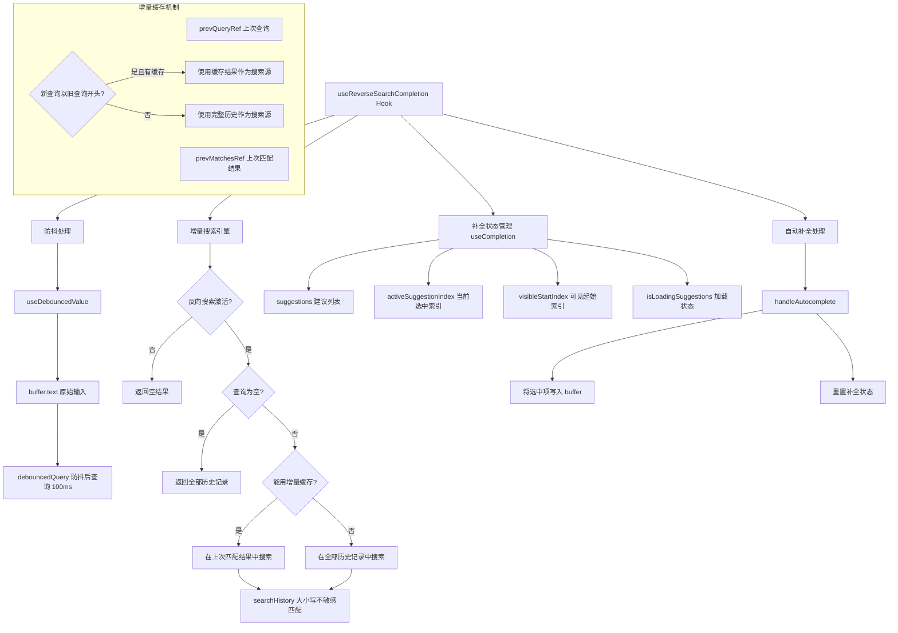

# useReverseSearchCompletion.tsx

## 概述

`useReverseSearchCompletion` 是一个 React 自定义 Hook，实现了类似 Bash/Zsh 中 **Ctrl+R 反向搜索历史命令**的功能。它允许用户在输入缓冲区中输入关键词，从命令历史记录中实时搜索匹配的条目，并以建议列表的形式展示。

核心特性包括：
- **增量搜索优化**：当新查询是旧查询的超集时（如 `git` -> `git co`），仅在上一次匹配结果中搜索，大幅减少搜索范围；
- **防抖搜索**：使用 100ms 的防抖延迟，避免频繁搜索导致的性能问题；
- **大小写不敏感匹配**：搜索时忽略大小写差异；
- **匹配位置高亮支持**：返回匹配字符的起始索引，便于 UI 高亮显示匹配部分；
- **键盘导航**：支持上下键在搜索结果中导航；
- **自动补全**：选中条目后自动填充到输入缓冲区。

## 架构图（Mermaid）



## 核心组件

### 1. 内部工具函数 `useDebouncedValue<T>`

```typescript
function useDebouncedValue<T>(value: T, delay = 200): T
```

一个泛型防抖 Hook，延迟更新值。当 `value` 持续变化时，只有在最后一次变化后等待 `delay` 毫秒后才会更新返回值。

| 参数 | 类型 | 默认值 | 说明 |
|------|------|--------|------|
| `value` | `T` | - | 需要防抖的值 |
| `delay` | `number` | `200` | 防抖延迟（毫秒） |

在本 Hook 中以 100ms 延迟用于 `buffer.text`，避免用户快速输入时频繁触发搜索。

### 2. 接口 `UseReverseSearchCompletionReturn`

Hook 的返回类型：

| 字段 | 类型 | 说明 |
|------|------|------|
| `suggestions` | `Suggestion[]` | 匹配的历史命令建议列表 |
| `activeSuggestionIndex` | `number` | 当前选中的建议索引（-1 表示无选中） |
| `visibleStartIndex` | `number` | 可见区域的起始索引（用于虚拟滚动） |
| `showSuggestions` | `boolean` | 是否显示建议列表 |
| `isLoadingSuggestions` | `boolean` | 是否正在加载建议 |
| `navigateUp` | `() => void` | 上键导航函数 |
| `navigateDown` | `() => void` | 下键导航函数 |
| `handleAutocomplete` | `(i: number) => void` | 选中第 i 项建议并自动补全 |
| `resetCompletionState` | `() => void` | 重置补全状态 |

### 3. 输入参数

| 参数 | 类型 | 说明 |
|------|------|------|
| `buffer` | `TextBuffer` | 用户输入的文本缓冲区 |
| `history` | `readonly string[]` | 命令历史记录数组 |
| `reverseSearchActive` | `boolean` | 反向搜索是否处于激活状态 |

### 4. 搜索引擎 `searchHistory`

```typescript
const searchHistory = useCallback(
  (query: string, items: readonly string[]) => {
    const out: Suggestion[] = [];
    for (let i = 0; i < items.length; i++) {
      const cmd = items[i];
      const idx = cmd.toLowerCase().indexOf(query);
      if (idx !== -1) {
        out.push({ label: cmd, value: cmd, matchedIndex: idx });
      }
    }
    return out;
  },
  [],
);
```

核心搜索函数，遍历给定列表，进行大小写不敏感的子字符串匹配，返回匹配的 `Suggestion` 数组。每个匹配项包含：
- `label`：显示文本（原始命令）
- `value`：补全值（原始命令）
- `matchedIndex`：匹配子串在命令中的起始位置（用于 UI 高亮）

### 5. 自动补全处理 `handleAutocomplete`

```typescript
const handleAutocomplete = useCallback(
  (i: number) => {
    if (i < 0 || i >= suggestions.length) return;
    buffer.setText(suggestions[i].value);
    resetCompletionState();
  },
  [buffer, suggestions, resetCompletionState],
);
```

将选中的建议项的值写入文本缓冲区，并重置补全状态。包含边界检查以防止越界访问。

## 依赖关系

### 内部依赖

| 模块 | 导入内容 | 用途 |
|------|----------|------|
| `./useCompletion.js` | `useCompletion` | 基础补全状态管理 Hook，提供建议列表、选中索引、导航等能力 |
| `../components/shared/text-buffer.js` | `TextBuffer` (类型) | 文本缓冲区类型，代表用户输入区域 |
| `../components/SuggestionsDisplay.js` | `Suggestion` (类型) | 建议项接口类型 |

### 外部依赖

| 包 | 导入内容 | 用途 |
|----|----------|------|
| `react` | `useState`, `useEffect`, `useMemo`, `useCallback`, `useRef` | React Hooks 基础设施 |

## 关键实现细节

### 1. 增量搜索优化（Incremental Search）

这是该 Hook 最重要的性能优化策略：

```typescript
const prevQueryRef = useRef<string>('');
const prevMatchesRef = useRef<Suggestion[]>([]);

// ...

const canUseCache =
  prevQueryRef.current &&
  query.startsWith(prevQueryRef.current) &&
  prevMatchesRef.current.length > 0;

const source = canUseCache
  ? prevMatchesRef.current.map((m) => m.value)
  : history;
```

**原理**：如果新查询字符串是旧查询的"前缀扩展"（例如 `git` -> `git co`），那么新查询的匹配结果一定是旧查询匹配结果的子集。因此可以只在上一次的匹配结果中搜索，而非全部历史记录。

**缓存失效条件**：
- 反向搜索重新激活时（`reverseSearchActive` 变为 true）；
- 历史记录变化时（`history` 引用改变）；
- 新查询不是旧查询的前缀扩展时。

这在历史记录很长时能显著提升搜索性能。

### 2. 防抖查询

```typescript
const debouncedQuery = useDebouncedValue(buffer.text, 100);
```

使用 100ms 防抖延迟处理 `buffer.text`。当用户快速输入时（如输入 `git commit`），不会对每个中间状态（`g`, `gi`, `git`, `git `, ...）都触发搜索，而是等用户停顿 100ms 后才执行搜索。

### 3. 空查询时显示全部历史

```typescript
if (debouncedQuery.length === 0)
  return history.map((cmd) => ({
    label: cmd,
    value: cmd,
    matchedIndex: -1,
  }));
```

当搜索框为空时，返回全部历史记录作为建议。此时 `matchedIndex` 为 -1，表示没有高亮匹配。

### 4. matches 的 useMemo 缓存

```typescript
const matches = useMemo<Suggestion[]>(() => {
  // ...搜索逻辑
}, [debouncedQuery, history, reverseSearchActive, searchHistory]);
```

使用 `useMemo` 缓存搜索结果，只有当防抖查询、历史记录、搜索激活状态或搜索函数变化时才重新计算。

### 5. 状态同步 Effect

```typescript
useEffect(() => {
  if (!reverseSearchActive) {
    resetCompletionState();
    return;
  }

  setSuggestions(matches);
  const hasAny = matches.length > 0;
  setActiveSuggestionIndex(hasAny ? 0 : -1);
  setVisibleStartIndex(0);

  prevQueryRef.current = debouncedQuery.toLowerCase();
  prevMatchesRef.current = matches;
}, [debouncedQuery, matches, reverseSearchActive, ...]);
```

当搜索结果变化时：
- 如果反向搜索未激活，重置所有补全状态；
- 否则更新建议列表，选中第一项（索引 0），重置可见区域起始位置；
- 更新增量搜索的缓存。

### 6. showSuggestions 的计算逻辑

```typescript
const showSuggestions =
  reverseSearchActive && (isLoadingSuggestions || suggestions.length > 0);
```

只有在反向搜索激活状态下，且有加载中或有匹配结果时，才显示建议列表。确保在没有匹配结果时不显示空的建议框。

### 7. 与 useCompletion 的组合

该 Hook 不自己管理补全 UI 状态，而是委托给 `useCompletion` Hook。`useCompletion` 提供了建议列表、选中索引管理、上下导航等通用补全能力，`useReverseSearchCompletion` 在此基础上添加了**历史记录搜索**这一特定的数据源逻辑。这是一个很好的关注点分离示例。
