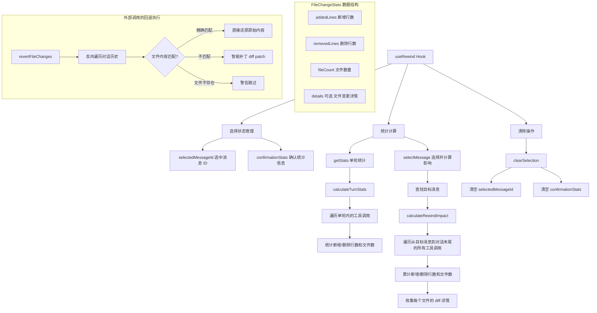

# useRewind.ts

## 概述

`useRewind` 是一个 React 自定义 Hook，为 Gemini CLI 提供**对话回退（Rewind）**功能的状态管理。它允许用户在对话过程中选择某个历史消息，查看从该消息到对话末尾的累计文件变更影响（新增/删除行数、涉及文件数），并在确认后执行回退操作。

该 Hook 的职责专注于**回退的选择与预览阶段**：
- 管理用户选中的消息 ID；
- 为每个对话轮次计算文件变更统计（单轮统计）；
- 计算从选中消息到对话末尾的累计变更影响（回退影响预览）；
- 提供清除选择的能力。

实际的文件回退操作（`revertFileChanges`）不在该 Hook 内部执行，而是由外部组件在用户确认后调用。

## 架构图（Mermaid）



## 核心组件

### 1. 输入参数

| 参数 | 类型 | 说明 |
|------|------|------|
| `conversation` | `ConversationRecord` | 完整的对话记录对象，包含所有消息 |

### 2. 状态

| 状态 | 类型 | 说明 |
|------|------|------|
| `selectedMessageId` | `string \| null` | 用户选中要回退到的消息 ID |
| `confirmationStats` | `FileChangeStats \| null` | 从选中消息到对话末尾的累计文件变更统计，用于在确认对话框中展示回退影响 |

### 3. 核心方法

#### `getStats(userMessage: MessageRecord): FileChangeStats | null`

计算**单个对话轮次**的文件变更统计。一个"轮次"定义为从给定用户消息之后开始，直到下一条用户消息之前的所有消息。

用途：在对话历史 UI 中，为每一轮对话旁边显示文件变更摘要（如 `+15 -3, 2 files`）。

#### `selectMessage(messageId: string): void`

选中一条消息并计算回退影响：
1. 在对话消息列表中查找指定 ID 的消息；
2. 如果找到，设置 `selectedMessageId`；
3. 调用 `calculateRewindImpact` 计算从该消息到对话末尾的**累计**变更统计，并存入 `confirmationStats`。

与 `getStats` 的区别：`getStats` 只计算单轮（到下一个用户消息为止），而 `selectMessage` 计算的是从选中点到对话末尾的所有变更。

#### `clearSelection(): void`

清除当前选择，将 `selectedMessageId` 和 `confirmationStats` 都重置为 `null`。

### 4. 返回值

```typescript
{
  selectedMessageId,   // 选中的消息 ID
  getStats,            // 获取单轮统计的函数
  confirmationStats,   // 回退影响的累计统计
  selectMessage,       // 选择消息并计算影响
  clearSelection,      // 清除选择
}
```

### 5. 关联数据结构 `FileChangeStats`

来自 `../utils/rewindFileOps.js`：

```typescript
interface FileChangeStats {
  addedLines: number;      // 新增的行数
  removedLines: number;    // 删除的行数
  fileCount: number;       // 涉及的文件数量
  details?: FileChangeDetail[];  // 可选：每个文件的变更详情
}

interface FileChangeDetail {
  fileName: string;  // 文件名
  diff: string;      // diff 内容
}
```

`calculateTurnStats`（单轮统计）不包含 `details` 字段，而 `calculateRewindImpact`（回退影响）包含 `details` 字段以便在确认对话框中展示每个文件的具体变更。

## 依赖关系

### 内部依赖

| 模块 | 导入内容 | 用途 |
|------|----------|------|
| `@google/gemini-cli-core` | `ConversationRecord`, `MessageRecord` (类型) | 对话记录和消息记录的类型定义 |
| `../utils/rewindFileOps.js` | `calculateTurnStats`, `calculateRewindImpact`, `FileChangeStats` (类型) | 文件变更统计计算函数。该模块还导出了 `revertFileChanges` 用于实际执行回退，但 `useRewind` 本身不调用 |

### 外部依赖

| 包 | 导入内容 | 用途 |
|----|----------|------|
| `react` | `useState`, `useCallback` | React Hooks 基础设施 |

## 关键实现细节

### 1. 单轮统计 vs 累计影响的区分

该 Hook 提供了两种不同粒度的统计：

- **`getStats`（单轮统计）**：调用 `calculateTurnStats`，只计算一个对话轮次内的变更。遍历从用户消息之后到下一个用户消息之前的所有 Gemini 消息中的工具调用。适合在对话历史列表中为每一轮显示变更摘要。

- **`selectMessage` -> `confirmationStats`（累计影响）**：调用 `calculateRewindImpact`，计算从选中消息到对话末尾的所有变更。遍历时**不会**在遇到用户消息时停止，而是一直遍历到对话末尾。适合在回退确认对话框中展示完整的回退影响。

### 2. 回退操作的关联函数 `revertFileChanges`

虽然 `useRewind` 本身不执行回退，但它密切关联的 `revertFileChanges` 函数（来自同一模块 `rewindFileOps.js`）实现了智能回退策略：

1. **反向遍历**：从对话末尾反向遍历到目标消息，确保后续的变更先被还原（类似 Git 的 revert 顺序）；
2. **精确匹配还原**：如果文件当前内容与模型修改后的内容完全一致，直接写回原始内容；
3. **智能补丁（Smart Patch）**：如果文件被用户手动修改过（内容不匹配），使用 `diff` 库生成反向补丁并应用，尝试只还原模型的修改而保留用户的修改；
4. **新文件删除**：如果原始内容为空（模型新建的文件），回退时删除该文件；
5. **错误容忍**：文件不存在、补丁失败等情况会发出警告但不中断整体回退流程。

### 3. useCallback 的依赖管理

- `getStats` 和 `selectMessage` 都依赖 `[conversation]`，因此当对话记录对象引用变化时会重新创建；
- `clearSelection` 无依赖（空数组），是完全稳定的引用。

这确保了：当对话记录更新时，统计计算能基于最新数据；同时 `clearSelection` 不会因对话变化而产生不必要的引用更新。

### 4. 简洁的状态模型

该 Hook 仅维护两个状态（`selectedMessageId` 和 `confirmationStats`），保持了最小化的状态设计：

- `selectedMessageId` 标识用户意图回退到哪条消息；
- `confirmationStats` 提供回退影响的预览数据；
- 两者通过 `selectMessage` 同步更新，通过 `clearSelection` 同步清除，始终保持一致。

### 5. 纯同步计算

`getStats` 和 `selectMessage` 中的统计计算（`calculateTurnStats` 和 `calculateRewindImpact`）都是**纯同步操作**，仅遍历内存中的对话记录数据，不涉及文件 I/O。这使得 UI 可以即时响应用户的选择操作，无需等待异步操作完成。
