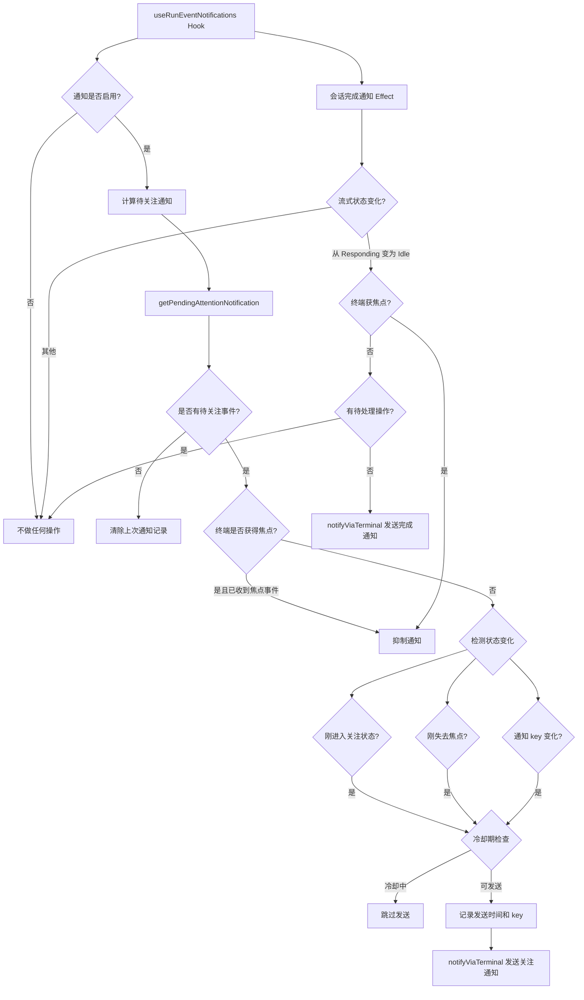

# useRunEventNotifications.ts

## 概述

`useRunEventNotifications` 是一个 React 自定义 Hook，负责在 Gemini CLI 运行过程中，当发生需要用户注意的事件（如命令确认请求、权限请求、会话完成等）时，通过终端通知机制向用户发送桌面/终端级别的通知。该 Hook 实现了智能的通知抑制逻辑，包括焦点感知（终端获得焦点时不发送通知）、冷却时间（同一通知在 20 秒内不重复发送）以及状态变化检测（仅在状态真正变化时才触发通知）。

**文件路径**: `packages/cli/src/ui/hooks/useRunEventNotifications.ts`

## 架构图（Mermaid）



## 核心组件

### 1. 接口 `RunEventNotificationParams`

Hook 接收的参数对象，定义了所有影响通知行为的状态：

| 参数名 | 类型 | 说明 |
|--------|------|------|
| `notificationsEnabled` | `boolean` | 全局通知开关 |
| `isFocused` | `boolean` | 终端当前是否获得焦点 |
| `hasReceivedFocusEvent` | `boolean` | 是否已接收过焦点事件（用于区分是否支持焦点检测） |
| `streamingState` | `StreamingState` | 当前流式传输状态（Idle / Responding 等） |
| `hasPendingActionRequired` | `boolean` | 是否有待处理的用户操作 |
| `pendingHistoryItems` | `HistoryItemWithoutId[]` | 待处理的历史记录项 |
| `commandConfirmationRequest` | `ConfirmationRequest \| null` | 命令执行确认请求 |
| `authConsentRequest` | `ConfirmationRequest \| null` | 授权同意请求 |
| `permissionConfirmationRequest` | `PermissionConfirmationRequest \| null` | 权限确认请求 |
| `hasConfirmUpdateExtensionRequests` | `boolean` | 是否有扩展更新确认请求 |
| `hasLoopDetectionConfirmationRequest` | `boolean` | 是否有循环检测确认请求 |
| `terminalName` | `string \| undefined` | 终端名称（可选） |

### 2. 常量 `ATTENTION_NOTIFICATION_COOLDOWN_MS`

- 值：`20_000`（20 秒）
- 用途：同一个通知 key 的冷却时间，防止短时间内重复发送相同通知。

### 3. Ref 状态管理

Hook 使用了 4 个 `useRef` 来追踪状态变化，避免不必要的重渲染：

| Ref | 类型 | 说明 |
|-----|------|------|
| `hadPendingAttentionRef` | `boolean` | 上一次是否有待关注事件 |
| `previousFocusedRef` | `boolean` | 上一次的焦点状态 |
| `previousStreamingStateRef` | `StreamingState` | 上一次的流式传输状态 |
| `lastSentAttentionNotificationRef` | `{ key: string; sentAt: number } \| null` | 上一次发送的关注通知的 key 和时间戳 |

### 4. 关注事件通知 Effect（第一个 `useEffect`）

这是核心逻辑，处理需要用户关注的事件通知：

**触发条件（需全部满足）**：
1. 通知功能已启用（`notificationsEnabled === true`）
2. 存在待关注事件（`pendingAttentionNotification !== null`）
3. 不被焦点抑制（终端未获得焦点，或未收到焦点事件）
4. 状态发生了变化（刚进入关注状态 / 刚失去焦点 / 通知 key 变化）
5. 不在冷却期内

**通知抑制逻辑**：
- **焦点抑制**：如果已收到焦点事件且终端当前获得焦点，则抑制通知（用户正在看终端，无需额外提醒）
- **冷却期抑制**：同一个 key 的通知在 20 秒内不会重复发送
- **状态未变化抑制**：只有状态真正变化（新进入关注状态、焦点丢失、key 变化）时才发送

### 5. 会话完成通知 Effect（第二个 `useEffect`）

处理 AI 回复完成时的通知：

**触发条件**：
1. 通知功能已启用
2. 流式状态从 `Responding` 变为 `Idle`（即刚完成一轮回复）
3. 不被焦点抑制
4. 没有待处理的操作（`hasPendingActionRequired === false`，避免与关注通知重复）

**通知内容**：发送类型为 `session_complete` 的通知，提示 "Gemini CLI finished responding."

## 依赖关系

### 内部依赖

| 依赖模块 | 导入内容 | 说明 |
|----------|----------|------|
| `../types.js` | `StreamingState`, `ConfirmationRequest`, `HistoryItemWithoutId`, `PermissionConfirmationRequest` | UI 层类型定义，包括流式状态枚举和各种确认请求类型 |
| `../utils/pendingAttentionNotification.js` | `getPendingAttentionNotification` | 工具函数，根据当前各种请求状态，计算出最需要关注的通知事件 |
| `../../utils/terminalNotifications.js` | `buildRunEventNotificationContent`, `notifyViaTerminal` | 终端通知工具函数，负责构建通知内容并通过终端 API 发送通知 |

### 外部依赖

| 依赖库 | 导入内容 | 说明 |
|--------|----------|------|
| `react` | `useEffect`, `useMemo`, `useRef` | React 核心 Hook |

## 关键实现细节

### 1. 焦点感知的两阶段设计

Hook 通过 `hasReceivedFocusEvent` 和 `isFocused` 两个参数实现了优雅的焦点感知降级：

- **已收到焦点事件**（`hasReceivedFocusEvent === true`）：说明终端支持焦点检测。此时焦点抑制完全生效，且"刚失去焦点"也会触发通知。
- **未收到焦点事件**（`hasReceivedFocusEvent === false`）：说明终端可能不支持焦点检测。此时焦点抑制不生效（因为无法判断焦点状态），且"刚失去焦点"不会作为触发条件。

```typescript
const shouldNotifyByStateChange = hasReceivedFocusEvent
  ? justEnteredAttentionState || justLostFocus || keyChanged
  : justEnteredAttentionState || keyChanged;
```

### 2. 通知去重与冷却机制

使用 `lastSentAttentionNotificationRef` 记录上次发送的通知 key 和时间戳，实现：

- **key 去重**：如果通知 key 没有变化且在冷却期内，不重复发送
- **冷却时间**：同一 key 的通知间隔至少 20 秒（`ATTENTION_NOTIFICATION_COOLDOWN_MS`）
- **自动清除**：当不再有待关注事件时，清除上次通知记录，确保下次出现同一事件时能及时通知

### 3. 异步通知发送

通知发送使用 `void` 前缀调用异步函数 `notifyViaTerminal`，表示不等待通知发送完成（fire-and-forget 模式），避免阻塞 UI 渲染。

```typescript
void notifyViaTerminal(
  notificationsEnabled,
  buildRunEventNotificationContent(pendingAttentionNotification.event),
);
```

### 4. useMemo 优化

`pendingAttentionNotification` 通过 `useMemo` 缓存计算结果，避免在依赖项未变化时重复调用 `getPendingAttentionNotification`，减少不必要的副作用触发。

### 5. 会话完成通知与关注通知的互斥

当 `hasPendingActionRequired === true` 时，会话完成通知不会发送。这是因为此时关注通知 Effect 会处理该情况，避免用户同时收到"完成"和"需要操作"两条通知。
