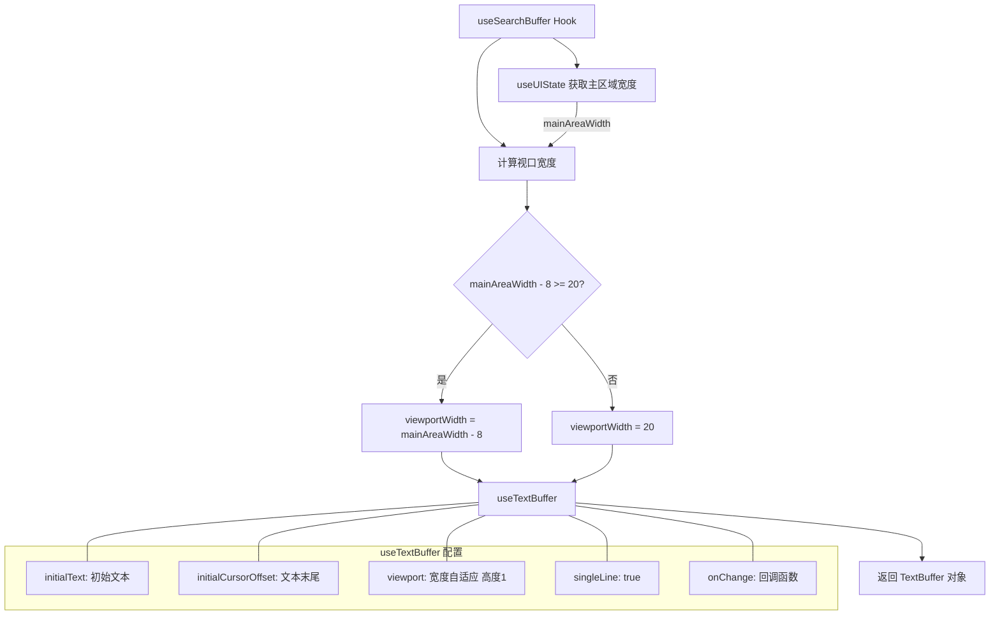

# useSearchBuffer.ts

## 概述

`useSearchBuffer` 是一个 React 自定义 Hook，为搜索输入框提供单行文本缓冲区管理功能。它封装了底层的 `useTextBuffer` Hook，并根据当前 UI 主区域宽度自动计算合适的视口宽度，确保搜索输入框能够自适应终端窗口大小。该 Hook 常用于 CLI 界面中的搜索/过滤功能，如会话浏览器中的搜索栏。

**文件路径**: `packages/cli/src/ui/hooks/useSearchBuffer.ts`

## 架构图（Mermaid）



## 核心组件

### 1. 接口 `UseSearchBufferProps`

Hook 的输入参数接口：

| 参数名 | 类型 | 默认值 | 说明 |
|--------|------|--------|------|
| `initialText` | `string` | `''` | 搜索框的初始文本内容 |
| `onChange` | `(text: string) => void` | 必填 | 文本变化时的回调函数，接收最新的文本内容 |

### 2. 常量

| 常量名 | 值 | 说明 |
|--------|-----|------|
| `MIN_VIEWPORT_WIDTH` | `20` | 视口最小宽度，确保搜索框在极窄终端下仍有最低可用宽度 |
| `VIEWPORT_WIDTH_OFFSET` | `8` | 视口宽度偏移量，为搜索框两侧的边距/装饰留出空间 |

### 3. 视口宽度计算

```typescript
const viewportWidth = Math.max(
  MIN_VIEWPORT_WIDTH,
  mainAreaWidth - VIEWPORT_WIDTH_OFFSET,
);
```

视口宽度 = `max(20, 主区域宽度 - 8)`，确保搜索输入框：
- 不会超出主区域边界（预留 8 个字符的边距）
- 在极窄终端下仍保持最小 20 个字符的可用宽度

### 4. TextBuffer 配置

通过 `useTextBuffer` 创建文本缓冲区，配置如下：
- **initialText**: 使用传入的初始文本
- **initialCursorOffset**: 光标初始位置设置在文本末尾（`initialText.length`）
- **viewport**: 宽度为计算后的 `viewportWidth`，高度固定为 `1`（单行）
- **singleLine**: `true`，限制为单行输入，不允许换行
- **onChange**: 透传外部回调，在文本变化时触发

### 5. 返回值

返回 `TextBuffer` 对象，提供完整的文本编辑能力，包括：
- 文本内容的读取与修改
- 光标位置管理
- 视口滚动控制
- 键盘输入处理

## 依赖关系

### 内部依赖

| 依赖模块 | 导入内容 | 说明 |
|----------|----------|------|
| `../components/shared/text-buffer.js` | `useTextBuffer`, `TextBuffer`（类型） | 底层文本缓冲区 Hook 和类型定义，提供完整的文本编辑和视口管理能力 |
| `../contexts/UIStateContext.js` | `useUIState` | UI 状态上下文 Hook，用于获取当前主区域的宽度（`mainAreaWidth`） |

### 外部依赖

无直接的外部依赖。底层的 `useTextBuffer` 和 `useUIState` 内部使用了 React，但本文件未直接导入 React。

## 关键实现细节

### 1. 自适应视口宽度

搜索缓冲区的视口宽度并非固定值，而是根据 `useUIState()` 返回的 `mainAreaWidth` 动态计算。当终端窗口大小发生变化时，`mainAreaWidth` 会更新，从而驱动视口宽度重新计算，保证搜索框始终适配当前终端尺寸。

### 2. 单行限制

通过 `singleLine: true` 配置，搜索缓冲区严格限制为单行输入。这意味着：
- 回车键不会插入换行符
- 粘贴的多行文本会被处理为单行
- 视口高度固定为 1

### 3. 光标初始定位

`initialCursorOffset: initialText.length` 将光标定位在初始文本的末尾，这是搜索框的常见用户体验模式 -- 用户打开搜索框时，如果有预填充文本，光标在末尾方便继续输入或直接退格修改。

### 4. 轻量封装模式

该 Hook 是一个典型的"配置封装" Hook：它不添加新的逻辑或状态，而是将底层通用 Hook（`useTextBuffer`）针对搜索场景进行预配置，简化上层组件的使用。这种模式提高了代码的可读性和复用性。
