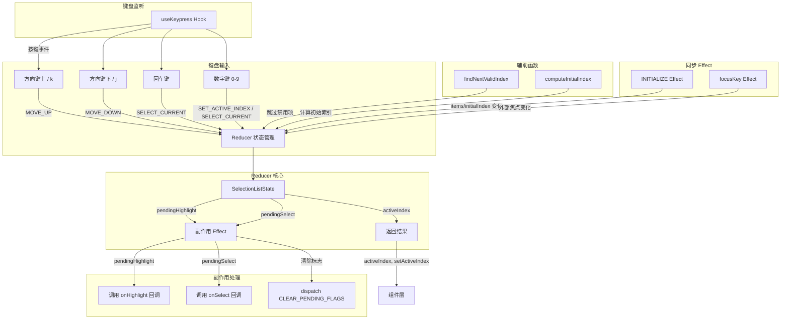

# useSelectionList.ts

## 概述

`useSelectionList` 是一个无头（headless）React 自定义 Hook，为列表选择类组件（如单选按钮组、菜单、下拉列表等）提供完整的键盘导航和选择逻辑。它支持上下方向键和 Vim 风格（j/k）导航、回车键确认选择、数字快速选择、禁用项跳过以及可选的循环导航。内部使用 `useReducer` 进行状态管理，通过 pending flag 模式实现副作用（`onSelect` / `onHighlight` 回调）与状态更新的分离。

**文件路径**: `packages/cli/src/ui/hooks/useSelectionList.ts`

## 架构图（Mermaid）



## 核心组件

### 1. 类型定义

#### `SelectionListItem<T>`（导出接口）

列表项的完整定义：

| 字段 | 类型 | 说明 |
|------|------|------|
| `key` | `string` | 唯一标识符 |
| `value` | `T` | 列表项的值（泛型） |
| `disabled` | `boolean \| undefined` | 是否禁用 |
| `hideNumber` | `boolean \| undefined` | 是否隐藏数字编号 |

#### `BaseSelectionItem`（内部接口）

精简版列表项，仅包含 Reducer 所需字段：

| 字段 | 类型 | 说明 |
|------|------|------|
| `key` | `string` | 唯一标识符 |
| `disabled` | `boolean \| undefined` | 是否禁用 |

#### `UseSelectionListOptions<T>`（导出接口）

Hook 的配置选项：

| 参数名 | 类型 | 默认值 | 说明 |
|--------|------|--------|------|
| `items` | `Array<SelectionListItem<T>>` | 必填 | 列表项数组 |
| `initialIndex` | `number` | `0` | 初始选中索引 |
| `onSelect` | `(value: T) => void` | 必填 | 选择确认回调 |
| `onHighlight` | `(value: T) => void` | 可选 | 高亮项变化回调 |
| `isFocused` | `boolean` | `true` | 是否激活键盘监听 |
| `showNumbers` | `boolean` | `false` | 是否启用数字快速选择 |
| `wrapAround` | `boolean` | `true` | 导航是否循环（末尾跳回开头） |
| `focusKey` | `string` | 可选 | 通过 key 值编程式设置焦点 |
| `priority` | `boolean` | 可选 | 键盘事件的优先级 |

#### `UseSelectionListResult`（导出接口）

Hook 的返回值：

| 字段 | 类型 | 说明 |
|------|------|------|
| `activeIndex` | `number` | 当前激活（高亮）的索引 |
| `setActiveIndex` | `(index: number) => void` | 编程式设置激活索引 |

#### `SelectionListState`（内部接口）

Reducer 管理的状态：

| 字段 | 类型 | 说明 |
|------|------|------|
| `activeIndex` | `number` | 当前激活索引 |
| `initialIndex` | `number` | 初始索引（用于检测变化） |
| `pendingHighlight` | `boolean` | 是否有待执行的高亮回调 |
| `pendingSelect` | `boolean` | 是否有待执行的选择回调 |
| `items` | `BaseSelectionItem[]` | 精简列表项（用于导航计算） |
| `wrapAround` | `boolean` | 是否循环导航 |

#### `SelectionListAction`（联合类型）

Reducer 支持的 6 种 action：

| Action 类型 | 载荷 | 说明 |
|-------------|------|------|
| `SET_ACTIVE_INDEX` | `{ index: number }` | 设置指定索引为激活项 |
| `MOVE_UP` | 无 | 向上移动高亮（跳过禁用项） |
| `MOVE_DOWN` | 无 | 向下移动高亮（跳过禁用项） |
| `SELECT_CURRENT` | 无 | 确认选择当前高亮项 |
| `INITIALIZE` | `{ initialIndex, items, wrapAround }` | 重新初始化状态 |
| `CLEAR_PENDING_FLAGS` | 无 | 清除 pending 标志 |

### 2. 常量

| 常量名 | 值 | 说明 |
|--------|-----|------|
| `NUMBER_INPUT_TIMEOUT_MS` | `1000` | 数字快速选择的输入超时时间（毫秒），超时后自动确认选择 |

### 3. 辅助函数

#### `findNextValidIndex(currentIndex, direction, items, wrapAround)`

在指定方向上查找下一个非禁用项的索引：

- **参数**: 当前索引、方向（`'up'` / `'down'`）、列表项数组、是否循环
- **逻辑**: 沿指定方向逐项查找，跳过所有 `disabled` 项
- **循环模式**: 到达边界时绕回另一端继续查找
- **非循环模式**: 到达边界时停止，返回原索引
- **全部禁用**: 如果所有项都被禁用，返回原索引

#### `computeInitialIndex(initialIndex, items, initialKey?)`

计算初始激活索引：

- 优先通过 `initialKey` 查找匹配的非禁用项
- 其次使用 `initialIndex`，如果该项被禁用则向下查找第一个可用项
- 索引越界时默认为 0

#### `areBaseItemsEqual(a, b)`

浅比较两个 `BaseSelectionItem[]` 是否相等（比较 `key` 和 `disabled` 字段），用于避免不必要的重新初始化。

#### `toBaseItems<T>(items)`

将完整的 `SelectionListItem<T>[]` 转换为精简的 `BaseSelectionItem[]`，仅保留 Reducer 所需的 `key` 和 `disabled` 字段。

### 4. `selectionListReducer`

纯函数 Reducer，处理所有状态转换逻辑：

- **SET_ACTIVE_INDEX**: 验证索引有效且已变化后更新，设置 `pendingHighlight`
- **MOVE_UP / MOVE_DOWN**: 调用 `findNextValidIndex` 查找下一个有效索引，索引变化时设置 `pendingHighlight`
- **SELECT_CURRENT**: 设置 `pendingSelect` 标志
- **INITIALIZE**: 根据新的 items 和 initialIndex 重新计算 activeIndex，尝试保持当前选中项的 key 不变
- **CLEAR_PENDING_FLAGS**: 清除 `pendingHighlight` 和 `pendingSelect`
- **default**: 使用 TypeScript 的 `never` 类型进行穷尽性检查

### 5. Hook 主体 `useSelectionList<T>`

Hook 的核心执行流程：

1. **初始化**: 使用 `useReducer` 创建状态，通过 `computeInitialIndex` 计算初始索引
2. **focusKey Effect**: 监听 `focusKey` 变化，通过 key 值编程式设置焦点
3. **同步 Effect**: 监听 `items` / `initialIndex` / `wrapAround` 变化，必要时重新初始化
4. **副作用 Effect**: 处理 `pendingHighlight` 和 `pendingSelect`，调用对应回调后清除标志
5. **清理 Effect**: 组件卸载时清理数字输入计时器
6. **键盘处理**: 通过 `useKeypress` 注册按键监听，处理方向键、回车键和数字键
7. **返回**: 暴露 `activeIndex` 和 `setActiveIndex`

## 依赖关系

### 内部依赖

| 依赖模块 | 导入内容 | 说明 |
|----------|----------|------|
| `./useKeypress.js` | `useKeypress`, `Key`（类型） | 键盘按键监听 Hook，用于注册按键处理函数 |
| `../key/keyMatchers.js` | `Command` | 命令枚举，定义了 `DIALOG_NAVIGATION_UP`、`DIALOG_NAVIGATION_DOWN`、`RETURN` 等命令标识 |
| `./useKeyMatchers.js` | `useKeyMatchers` | 键匹配器 Hook，返回命令到按键匹配函数的映射 |

### 外部依赖

| 依赖库 | 导入内容 | 说明 |
|--------|----------|------|
| `react` | `useReducer`, `useRef`, `useEffect`, `useCallback` | React 核心 Hook |
| `@google/gemini-cli-core` | `debugLogger` | 调试日志工具，用于在 Reducer 遇到未知 action 时输出警告 |

## 关键实现细节

### 1. Pending Flag 模式（状态与副作用分离）

这是该 Hook 最核心的设计模式。Reducer 本身是纯函数，不能直接调用回调。因此：

1. Reducer 在状态变化时设置 `pendingHighlight` 或 `pendingSelect` 标志
2. 一个独立的 `useEffect` 监听这些标志，在标志为 `true` 时调用对应的回调（`onHighlight` / `onSelect`）
3. 回调执行后，dispatch `CLEAR_PENDING_FLAGS` 清除标志

```typescript
// Reducer 中（纯函数）
case 'MOVE_UP': {
  return { ...state, activeIndex: newIndex, pendingHighlight: true };
}

// Effect 中（副作用）
if (state.pendingHighlight && items[state.activeIndex]) {
  onHighlight?.(items[state.activeIndex].value);
}
```

### 2. 数字快速选择（Multi-digit Number Input）

当 `showNumbers === true` 时，用户可以通过按数字键快速选择列表项：

- **1-indexed**: 数字 `1` 对应索引 `0`，`0` 无效
- **多位数字**: 支持输入多位数字（如 `12` 选择第 12 项）
- **即时确认**: 如果输入的数字不可能是更大有效数字的前缀（如列表只有 5 项时输入 `3`），立即确认选择
- **超时确认**: 如果数字可能是前缀（如列表有 30 项时输入 `1`），等待 1 秒后自动确认
- **缓冲区管理**: 使用 `numberInputRef` 缓存输入，非数字键按下时清空

```typescript
const potentialNextNumber = Number.parseInt(newNumberInput + '0', 10);
if (potentialNextNumber > itemsLength) {
  // 不可能有更多匹配，立即选择
  dispatch({ type: 'SELECT_CURRENT' });
}
```

### 3. BaseSelectionItem 优化

为避免在 `items` 数组引用变化但内容未变时触发不必要的重新初始化，Hook 将完整的 `SelectionListItem<T>` 转换为仅包含 `key` 和 `disabled` 的 `BaseSelectionItem`，并通过 `areBaseItemsEqual` 进行浅比较。这确保了只有在列表结构真正变化时才重新初始化。

### 4. 活跃项保持策略

在 `INITIALIZE` action 中，如果 `initialIndex` 没有变化，Reducer 会尝试通过当前活跃项的 `key` 在新列表中找到对应项，从而在列表内容更新时保持用户当前的选择不变。

```typescript
const activeKey =
  initialIndex === state.initialIndex
    ? state.items[state.activeIndex]?.key
    : undefined;
const targetIndex = computeInitialIndex(initialIndex, items, activeKey);
```

### 5. 禁用项导航

`findNextValidIndex` 在导航时自动跳过所有 `disabled` 项。在循环模式下，它最多遍历整个列表一次，如果所有项都被禁用则返回原索引，不会造成无限循环。

### 6. 穷尽性检查

Reducer 的 `default` 分支使用 TypeScript 的 `never` 类型进行编译时穷尽性检查，确保所有 action 类型都被处理：

```typescript
default: {
  const exhaustiveCheck: never = action;
  debugLogger.warn(`Unknown selection list action: ${exhaustiveCheck}`);
  return state;
}
```

### 7. 键盘监听的条件激活

`useKeypress` 仅在 `isFocused && itemsLength > 0` 时激活。这确保了：
- 组件未获得焦点时不会响应键盘事件
- 空列表不会注册无用的键盘监听
