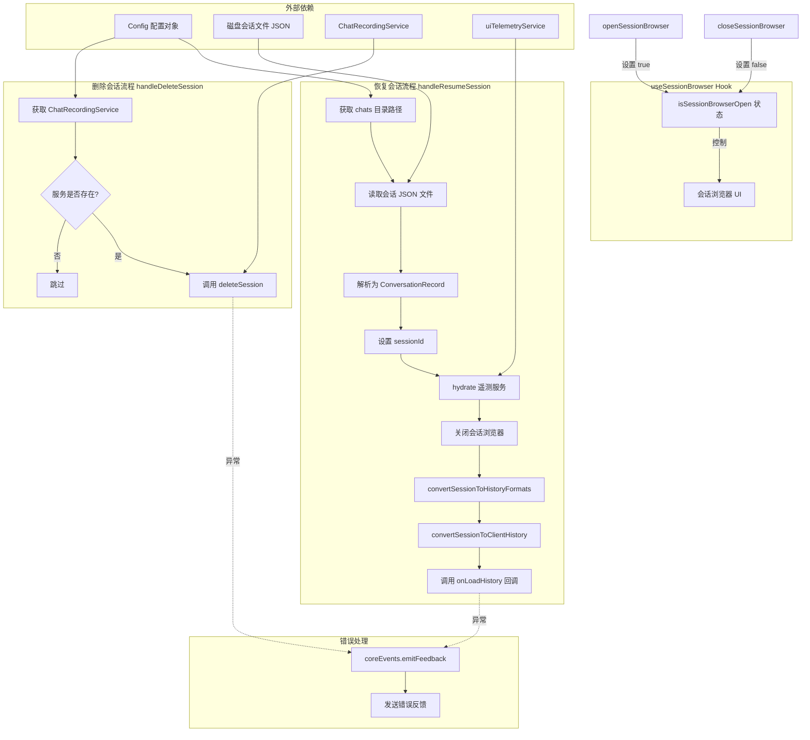

# useSessionBrowser.ts

## 概述

`useSessionBrowser` 是一个 React 自定义 Hook，提供会话浏览器的完整状态管理和操作逻辑。会话浏览器允许用户查看、恢复和删除之前的对话会话。该 Hook 管理浏览器的打开/关闭状态，并提供两个核心异步操作：恢复会话（从磁盘加载会话文件、重建会话上下文、将历史记录传递给 UI）和删除会话（通过 ChatRecordingService 删除磁盘上的会话文件）。

**文件路径**: `packages/cli/src/ui/hooks/useSessionBrowser.ts`

## 架构图（Mermaid）



## 核心组件

### 1. Hook 签名与参数

```typescript
useSessionBrowser(
  config: Config,
  onLoadHistory: (
    uiHistory: HistoryItemWithoutId[],
    clientHistory: Array<{ role: 'user' | 'model'; parts: Part[] }>,
    resumedSessionData: ResumedSessionData,
  ) => Promise<void>,
)
```

| 参数名 | 类型 | 说明 |
|--------|------|------|
| `config` | `Config` | 全局配置对象，提供存储路径、session ID 管理和 Gemini 客户端访问 |
| `onLoadHistory` | `(uiHistory, clientHistory, resumedSessionData) => Promise<void>` | 会话加载完成后的回调，接收 UI 历史记录、客户端历史记录和恢复的会话数据 |

### 2. 返回值

| 字段 | 类型 | 说明 |
|------|------|------|
| `isSessionBrowserOpen` | `boolean` | 会话浏览器是否处于打开状态 |
| `openSessionBrowser` | `() => void` | 打开会话浏览器 |
| `closeSessionBrowser` | `() => void` | 关闭会话浏览器 |
| `handleResumeSession` | `(session: SessionInfo) => Promise<void>` | 恢复指定会话 |
| `handleDeleteSession` | `(session: SessionInfo) => Promise<void>` | 删除指定会话 |

### 3. `handleResumeSession` 详细流程

恢复会话是该 Hook 最核心的功能，完整流程如下：

1. **构建文件路径**: 根据 `config.storage.getProjectTempDir()` 获取项目临时目录，拼接 `chats` 子目录和会话文件名
2. **读取会话文件**: 使用 `fs.readFile` 读取 JSON 文件，解析为 `ConversationRecord` 对象
3. **恢复 Session ID**: 从会话记录中提取 `sessionId`，通过 `config.setSessionId()` 设置为当前 session
4. **恢复遥测数据**: 调用 `uiTelemetryService.hydrate(conversation)` 重建遥测状态
5. **构建恢复数据**: 创建 `ResumedSessionData` 对象，包含会话记录和原始文件路径
6. **关闭浏览器**: 设置 `isSessionBrowserOpen = false`
7. **转换历史格式**: 调用 `convertSessionToHistoryFormats` 将消息转换为 UI 历史记录格式
8. **转换客户端历史**: 调用 `convertSessionToClientHistory` 将消息转换为 Gemini API 客户端格式
9. **通知上层**: 调用 `onLoadHistory` 回调，将所有转换后的数据传递给 UI 层

**错误处理**: 如果任何步骤失败，通过 `coreEvents.emitFeedback` 发送错误反馈，并关闭浏览器。

### 4. `handleDeleteSession` 详细流程

1. **获取录制服务**: 通过 `config.getGeminiClient()?.getChatRecordingService()` 获取 `ChatRecordingService` 实例
2. **执行删除**: 如果服务存在，调用 `chatRecordingService.deleteSession(session.file)` 删除会话文件

**注意**: `deleteSession` 接收的参数是文件基名（不含 `.json` 扩展名），而非完整的 session UUID。文件命名格式为 `session-<timestamp>-<sessionIdPrefix>.json`。

**错误处理**: 如果删除失败，通过 `coreEvents.emitFeedback` 发送错误反馈，并重新抛出错误。

### 5. 导出

除了 Hook 本身，该文件还重新导出了 `convertSessionToHistoryFormats` 函数：

```typescript
export { convertSessionToHistoryFormats };
```

## 依赖关系

### 内部依赖

| 依赖模块 | 导入内容 | 说明 |
|----------|----------|------|
| `../types.js` | `HistoryItemWithoutId`（类型） | UI 历史记录项类型（不含 ID） |
| `../../utils/sessionUtils.js` | `convertSessionToHistoryFormats`, `SessionInfo`（类型） | 会话工具函数，将会话消息转换为 UI 和客户端两种历史格式 |

### 外部依赖

| 依赖库 | 导入内容 | 说明 |
|--------|----------|------|
| `react` | `useState`, `useCallback` | React 核心 Hook |
| `node:fs/promises` | `fs`（命名空间导入） | Node.js 文件系统异步 API，用于读取会话 JSON 文件 |
| `node:path` | `path` | Node.js 路径处理工具，用于拼接文件路径 |
| `@google/gemini-cli-core` | `coreEvents`, `convertSessionToClientHistory`, `uiTelemetryService`, `Config`（类型）, `ConversationRecord`（类型）, `ResumedSessionData`（类型） | 核心包：事件系统、会话转换、遥测服务及类型定义 |
| `@google/genai` | `Part`（类型） | Google GenAI SDK 类型，表示消息中的一部分内容 |

## 关键实现细节

### 1. 会话存储结构

会话文件存储在项目临时目录下的 `chats` 子目录中：

```
<projectTempDir>/
  chats/
    session-<timestamp>-<sessionIdPrefix>.json
    session-<timestamp>-<sessionIdPrefix>.json
    ...
```

每个 JSON 文件是一个 `ConversationRecord` 对象，包含完整的会话消息和元数据。

### 2. 双格式历史记录转换

恢复会话时需要同时生成两种格式的历史记录：

- **UI 历史记录** (`HistoryItemWithoutId[]`): 用于在终端 UI 中显示对话历史，通过 `convertSessionToHistoryFormats` 生成
- **客户端历史记录** (`Array<{ role: 'user' | 'model'; parts: Part[] }>`): 用于发送给 Gemini API 以恢复对话上下文，通过 `convertSessionToClientHistory` 生成

### 3. 遥测数据恢复

调用 `uiTelemetryService.hydrate(conversation)` 确保恢复的会话能继续正确的遥测追踪，不会因为会话恢复而丢失之前的遥测上下文。

### 4. useCallback 优化

所有返回的函数都使用 `useCallback` 包装：
- `openSessionBrowser` 和 `closeSessionBrowser` 依赖列表为空（`[]`），永远不会重新创建
- `handleResumeSession` 依赖 `[config, onLoadHistory]`
- `handleDeleteSession` 依赖 `[config]`

这确保了回调的引用稳定性，避免触发不必要的子组件重渲染。

### 5. 错误处理策略差异

两个异步操作的错误处理策略不同：
- **恢复会话**: 捕获错误后发送反馈并关闭浏览器，不重新抛出（用户体验优先，避免崩溃）
- **删除会话**: 捕获错误后发送反馈并重新抛出（`throw error`），允许调用方进一步处理（如显示删除失败提示）

### 6. 可选链安全访问

获取 `ChatRecordingService` 时使用可选链：

```typescript
const chatRecordingService = config.getGeminiClient()?.getChatRecordingService();
```

这确保在 Gemini 客户端未初始化时不会抛出错误，而是静默跳过删除操作。
