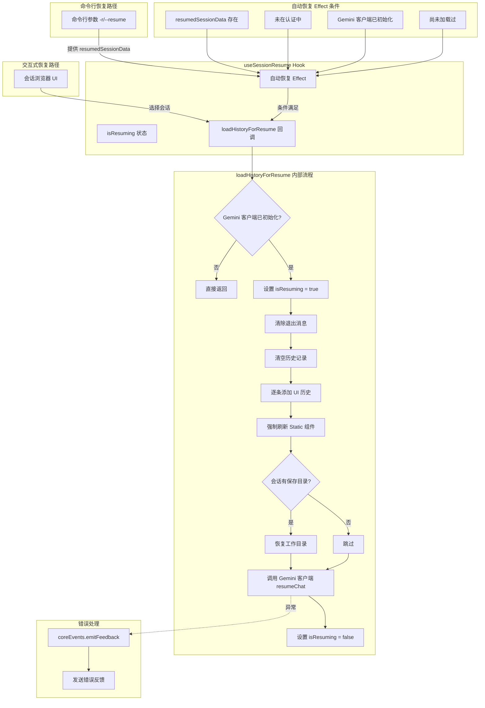

# useSessionResume.ts

## 概述

`useSessionResume` 是一个 React 自定义 Hook，负责处理会话恢复（session resume）的完整逻辑。它提供两种恢复路径：一是通过 `loadHistoryForResume` 回调函数供会话浏览器调用（交互式恢复），二是通过自动 Effect 处理命令行参数 `-r` / `--resume` 触发的恢复（非交互式恢复）。恢复过程包括清除现有历史、加载 UI 历史记录、恢复工作目录、将客户端历史传递给 Gemini API 客户端等步骤。

**文件路径**: `packages/cli/src/ui/hooks/useSessionResume.ts`

## 架构图（Mermaid）



## 核心组件

### 1. 接口 `UseSessionResumeParams`

Hook 的输入参数：

| 参数名 | 类型 | 说明 |
|--------|------|------|
| `config` | `Config` | 全局配置对象，提供 Gemini 客户端和工作空间上下文 |
| `historyManager` | `UseHistoryManagerReturn` | 历史记录管理器，提供 `clearItems` 和 `addItem` 方法 |
| `refreshStatic` | `() => void` | 强制 Static 组件重新渲染的函数 |
| `isGeminiClientInitialized` | `boolean` | Gemini 客户端是否已完成初始化 |
| `setQuittingMessages` | `(messages: null) => void` | 设置退出消息为 null（清除退出状态） |
| `resumedSessionData` | `ResumedSessionData \| undefined` | 命令行传入的待恢复会话数据（可选） |
| `isAuthenticating` | `boolean` | 是否正在进行身份认证 |

### 2. 返回值

| 字段 | 类型 | 说明 |
|------|------|------|
| `loadHistoryForResume` | `(uiHistory, clientHistory, resumedData) => Promise<void>` | 加载历史记录进行恢复的回调函数 |
| `isResuming` | `boolean` | 是否正在恢复会话中 |

### 3. `loadHistoryForResume` 回调

这是该 Hook 的核心函数，执行完整的会话恢复流程：

**参数**:

| 参数名 | 类型 | 说明 |
|--------|------|------|
| `uiHistory` | `HistoryItemWithoutId[]` | UI 格式的历史记录 |
| `clientHistory` | `Array<{ role: 'user' \| 'model'; parts: Part[] }>` | Gemini API 客户端格式的历史记录 |
| `resumedData` | `ResumedSessionData` | 恢复的会话数据，包含完整的会话记录和文件路径 |

**执行步骤**:

1. **前置检查**: 如果 Gemini 客户端未初始化，直接返回
2. **设置加载状态**: `setIsResuming(true)`
3. **清除退出消息**: 调用 `setQuittingMessages(null)` 确保不处于退出状态
4. **清空现有历史**: 调用 `historyManager.clearItems()` 清除当前 UI 中的历史
5. **加载 UI 历史**: 逐条调用 `historyManager.addItem(item, index, true)` 添加历史记录项（第三个参数 `true` 表示静默添加，不触发动画）
6. **刷新 Static 组件**: 调用 `refreshStatic()` 强制 Static 组件用新历史重新渲染
7. **恢复工作目录**: 如果会话记录中保存了目录列表（`directories`），通过 `workspaceContext.addDirectories()` 恢复这些目录
8. **恢复 Gemini 客户端**: 调用 `config.getGeminiClient()?.resumeChat(clientHistory, resumedData)` 将历史传给 API 客户端
9. **完成**: 在 `finally` 块中设置 `setIsResuming(false)`

### 4. 自动恢复 Effect

处理通过命令行 `-r` / `--resume` 参数传入的会话恢复：

**触发条件（需全部满足）**:
1. `resumedSessionData` 存在（命令行提供了待恢复会话）
2. `isAuthenticating === false`（身份认证已完成）
3. `isGeminiClientInitialized === true`（Gemini 客户端已就绪）
4. `hasLoadedResumedSession.current === false`（尚未加载过，防止重复加载）

**执行流程**:
1. 标记 `hasLoadedResumedSession.current = true`（防止重复执行）
2. 调用 `convertSessionToHistoryFormats` 转换 UI 历史
3. 调用 `convertSessionToClientHistory` 转换客户端历史
4. 调用 `loadHistoryForResume` 执行恢复（使用 `void` 前缀，fire-and-forget）

### 5. Ref 状态管理

| Ref | 类型 | 说明 |
|-----|------|------|
| `historyManagerRef` | `UseHistoryManagerReturn` | 历史管理器引用，避免将其加入 `useCallback` 依赖导致无限循环 |
| `refreshStaticRef` | `() => void` | 刷新函数引用，同样为避免依赖链无限循环 |
| `hasLoadedResumedSession` | `boolean` | 标记命令行恢复是否已执行，确保只执行一次 |

## 依赖关系

### 内部依赖

| 依赖模块 | 导入内容 | 说明 |
|----------|----------|------|
| `../types.js` | `HistoryItemWithoutId`（类型） | UI 历史记录项类型 |
| `./useHistoryManager.js` | `UseHistoryManagerReturn`（类型） | 历史记录管理器 Hook 的返回值类型 |
| `./useSessionBrowser.js` | `convertSessionToHistoryFormats` | 从 `useSessionBrowser` 重新导出的会话转换函数 |

### 外部依赖

| 依赖库 | 导入内容 | 说明 |
|--------|----------|------|
| `react` | `useCallback`, `useEffect`, `useRef`, `useState` | React 核心 Hook |
| `@google/gemini-cli-core` | `coreEvents`, `Config`（类型）, `ResumedSessionData`（类型）, `convertSessionToClientHistory` | 核心包：事件系统、配置类型、会话数据类型及客户端历史转换函数 |
| `@google/genai` | `Part`（类型） | Google GenAI SDK 类型 |

## 关键实现细节

### 1. Ref 打破依赖链避免无限循环

`historyManager` 和 `refreshStatic` 都是每次渲染可能变化的值。如果将它们直接放入 `useCallback` 的依赖列表，会导致 `loadHistoryForResume` 在每次渲染时重新创建，进而触发依赖它的 `useEffect` 重新执行，形成无限循环。

解决方案是使用 `useRef` 存储这些值，并在每次渲染时通过一个无依赖的 `useEffect` 更新 ref：

```typescript
const historyManagerRef = useRef(historyManager);
const refreshStaticRef = useRef(refreshStatic);

useEffect(() => {
  historyManagerRef.current = historyManager;
  refreshStaticRef.current = refreshStatic;
});
```

这样，`loadHistoryForResume` 内部通过 ref 访问最新值，而其 `useCallback` 依赖列表不需要包含这些频繁变化的值。

### 2. 一次性加载保护

自动恢复 Effect 使用 `hasLoadedResumedSession` ref 确保命令行恢复只执行一次：

```typescript
const hasLoadedResumedSession = useRef(false);
useEffect(() => {
  if (... && !hasLoadedResumedSession.current) {
    hasLoadedResumedSession.current = true;
    // 执行恢复
  }
}, [...]);
```

这是必要的，因为 `useEffect` 可能在依赖项变化时多次触发，而会话恢复只应执行一次。

### 3. 双路径恢复架构

该 Hook 支持两种恢复路径：

- **交互式路径**: 用户通过会话浏览器 UI 选择会话，`useSessionBrowser` 处理文件读取和格式转换后，调用 `loadHistoryForResume`
- **命令行路径**: 用户通过 `-r` / `--resume` 参数启动 CLI，`resumedSessionData` 在组件挂载时就已存在，自动 Effect 在条件满足后自动触发恢复

两条路径最终都汇聚到 `loadHistoryForResume`，确保恢复逻辑的一致性。

### 4. 等待条件成熟

自动恢复 Effect 等待三个条件同时满足才执行：
- **客户端初始化**: Gemini 客户端需要就绪才能调用 `resumeChat`
- **认证完成**: 认证过程中不应执行恢复操作
- **数据可用**: `resumedSessionData` 必须存在

这种"等待条件成熟"的模式确保了即使各个异步初始化流程的完成顺序不确定，恢复操作也能在正确的时机执行。

### 5. 工作目录恢复

恢复会话时不仅恢复对话历史，还恢复会话保存时的工作目录列表：

```typescript
if (resumedData.conversation.directories?.length > 0) {
  const workspaceContext = config.getWorkspaceContext();
  workspaceContext.addDirectories(resumedData.conversation.directories);
}
```

这确保了恢复的会话能在与之前相同的工作空间上下文中继续运行。

### 6. 静默添加历史记录

加载 UI 历史时，第三个参数为 `true`：

```typescript
historyManagerRef.current.addItem(item, index, true);
```

这个 `true` 参数表示"静默添加"，不触发通常伴随新消息添加的动画效果。这对于批量恢复历史记录是合理的，因为这些是已有的历史消息，不需要逐条动画展示。

### 7. 错误恢复策略

`loadHistoryForResume` 使用 `try...catch...finally` 结构：
- **catch**: 通过 `coreEvents.emitFeedback` 向用户展示友好错误消息
- **finally**: 无论成功还是失败，都确保 `isResuming` 被重置为 `false`，避免 UI 永远停留在"恢复中"状态
