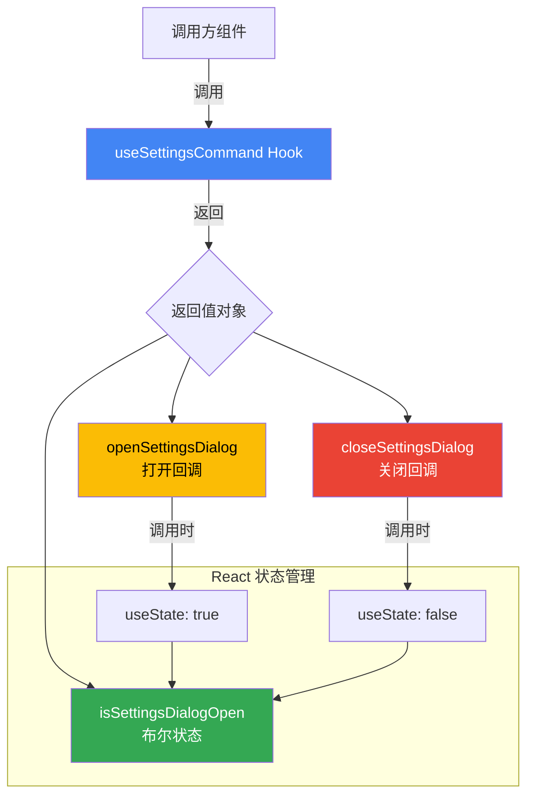

# useSettingsCommand.ts

## 概述

`useSettingsCommand` 是一个 React 自定义 Hook，用于管理设置对话框（Settings Dialog）的打开/关闭状态。它提供了一个简洁的布尔状态和两个回调函数，供 UI 组件控制设置面板的显隐。

该 Hook 属于 Gemini CLI 项目的 UI 层，位于 `packages/cli/src/ui/hooks/` 目录下，是设置功能的入口控制器。

## 架构图（Mermaid）

## 核心组件

### `useSettingsCommand()` 函数

| 返回属性 | 类型 | 说明 |
|---|---|---|
| `isSettingsDialogOpen` | `boolean` | 设置对话框当前是否处于打开状态，初始值为 `false` |
| `openSettingsDialog` | `() => void` | 使用 `useCallback` 包裹的回调函数，调用后将 `isSettingsDialogOpen` 设为 `true` |
| `closeSettingsDialog` | `() => void` | 使用 `useCallback` 包裹的回调函数，调用后将 `isSettingsDialogOpen` 设为 `false` |

### 状态管理细节

- 使用 `useState(false)` 初始化对话框关闭状态
- `openSettingsDialog` 和 `closeSettingsDialog` 均通过 `useCallback` 进行记忆化（memoization），依赖数组为空 `[]`，因此在组件整个生命周期内引用保持稳定，不会因父组件重渲染而创建新的函数实例
- 这种设计模式可以避免传递给子组件时导致不必要的重渲染

## 依赖关系

### 内部依赖

无内部依赖。该 Hook 是一个完全自包含的状态管理单元，不依赖项目中的其他模块。

### 外部依赖

| 依赖包 | 导入内容 | 用途 |
|---|---|---|
| `react` | `useState` | 管理设置对话框的布尔开关状态 |
| `react` | `useCallback` | 对打开/关闭回调函数进行记忆化，保持引用稳定性 |

## 关键实现细节

1. **极简设计模式**：该 Hook 仅管理一个布尔状态，是经典的"开关模式"（Toggle Pattern）的 React Hook 实现。将状态逻辑从 UI 组件中抽离，遵循了关注点分离原则。

2. **useCallback 优化**：两个回调函数都使用了 `useCallback` 且依赖数组为空，这意味着：
   - 函数引用在组件的整个生命周期内保持不变
   - 当这些函数作为 props 传递给使用 `React.memo` 的子组件时，不会触发子组件的不必要重渲染
   - 这是一种性能优化的最佳实践

3. **无副作用**：该 Hook 不包含任何 `useEffect`，不执行任何异步操作或 DOM 操作，是纯粹的状态管理逻辑。

4. **命名约定**：遵循 React 自定义 Hook 的 `use` 前缀命名规范，返回值的命名也遵循了 `is/open/close` 的语义化命名约定，清晰表达了每个属性的用途。
