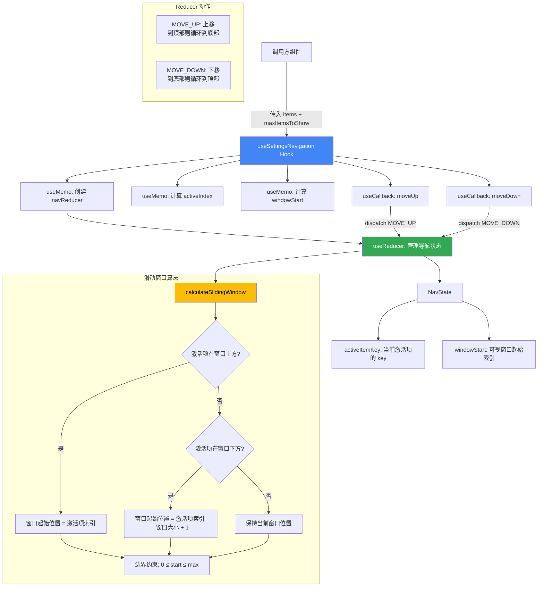

# useSettingsNavigation.ts

## 概述

`useSettingsNavigation` 是一个 React 自定义 Hook，实现了设置列表中的**键盘导航**和**滑动窗口**逻辑。它支持上下方向键在设置项之间循环移动，并在项目数量超过可视区域时自动管理"滑动窗口"，确保当前激活的项始终处于可见区域内。

该 Hook 使用了 `useReducer` 模式来管理导航状态，核心思想是将导航项列表视为一个可滚动的虚拟列表，通过 `windowStart` 控制当前可见窗口的起始位置。

## 架构图（Mermaid）

## 核心组件

### 接口与类型定义

#### `UseSettingsNavigationProps`

| 属性 | 类型 | 说明 |
|---|---|---|
| `items` | `Array<{ key: string }>` | 设置项数组，每项必须包含唯一的 `key` 字段用于标识 |
| `maxItemsToShow` | `number` | 可视窗口一次最多显示的项目数量 |

#### `NavState`

| 属性 | 类型 | 说明 |
|---|---|---|
| `activeItemKey` | `string \| null` | 当前激活（高亮）项的 key 值，若无项目则为 `null` |
| `windowStart` | `number` | 滑动窗口的起始索引，表示从第几项开始渲染可见列表 |

#### `NavAction`

| 动作类型 | 说明 |
|---|---|
| `MOVE_UP` | 向上移动激活项，到顶部时循环跳转到列表末尾 |
| `MOVE_DOWN` | 向下移动激活项，到底部时循环跳转到列表开头 |

### `calculateSlidingWindow()` 函数

**签名：** `calculateSlidingWindow(start, activeIndex, itemCount, windowSize) => number`

该函数是滑动窗口算法的核心，负责计算可视窗口的起始位置。逻辑如下：

1. **激活项在窗口上方**（`activeIndex < start`）：将窗口起始位置移动到激活项的位置
2. **激活项在窗口下方**（`activeIndex >= start + windowSize`）：将窗口下移，使激活项成为窗口中的最后一项
3. **激活项在窗口内**：保持窗口起始位置不变
4. **边界约束**：确保起始位置不小于 0，不超过 `itemCount - windowSize`

### `createNavReducer()` 工厂函数

**签名：** `createNavReducer(items, maxItemsToShow) => navReducer`

这是一个工厂函数，根据当前的 `items` 和 `maxItemsToShow` 创建一个闭包形式的 reducer 函数。使用工厂模式而非直接在 reducer 中引用外部变量，是因为 `useReducer` 不直接支持动态依赖，而通过 `useMemo` 在依赖变化时重建 reducer 可以解决这个问题。

reducer 内部逻辑：
- 若 `items` 为空数组，直接返回当前状态（无操作）
- 通过 `findIndex` 查找当前激活项在列表中的位置，若找不到则默认为索引 0
- `MOVE_UP`：索引 -1，到顶部（索引 0）时循环到末尾（`items.length - 1`）
- `MOVE_DOWN`：索引 +1，到末尾时循环到顶部（索引 0）
- 每次移动后，调用 `calculateSlidingWindow` 更新窗口起始位置

### `useSettingsNavigation()` Hook 主体

**返回值：**

| 属性 | 类型 | 说明 |
|---|---|---|
| `activeItemKey` | `string \| null` | 当前激活项的 key |
| `activeIndex` | `number` | 当前激活项在 `items` 数组中的索引，若找不到则为 0 |
| `windowStart` | `number` | 经过边界约束后的可视窗口起始索引 |
| `moveUp` | `() => void` | 向上导航的回调函数 |
| `moveDown` | `() => void` | 向下导航的回调函数 |

## 依赖关系

### 内部依赖

无内部依赖。该 Hook 是一个自包含的导航状态管理单元。

### 外部依赖

| 依赖包 | 导入内容 | 用途 |
|---|---|---|
| `react` | `useMemo` | 记忆化 reducer 函数、activeIndex 和 windowStart 的计算结果 |
| `react` | `useReducer` | 管理导航状态（activeItemKey + windowStart） |
| `react` | `useCallback` | 记忆化 moveUp / moveDown 回调函数 |

## 关键实现细节

1. **循环导航**：上下方向键到达列表边界时会循环到另一端，提供了流畅的用户体验。当在第一项按上键时跳到最后一项，在最后一项按下键时跳到第一项。

2. **滑动窗口机制**：当列表项数超过 `maxItemsToShow` 时，不会一次性渲染所有项目，而是通过 `windowStart` 确定当前可见的子集。这类似于虚拟滚动的简化版本，适合终端 UI 中的有限显示空间。

3. **Reducer 工厂模式**：`createNavReducer` 通过闭包捕获 `items` 和 `maxItemsToShow`，然后通过 `useMemo` 在依赖变化时重建 reducer。这是解决 `useReducer` 无法直接感知外部依赖变化的经典模式。

4. **搜索/终端调整适配**：代码注释和实现表明，当列表项因搜索过滤或终端窗口大小调整而变化时（`items` 引用变化），Hook 会重新计算 `activeIndex` 和 `windowStart`，确保高亮位置和窗口位置的正确性。具体表现为：
   - `activeIndex` 通过 `useMemo` 依赖 `items` 重新计算，如果之前的 `activeItemKey` 在新列表中找不到，则回退到索引 0
   - `windowStart` 同样通过 `useMemo` 重新计算，使用 `calculateSlidingWindow` 确保边界正确

5. **边界安全**：`calculateSlidingWindow` 函数最后通过 `Math.max(0, Math.min(start, maxScroll))` 双重约束，确保窗口起始位置始终在合法范围内，不会出现负数或超出列表长度的情况。

6. **初始状态**：初始时，`activeItemKey` 设为列表第一项的 key（若列表为空则为 `null`），`windowStart` 为 0，即从列表顶部开始显示。
