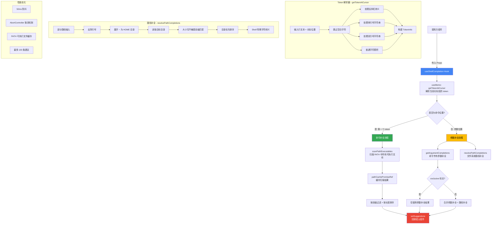

# useShellCompletion.ts

## 概述

`useShellCompletion` 是一个功能丰富的 React 自定义 Hook，为 Gemini CLI 的 Shell 输入提供**智能自动补全**功能。它实现了类似 Bash/Zsh 终端中 Tab 补全的体验，包括：

- **命令补全**：在命令位置（行首第一个 token）时，扫描系统 `$PATH` 目录中的所有可执行文件进行匹配
- **路径补全**：在参数位置时，根据用户输入的路径前缀读取文件系统，提供文件和目录的补全建议
- **参数补全**：针对特定命令（如 `git`、`cd` 等），通过插件式的参数补全系统提供专有建议
- **Shell 语法解析**：支持单引号、双引号、反斜杠转义等 Shell 语法的 token 解析

该模块还包含多个导出的辅助函数（`escapeShellPath`、`getTokenAtCursor`、`scanPathExecutables`、`resolvePathCompletions`），可独立使用。

## 架构图（Mermaid）

## 核心组件

### 常量

| 常量名 | 值 | 说明 |
|---|---|---|
| `MAX_SHELL_SUGGESTIONS` | `100` | 单次返回的最大建议数量，避免 React Ink UI 冻结 |
| `FS_COMPLETION_DEBOUNCE_MS` | `50` | 文件系统补全的防抖间隔（毫秒） |
| `UNIX_SHELL_SPECIAL_CHARS` | 正则表达式 | 需要在 Unix 系统上进行反斜杠转义的 Shell 元字符集合 |

### `escapeShellPath(segment: string): string`

对路径中的 Shell 特殊字符进行转义：
- **Windows 平台**：直接返回原始路径（`cmd.exe` 不使用反斜杠转义，`\` 是路径分隔符）
- **Unix 平台**：用 `\` 转义空格、括号、引号、管道符、通配符等元字符

### `TokenInfo` 接口

| 属性 | 类型 | 说明 |
|---|---|---|
| `token` | `string` | 原始 token 文本（去除引号但保留内部转义） |
| `start` | `number` | token 在原始行中的起始偏移量 |
| `end` | `number` | token 在原始行中的结束偏移量（不包含） |
| `isFirstToken` | `boolean` | 是否为第一个 token（命令位置） |
| `tokens` | `string[]` | 完整的 token 列表 |
| `cursorIndex` | `number` | 光标所在 token 在列表中的索引 |
| `commandToken` | `string` | 命令 token（始终为 `tokens[0]`，若为空则为空字符串） |

### `getTokenAtCursor(line: string, cursorCol: number): TokenInfo | null`

Shell 语法感知的 token 解析器，核心逻辑：

1. **词法分析阶段**：遍历输入行，按 Shell 语法规则切分 token
   - 空白字符（空格、制表符）作为 token 分隔符
   - `\` 转义下一个字符（字面量处理）
   - 单引号 `'...'` 内的内容原样保留（不支持转义）
   - 双引号 `"..."` 内支持 `\` 转义
2. **光标定位阶段**：遍历所有 token，找到包含或紧邻光标位置的 token
3. **空白处理**：若光标处于空白区域，则在对应位置插入一个空 token

### `scanPathExecutables(signal?: AbortSignal): Promise<string[]>`

扫描系统 `$PATH` 环境变量中的所有可执行文件：

1. 将 `$PATH` 按分隔符拆分为目录列表
2. **Windows 特殊处理**：
   - 添加 Windows shell 内置命令（`cd`、`dir`、`echo` 等共 40+ 个）
   - 根据 `PATHEXT` 环境变量过滤可执行文件扩展名
3. 并行读取所有目录下的文件条目
4. 检查文件的可执行权限（`R_OK | X_OK`）
5. 使用 `Set` 去重（同名命令取 PATH 中靠前的）
6. 最终按字母顺序排序
7. 支持 `AbortSignal` 提前取消

### `resolvePathCompletions(partial: string, cwd: string, signal?: AbortSignal): Promise<Suggestion[]>`

根据部分路径输入，提供文件/目录补全建议：

1. **输入清理**：去除首尾引号、将 `\` 统一为 `/`
2. **波浪号展开**：`~` 和 `~/` 展开为用户主目录
3. **目录检测**：判断用户输入的是目录路径（以 `/` 结尾）还是文件名前缀
4. **目录读取**：异步读取目标目录的条目
5. **过滤规则**：
   - 隐藏以 `.` 开头的文件，除非用户输入也以 `.` 开头
   - 大小写不敏感的前缀匹配
6. **补全值构建**：保留用户输入的路径格式，目录追加 `/` 后缀
7. **波浪号恢复**：如果之前展开了 `~`，将结果中的绝对路径还原为 `~/` 格式
8. **Shell 转义**：对补全值进行 Shell 特殊字符转义
9. **排序**：目录优先，同类按字母顺序
10. **限制**：最多返回 `MAX_SHELL_SUGGESTIONS` 条

### `UseShellCompletionProps` 接口

| 属性 | 类型 | 说明 |
|---|---|---|
| `enabled` | `boolean` | 是否启用 Shell 补全功能 |
| `line` | `string` | 当前输入行文本 |
| `cursorCol` | `number` | 当前光标列位置 |
| `cwd` | `string` | 当前工作目录，用于路径解析 |
| `setSuggestions` | `(suggestions: Suggestion[]) => void` | 向父组件设置建议列表的回调 |
| `setIsLoadingSuggestions` | `(isLoading: boolean) => void` | 向父组件设置加载状态的回调 |

### `UseShellCompletionReturn` 接口

| 属性 | 类型 | 说明 |
|---|---|---|
| `completionStart` | `number` | 当前补全 token 在行中的起始位置 |
| `completionEnd` | `number` | 当前补全 token 在行中的结束位置 |
| `query` | `string` | 当前补全的查询字符串（token 文本） |
| `activeStart` | `number` | 当前活跃补全的起始位置，用于检测 token 范围变化 |

### `useShellCompletion()` Hook 主体

核心流程：

1. **Token 解析**（`useMemo`）：每当 `line` 或 `cursorCol` 变化时，调用 `getTokenAtCursor` 解析当前光标处的 token
2. **闪烁防护**：如果 token 范围发生变化（`completionStart !== activeStart`），立即清除旧建议，避免显示过期数据
3. **PATH 缓存失效**（`useEffect`）：监控 `$PATH` 环境变量变化，变化时清除可执行文件缓存
4. **补全执行**（`performCompletion` 回调）：
   - 跳过以 `-` 开头的 flag 参数
   - 取消之前的进行中请求（`AbortController`）
   - 命令位置：懒加载并缓存 PATH 可执行文件列表，前缀过滤 + 长度优先排序
   - 参数位置：先尝试命令专有补全（`getArgumentCompletions`），若非独占则合并路径补全
5. **防抖触发**（`useEffect`）：50ms 防抖后触发 `performCompletion`
6. **禁用处理**（`useEffect`）：当 `enabled` 变为 `false` 时，取消进行中的请求并清除建议
7. **卸载清理**（`useEffect`）：组件卸载时取消请求并清除定时器

## 依赖关系

### 内部依赖

| 模块路径 | 导入内容 | 用途 |
|---|---|---|
| `../components/SuggestionsDisplay.js` | `Suggestion` 类型 | 建议项的类型定义（label、value、description） |
| `@google/gemini-cli-core` | `debugLogger` | 补全失败时的日志记录 |
| `./shell-completions/index.js` | `getArgumentCompletions` | 命令专有参数补全（如 git 子命令补全） |

### 外部依赖

| 依赖包 | 导入内容 | 用途 |
|---|---|---|
| `react` | `useEffect` | 管理副作用（防抖、PATH 缓存失效、禁用清理、卸载清理） |
| `react` | `useRef` | 保存 PATH 缓存 Promise、上次 PATH 值、AbortController、防抖定时器 |
| `react` | `useCallback` | 记忆化 `performCompletion` 回调 |
| `react` | `useMemo` | 记忆化 token 解析结果 |
| `react` | `useState` | 管理 `activeStart` 状态 |
| `node:fs/promises` | `readdir`, `access`, `constants` | 文件系统操作（目录读取、权限检查） |
| `node:path` | `join`, `resolve`, `dirname`, `basename`, `extname`, `delimiter`, `sep` | 路径处理 |
| `node:os` | `homedir` | 获取用户主目录（波浪号展开） |

## 关键实现细节

1. **PATH 可执行文件缓存策略**：`scanPathExecutables` 的结果通过 `pathCachePromiseRef`（一个 `useRef`）缓存。注意缓存的是 **Promise** 本身，而非解析后的数组。这意味着：
   - 多个并发请求共享同一个 Promise，避免重复扫描
   - 即使当前补全请求被 abort，缓存仍然继续填充（故意不传 signal 给 `scanPathExecutables`）
   - 当 `$PATH` 环境变量变化时，缓存被设为 `null`，下次访问时重新扫描

2. **AbortController 取消机制**：每次触发新的补全时，先 abort 上一次的请求。所有异步操作（文件系统读取、PATH 扫描等）在关键节点检查 `signal.aborted`，实现优雅的取消。

3. **50ms 防抖**：使用 `setTimeout` + `useRef` 实现防抖，避免用户快速输入时频繁触发文件系统操作。50ms 是一个经验值，兼顾响应速度和性能。

4. **闪烁防护**：当用户移动到不同的 token 时（例如从 `ls` 后面的参数移到另一个位置），在 render 阶段同步清除旧建议，避免显示一帧过期的建议列表。

5. **跨平台兼容**：
   - Windows：不转义 Shell 路径（`\` 是路径分隔符）、支持 `PATHEXT` 扩展名过滤、包含 Windows shell 内置命令
   - Unix：转义 Shell 元字符、支持波浪号 `~` 展开

6. **命令专有参数补全的独占模式**：`getArgumentCompletions` 可以返回 `exclusive: true` 标志，表示仅使用命令专有补全结果，不混合路径补全。这适用于某些命令的子命令参数（如 `git checkout` 的分支名）。

7. **排序策略**：
   - 命令补全：优先短命令（常见内置命令通常较短），同长度按字母序
   - 路径补全：目录优先于文件，同类按字母序

8. **隐藏文件处理**：默认隐藏以 `.` 开头的文件/目录，只有当用户输入也以 `.` 开头时才显示，与标准 Shell 行为一致。
