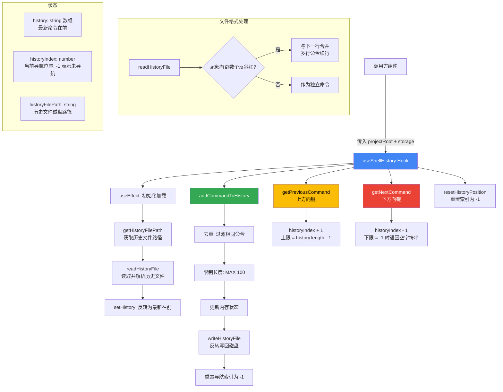

# useShellHistory.ts

## 概述

`useShellHistory` 是一个 React 自定义 Hook，为 Gemini CLI 的 Shell 模式提供**命令历史记录**管理功能。它实现了类似终端中上下方向键浏览历史命令的体验，包括：

- 从磁盘文件加载历史记录
- 将新执行的命令追加到历史记录（同时去重）
- 通过上下键导航浏览历史命令
- 将变更持久化写回磁盘文件
- 支持多行命令的读写（通过尾部反斜杠续行）

历史记录存储在项目维度的文件中，由 `@google/gemini-cli-core` 的 `Storage` 类管理路径。

## 架构图（Mermaid）

## 核心组件

### 常量

| 常量名 | 值 | 说明 |
|---|---|---|
| `MAX_HISTORY_LENGTH` | `100` | 历史记录最大保存条数 |

### `UseShellHistoryReturn` 接口

| 属性 | 类型 | 说明 |
|---|---|---|
| `history` | `string[]` | 完整的历史命令列表（最新在前） |
| `addCommandToHistory` | `(command: string) => void` | 将新命令添加到历史记录 |
| `getPreviousCommand` | `() => string \| null` | 获取上一条历史命令（上方向键） |
| `getNextCommand` | `() => string \| null` | 获取下一条历史命令（下方向键） |
| `resetHistoryPosition` | `() => void` | 重置导航位置到初始状态 |

### `getHistoryFilePath(projectRoot: string, configStorage?: Storage): Promise<string>`

获取历史文件的磁盘路径：
- 使用传入的 `Storage` 实例或根据 `projectRoot` 创建新实例
- 调用 `storage.initialize()` 确保存储目录已创建
- 返回 `storage.getHistoryFilePath()` 提供的路径

### `readHistoryFile(filePath: string): Promise<string[]>`

读取并解析历史文件：
- 按行分割文件内容（支持 `\n` 和 `\r\n`）
- 跳过空行
- **多行命令处理**：如果一行末尾有奇数个反斜杠 `\`，则该行与下一行合并（将末尾的 `\` 替换为空格 + 下一行内容）。偶数个反斜杠是转义的反斜杠本身，不算续行符
- 文件不存在（`ENOENT`）时返回空数组
- 其他错误记录日志并返回空数组

### `writeHistoryFile(filePath: string, history: string[]): Promise<void>`

将历史记录写入磁盘：
- 自动创建目录结构（`mkdir -p`）
- 将数组用换行符连接后写入文件
- 写入错误时仅记录日志，不抛出异常

### `useShellHistory()` Hook 主体

**参数：**

| 参数 | 类型 | 说明 |
|---|---|---|
| `projectRoot` | `string` | 项目根目录路径 |
| `storage` | `Storage \| undefined` | 可选的 Storage 实例，用于获取历史文件路径 |

**内部状态：**

| 状态 | 类型 | 初始值 | 说明 |
|---|---|---|---|
| `history` | `string[]` | `[]` | 历史命令列表，最新在前 |
| `historyIndex` | `number` | `-1` | 当前导航位置。`-1` 表示未处于导航模式 |
| `historyFilePath` | `string \| null` | `null` | 历史文件的磁盘路径 |

**核心逻辑：**

1. **初始化加载**（`useEffect`）：组件挂载时异步获取历史文件路径、读取文件内容，并将读取结果反转（文件中最旧在前 -> 内存中最新在前）
2. **addCommandToHistory**：
   - 忽略空白命令和历史文件路径未就绪的情况
   - 将新命令放在数组最前面，同时过滤掉与新命令相同的旧条目（去重）
   - 截取前 `MAX_HISTORY_LENGTH` 条
   - 写入磁盘时再次反转（恢复最旧在前的文件格式）
   - 重置导航索引为 `-1`
3. **getPreviousCommand**（上方向键）：索引 +1，上限为 `history.length - 1`，返回对应命令
4. **getNextCommand**（下方向键）：索引 -1，当索引降为 -1 时返回空字符串（表示回到空输入行）
5. **resetHistoryPosition**：将索引重置为 -1

## 依赖关系

### 内部依赖

| 模块路径 | 导入内容 | 用途 |
|---|---|---|
| `@google/gemini-cli-core` | `debugLogger` | 文件操作错误时记录日志 |
| `@google/gemini-cli-core` | `isNodeError` | 类型安全地检查 Node.js 错误码（如 `ENOENT`） |
| `@google/gemini-cli-core` | `Storage` | 管理项目级配置/历史文件路径 |

### 外部依赖

| 依赖包 | 导入内容 | 用途 |
|---|---|---|
| `react` | `useState` | 管理 history、historyIndex、historyFilePath 三个状态 |
| `react` | `useEffect` | 组件挂载时异步加载历史文件 |
| `react` | `useCallback` | 记忆化 addCommandToHistory、getPreviousCommand、getNextCommand、resetHistoryPosition |
| `node:fs/promises` | `readFile`, `writeFile`, `mkdir` | 历史文件的读写和目录创建 |
| `node:path` | `dirname` | 获取历史文件的父目录（用于 mkdir） |

## 关键实现细节

1. **内存与磁盘的排列顺序相反**：
   - 内存中（`history` 状态数组）：**最新在前**（`[newest, ..., oldest]`），方便上方向键按索引 +1 递增来获取更旧的命令
   - 磁盘文件中：**最旧在前**（按时间顺序追加），方便人类阅读和 `tail` 查看最新记录
   - 读取时 `.reverse()`，写入时再 `.reverse()`

2. **去重策略**：`addCommandToHistory` 中通过 `history.filter(c => c !== command)` 移除与新命令完全相同的旧条目，然后将新命令放在最前面。这意味着重复执行同一条命令不会占用多个历史槽位，且总是将其提升到最近位置。

3. **多行命令续行解析**：`readHistoryFile` 支持 Shell 风格的多行命令。当一行末尾有奇数个 `\` 时，视为续行标记，将当前行和下一行合并。偶数个 `\` 意味着反斜杠被转义（`\\` 是字面量 `\`），不触发续行。

4. **导航索引语义**：
   - `-1`：未处于历史导航模式（当前输入行为空或用户自行输入的内容）
   - `0`：最近一条历史命令
   - `history.length - 1`：最旧的一条历史命令
   - `getNextCommand` 返回 `''`（空字符串）而非 `null` 当索引回到 -1 时，这允许调用方区分"没有更多历史了"（`null`）和"回到空输入行"（`''`）

5. **异步写入不阻塞 UI**：`writeHistoryFile` 是一个 fire-and-forget 的异步操作（通过 eslint-disable 注释抑制了 floating promise 警告），确保写入磁盘不会阻塞用户交互。

6. **错误容忍**：文件操作失败时仅记录日志，不影响 UI 功能。历史文件不存在时优雅返回空数组而非报错。
