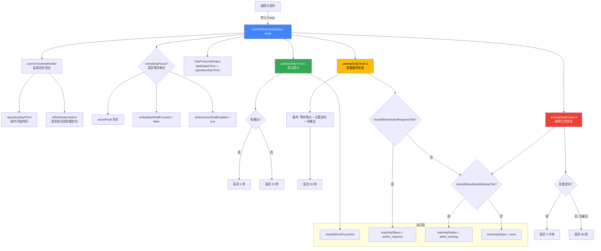

# useShellInactivityStatus.ts

## 概述

`useShellInactivityStatus` 是一个 React 自定义 Hook，负责**集中管理 Shell 模式下的所有不活跃状态检测**。当嵌入式 Shell 正在运行但用户长时间未交互时，该 Hook 会根据不同的时间阈值和条件触发不同级别的提示状态，帮助用户注意到需要关注或操作的终端窗口。

它整合了三种不活跃检测场景：
1. **焦点提示**（Focus Hint）：提示用户按 Tab 键聚焦到嵌入式终端
2. **需要操作状态**（Action Required）：终端窗口标题显示手掌图标，表示可能有提示等待输入
3. **静默工作状态**（Silent Working）：终端窗口标题显示计时器图标，表示命令正在静默运行

该 Hook 是对多个底层 Hook（`useInactivityTimer`、`useTurnActivityMonitor`）的编排层，集中了时间启发式逻辑和重定向抑制逻辑。

## 架构图（Mermaid）



## 核心组件

### `ShellInactivityStatusProps` 接口（输入参数）

| 属性 | 类型 | 说明 |
|---|---|---|
| `activePtyId` | `number \| string \| null \| undefined` | 当前活跃的 PTY（伪终端）标识，有值表示 Shell 正在运行 |
| `lastOutputTime` | `number` | 终端最后一次产生输出的时间戳（毫秒） |
| `streamingState` | `StreamingState` | 当前的流式传输状态（如是否正在接收 AI 响应） |
| `pendingToolCalls` | `TrackedToolCall[]` | 待处理的工具调用列表 |
| `embeddedShellFocused` | `boolean` | 嵌入式 Shell 是否已获得焦点 |
| `isInteractiveShellEnabled` | `boolean` | 交互式 Shell 功能是否启用 |

### `InactivityStatus` 类型

```typescript
type InactivityStatus = 'none' | 'action_required' | 'silent_working';
```

| 值 | 含义 | 对应场景 |
|---|---|---|
| `'none'` | 无不活跃状态 | 一切正常，无需额外提示 |
| `'action_required'` | 需要用户操作 | 终端可能显示了交互提示（如密码输入），等待用户响应 |
| `'silent_working'` | 静默工作中 | 命令正在后台运行，无输出（如 `sleep 600`）或输出被重定向 |

### `ShellInactivityStatus` 接口（返回值）

| 属性 | 类型 | 说明 |
|---|---|---|
| `shouldShowFocusHint` | `boolean` | 是否应显示"按 Tab 聚焦"提示 |
| `inactivityStatus` | `InactivityStatus` | 当前的不活跃状态级别 |

### Hook 主体逻辑

#### 1. 回合活动监控

通过 `useTurnActivityMonitor` 获取：
- `operationStartTime`：当前操作的开始时间戳
- `isRedirectionActive`：是否有活跃的输出重定向（如 `command > file`）

#### 2. 焦点等待判断

```typescript
const isAwaitingFocus = !!activePtyId && !embeddedShellFocused && isInteractiveShellEnabled;
```

只有同时满足以下三个条件时，才认为"正在等待焦点"：
- 存在活跃的 PTY（Shell 正在运行）
- 嵌入式 Shell 未获得焦点
- 交互式 Shell 功能已启用

#### 3. 输出检测

```typescript
const hasProducedOutput = lastOutputTime > operationStartTime;
```

通过比较最后输出时间和操作开始时间，判断当前操作是否已经产生过输出。

#### 4. 三级不活跃检测

**焦点提示（Focus Hint）：**
- 启用条件：`isAwaitingFocus && !isRedirectionActive`
- 延迟：有输出时 `SHELL_FOCUS_HINT_DELAY_MS`（约 5 秒），无输出时 4 倍（约 20 秒）
- 被重定向抑制：输出被重定向时不显示

**需要操作（Action Required）：**
- 启用条件：`isAwaitingFocus && !isRedirectionActive && hasProducedOutput`
- 延迟：`SHELL_ACTION_REQUIRED_TITLE_DELAY_MS`（约 30 秒）
- 仅在有输出时触发（有输出 + 长时间无新输出 = 可能在等待用户输入）
- 被重定向抑制

**静默工作（Silent Working）：**
- 启用条件：`isAwaitingFocus && (isRedirectionActive || !hasProducedOutput)`
- 延迟：重定向时 `SHELL_SILENT_WORKING_TITLE_DELAY_MS`（约 2 分钟），非重定向无输出时 `SHELL_ACTION_REQUIRED_TITLE_DELAY_MS * 2`（约 60 秒）
- 覆盖两种场景：输出被重定向、命令从未产生输出

#### 5. 状态优先级

`action_required` 优先于 `silent_working`。两者都不满足时为 `none`。

## 依赖关系

### 内部依赖

| 模块路径 | 导入内容 | 用途 |
|---|---|---|
| `./useInactivityTimer.js` | `useInactivityTimer` | 通用的不活跃定时器 Hook，给定条件和延迟后返回是否已超时 |
| `./useTurnActivityMonitor.js` | `useTurnActivityMonitor` | 监控当前回合的活动状态（操作开始时间、是否有重定向） |
| `../constants.js` | `SHELL_FOCUS_HINT_DELAY_MS` | 焦点提示延迟常量（约 5 秒） |
| `../constants.js` | `SHELL_ACTION_REQUIRED_TITLE_DELAY_MS` | 需要操作状态延迟常量（约 30 秒） |
| `../constants.js` | `SHELL_SILENT_WORKING_TITLE_DELAY_MS` | 静默工作状态延迟常量（约 2 分钟） |
| `../types.js` | `StreamingState` 类型 | 流式传输状态类型定义 |
| `./useToolScheduler.js` | `TrackedToolCall` 类型 | 被追踪的工具调用类型定义 |

### 外部依赖

无直接的外部依赖。该 Hook 完全通过组合内部的 `useInactivityTimer` 和 `useTurnActivityMonitor` Hook 实现功能，自身不直接导入 React 或 Node.js 模块。

## 关键实现细节

1. **编排层设计**：该 Hook 是一个"编排 Hook"（Orchestration Hook），不包含自己的 `useState` 或 `useEffect`，而是通过组合底层 Hook（`useInactivityTimer` 和 `useTurnActivityMonitor`）并传入不同的参数来派生出三种不活跃状态。这种设计使得时间启发式逻辑集中在一处，便于维护和调整。

2. **重定向抑制逻辑**：当检测到输出重定向（`isRedirectionActive`）时：
   - 焦点提示被完全抑制（条件中 `!isRedirectionActive`）
   - 需要操作状态被完全抑制（条件中 `!isRedirectionActive`）
   - 静默工作状态被启用，但延迟更长（2 分钟而非 60 秒）
   - 原因：重定向时，输出不可见，不应误判为"需要用户操作"

3. **自适应延迟策略**：焦点提示的延迟会根据是否有输出动态调整。有输出时（可能正在交互），更早提示用户聚焦（5 秒）；无输出时（可能是长时间运行的命令），延迟提示（20 秒），避免过早打扰。

4. **状态优先级设计**：`action_required` 优先于 `silent_working` 的判断逻辑意味着，如果命令先产生了输出然后长时间静默，会显示"需要操作"而非"静默工作"。这在语义上更合理——有输出后的沉默更可能是在等待用户输入。

5. **三个 `useInactivityTimer` 互不干扰**：每个定时器独立运行，有自己的启用条件、参考时间点（`lastOutputTime`）和延迟阈值。它们的激活条件是互斥或重叠的，最终通过优先级逻辑合并为单一的 `inactivityStatus`。

6. **`isAwaitingFocus` 作为前置条件**：所有三个定时器都以 `isAwaitingFocus` 为前提，确保只有在 Shell 运行中、未聚焦、且交互式功能开启时才进行不活跃检测。一旦用户聚焦了终端或 Shell 停止运行，所有检测自动停止。
