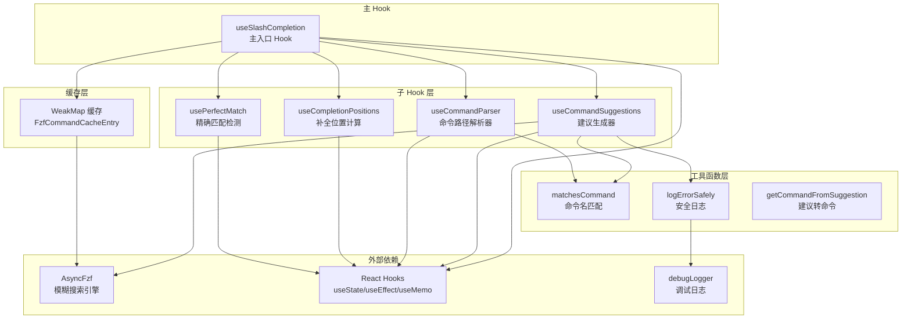
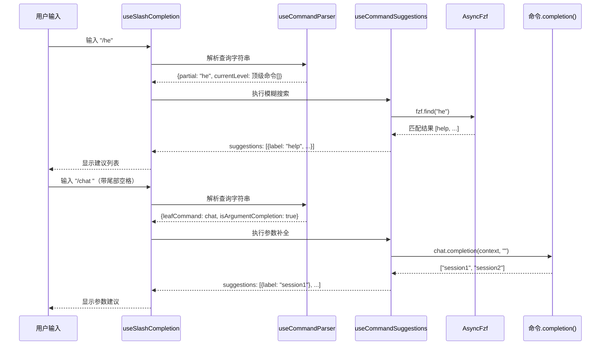

# useSlashCompletion.ts

## 概述

`useSlashCompletion` 是一个 React 自定义 Hook，负责为 Gemini CLI 的终端界面提供**斜杠命令（Slash Command）自动补全**功能。它实现了以下核心能力：

1. **命令路径解析**：将用户输入的 `/command subcommand arg` 格式字符串解析为层级化的命令路径
2. **模糊搜索**：使用 `fzf` 库对命令名进行模糊匹配，支持回退到前缀匹配
3. **参数补全**：当命令已确定、用户正在输入参数时，调用命令自身的 `completion` 函数获取参数建议
4. **精确匹配检测**：判断当前输入是否已完全匹配到某个可执行命令
5. **补全位置计算**：精确计算输入文本中需要被补全替换的起止位置

文件位于 `packages/cli/src/ui/hooks/useSlashCompletion.ts`，共约 632 行代码。

## 架构图（Mermaid）





## 核心组件

### 1. `useSlashCompletion`（主入口 Hook）

**签名：**
```typescript
export function useSlashCompletion(props: UseSlashCompletionProps): {
  completionStart: number;
  completionEnd: number;
  getCommandFromSuggestion: (suggestion: Suggestion) => SlashCommand | undefined;
  isArgumentCompletion: boolean;
  leafCommand: SlashCommand | null;
}
```

**输入属性（`UseSlashCompletionProps`）：**

| 属性 | 类型 | 说明 |
|------|------|------|
| `enabled` | `boolean` | 是否启用补全功能 |
| `query` | `string \| null` | 用户当前输入的查询字符串（以 `/` 开头） |
| `slashCommands` | `readonly SlashCommand[]` | 所有可用的顶级斜杠命令列表 |
| `commandContext` | `CommandContext` | 命令执行上下文信息 |
| `setSuggestions` | `(suggestions: Suggestion[]) => void` | 外部状态更新：设置建议列表 |
| `setIsLoadingSuggestions` | `(isLoading: boolean) => void` | 外部状态更新：设置加载状态 |
| `setIsPerfectMatch` | `(isMatch: boolean) => void` | 外部状态更新：设置精确匹配状态 |

**返回值：**

| 字段 | 类型 | 说明 |
|------|------|------|
| `completionStart` | `number` | 补全替换的起始位置索引 |
| `completionEnd` | `number` | 补全替换的结束位置索引 |
| `getCommandFromSuggestion` | 函数 | 从建议对象反查对应的 `SlashCommand` |
| `isArgumentCompletion` | `boolean` | 当前是否处于参数补全模式 |
| `leafCommand` | `SlashCommand \| null` | 当前已解析到的叶子命令 |

**核心逻辑：**
- 使用 `WeakMap` 缓存 `AsyncFzf` 实例，以命令数组引用为 key，自动随引用释放而清理
- 协调四个子 Hook 的输出，并通过 `useEffect` 同步到外部状态
- 当 `enabled` 为 `false` 时，清空所有内部和外部状态

---

### 2. `useCommandParser`（命令路径解析器）

**签名：**
```typescript
function useCommandParser(
  query: string | null,
  slashCommands: readonly SlashCommand[],
): CommandParserResult
```

**返回结构 `CommandParserResult`：**

| 字段 | 类型 | 说明 |
|------|------|------|
| `hasTrailingSpace` | `boolean` | 输入末尾是否有空格（标识用户准备输入下一个部分） |
| `commandPathParts` | `string[]` | 已确认的命令路径各段（不含正在输入的部分） |
| `partial` | `string` | 用户正在输入的不完整部分 |
| `currentLevel` | `readonly SlashCommand[] \| undefined` | 当前层级的可选子命令列表 |
| `leafCommand` | `SlashCommand \| null` | 路径中最后一个匹配成功的命令 |
| `isArgumentCompletion` | `boolean` | 是否进入参数补全模式 |

**解析算法：**
1. 去掉前导 `/`，按空白字符分割
2. 根据尾部是否有空格确定 `partial`（尾部有空格意味着用户正准备输入新部分）
3. 沿命令层级树逐段查找：每找到一个命令，进入其 `subCommands` 继续
4. 特殊处理 `MCP_PROMPT` 类型命令——遇到后立即停止层级遍历
5. 根据 `leafCommand.completion` 是否存在和输入深度判断是否进入参数补全模式

---

### 3. `useCommandSuggestions`（建议生成器）

**签名：**
```typescript
function useCommandSuggestions(
  query: string | null,
  parserResult: CommandParserResult,
  commandContext: CommandContext,
  getFzfForCommands: (commands: readonly SlashCommand[]) => FzfCommandCacheEntry | null,
  getPrefixSuggestions: (commands: readonly SlashCommand[], partial: string) => SlashCommand[],
): SuggestionsResult
```

**两种工作模式：**

**模式 A：参数补全（`isArgumentCompletion === true`）**
- 调用 `leafCommand.completion(context, argString)` 获取参数建议
- 支持 `showCompletionLoading` 控制是否显示加载状态
- 使用 `AbortController` 处理竞态条件

**模式 B：命令补全**
- `partial` 为空时：显示当前层级所有非隐藏、有描述的命令
- `partial` 非空时：
  1. 优先使用 `AsyncFzf` 进行模糊搜索
  2. 搜索失败时回退到前缀匹配（`getPrefixSuggestions`）
  3. FZF 实例创建失败时也回退到前缀匹配

**排序策略（4 级优先级）：**
1. 精确名称匹配（`name === partial`）
2. 精确别名匹配（`altNames` 中有 === partial）
3. 名称前缀匹配（`name.startsWith(partial)`）
4. 别名前缀匹配
5. 其余保持 FZF 分数排序

**特殊处理：** 当解析到 `chat` 或 `resume` 命令的顶层上下文时，自动在建议列表最前面插入一个 `list`（"Browse auto-saved chats"）的特殊建议项。

---

### 4. `useCompletionPositions`（补全位置计算器）

**签名：**
```typescript
function useCompletionPositions(
  query: string | null,
  parserResult: CommandParserResult,
): CompletionPositions
```

**位置计算规则：**

| 场景 | `start` | `end` |
|------|---------|-------|
| 无查询 | -1 | -1 |
| 尾部空格（准备输入新内容） | `query.length` | `query.length` |
| 参数补全中 | 命令路径结束后的偏移量 | `query.length` |
| 命令补全中 | `query.length - partial.length` | `query.length` |
| 仅有 `/` | 1 | `query.length` |

---

### 5. `usePerfectMatch`（精确匹配检测器）

**签名：**
```typescript
function usePerfectMatch(parserResult: CommandParserResult): PerfectMatchResult
```

**判定规则：**
- 尾部有空格 -> 非精确匹配
- `leafCommand` 存在且 `partial === ''` 且有 `action` -> 精确匹配
- `currentLevel` 中存在与 `partial` 完全匹配且有 `action` 的命令 -> 精确匹配

---

### 6. 工具函数

#### `matchesCommand(cmd, query)`
检查命令的主名或别名是否与查询字符串匹配（不区分大小写）。

#### `logErrorSafely(error, context)`
安全地记录错误信息到调试日志，区分 `Error` 实例和非 `Error` 类型，避免信息泄露。

#### `getCommandFromSuggestion(suggestion, parserResult)`
从建议对象中根据 `suggestion.value` 在 `currentLevel` 中查找对应的 `SlashCommand` 对象。

---

### 7. 类型定义

#### `FzfCommandResult`
```typescript
type FzfCommandResult = {
  item: string;
  start: number;
  end: number;
  score: number;
  positions?: number[];
};
```
FZF 搜索结果的类型描述，`positions` 可选（取决于 FZF 算法配置）。

#### `FzfCommandCacheEntry`
```typescript
interface FzfCommandCacheEntry {
  fzf: AsyncFzf<string[]>;
  commandMap: Map<string, SlashCommand>;
}
```
FZF 实例缓存条目，包含搜索引擎实例和命令名到 `SlashCommand` 对象的映射。

## 依赖关系

### 内部依赖

| 模块路径 | 导入内容 | 用途 |
|----------|----------|------|
| `../components/SuggestionsDisplay.js` | `Suggestion`（类型） | 建议列表的数据结构 |
| `../commands/types.js` | `CommandKind`, `CommandContext`, `SlashCommand`（类型） | 斜杠命令的类型定义和枚举 |
| `@google/gemini-cli-core` | `debugLogger` | 调试日志记录 |

### 外部依赖

| 包名 | 导入内容 | 用途 |
|------|----------|------|
| `react` | `useState`, `useEffect`, `useMemo` | React 状态管理和副作用处理 |
| `fzf` | `AsyncFzf` | 异步模糊搜索引擎，用于命令名模糊匹配 |

## 关键实现细节

### 1. FZF 实例缓存策略

使用 `WeakMap<readonly SlashCommand[], FzfCommandCacheEntry>` 作为缓存容器：
- **Key**：命令数组的引用（`readonly SlashCommand[]`）
- **优势**：当命令数组被 GC 回收时，对应的 FZF 实例也自动清理，无需手动管理生命周期
- **构建过程**：将命令的 `name` 和所有 `altNames` 展开为平铺列表，同时构建 `commandMap` 反向映射
- **FZF 配置**：使用 `v2` 模糊算法 + 大小写不敏感

### 2. 竞态条件处理

`useCommandSuggestions` 中使用 `AbortController` 防止过期的异步操作覆盖新结果：
- 每次 effect 触发时创建新的 `AbortController`
- 清理函数中调用 `abort()`
- 异步操作在每个关键节点检查 `signal.aborted`

### 3. 多级容错搜索

搜索采用三级容错设计：
1. **首选**：`AsyncFzf` 模糊搜索
2. **一级回退**：前缀匹配（FZF 搜索抛出异常时）
3. **二级回退**：前缀匹配（FZF 实例创建失败时）
4. **最终回退**：返回空建议列表（完全无法搜索时）

### 4. 命令层级遍历

支持多级子命令结构（如 `/mcp tool list`）：
- 按空格分割输入，逐段在 `subCommands` 中查找
- 遇到 `CommandKind.MCP_PROMPT` 类型命令时提前终止遍历（此类命令的后续输入视为 prompt 内容而非子命令）
- 判断参数补全的条件：`leafCommand` 拥有 `completion` 函数，且输入深度超过已匹配的命令路径深度

### 5. 状态同步设计

采用"内部计算 + 外部同步"的双层模式：
- 四个子 Hook 各自独立计算结果
- 主 Hook 通过两个 `useEffect` 将计算结果同步到外部 props 回调（`setSuggestions`, `setIsLoadingSuggestions`, `setIsPerfectMatch`）
- `enabled` 切换时立即清空所有状态

### 6. chat/resume 特殊逻辑

当用户输入 `/chat` 或 `/resume` 相关内容时，自动在建议列表头部插入一个特殊的 `list` 建议项：
- `sectionTitle: 'auto'` 用于 UI 分组显示
- `submitValue` 设置为 `/{commandName}` 以便直接提交
- `insertValue` 设置为命令的规范名称
