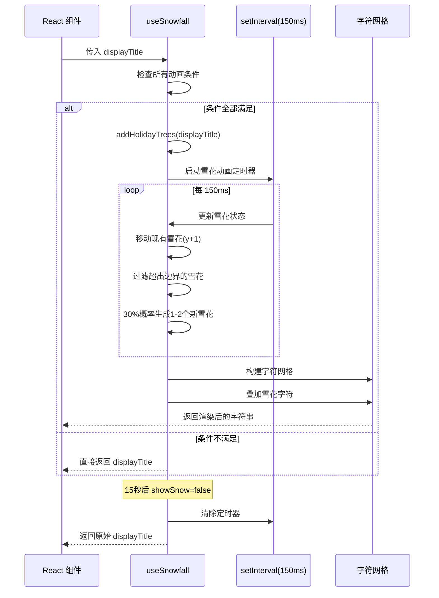

# useSnowfall.ts

## 概述

`useSnowfall` 是一个 React 自定义 Hook，用于在 Gemini CLI 的终端界面中实现**节日雪花飘落动画效果**。当满足以下全部条件时，该 Hook 会在 ASCII Logo 上方叠加雪花动画并在 Logo 下方添加圣诞树装饰：

1. 当前时间处于**节日季**（12 月或 1 月）
2. 用户选择了**节日主题**（`Holiday` 暗色主题）
3. 终端宽度足够容纳 Logo
4. 用户尚未开始聊天（首页状态）
5. 15 秒自动关闭计时器尚未到期

文件位于 `packages/cli/src/ui/hooks/useSnowfall.ts`，共约 163 行代码。

## 架构图（Mermaid）

```mermaid
graph TB
    subgraph 主 Hook
        US[useSnowfall<br/>雪花动画主入口]
    end

    subgraph 条件判断层
        HS[节日季检测<br/>12月/1月]
        TH[主题检测<br/>Holiday 主题]
        TW[终端宽度检测<br/>够宽才显示]
        SC[聊天状态检测<br/>未开始聊天]
        ST[计时器状态<br/>15秒自动关闭]
    end

    subgraph 动画引擎
        SF[雪花状态管理<br/>useState Snowflake[]]
        TI[定时器<br/>setInterval 150ms]
        SP[雪花生成器<br/>随机位置和字符]
        MV[雪花移动器<br/>y坐标+1/帧]
        RD[渲染器<br/>字符网格叠加]
    end

    subgraph 装饰组件
        HT[addHolidayTrees<br/>圣诞树 ASCII 艺术]
    end

    subgraph 外部依赖
        UTS[useTerminalSize<br/>终端尺寸]
        UUI[useUIState<br/>UI状态上下文]
        TM[themeManager<br/>主题管理器]
        DS[debugState<br/>调试状态]
        GAW[getAsciiArtWidth<br/>ASCII宽度计算]
    end

    US --> HS
    US --> TH
    US --> TW
    US --> SC
    US --> ST

    HS --> |全部满足| SF
    TH --> |全部满足| SF
    TW --> |全部满足| SF
    SC --> |全部满足| SF
    ST --> |全部满足| SF

    SF --> TI
    TI --> SP
    TI --> MV
    SF --> RD

    US --> HT
    US --> UTS
    US --> UUI
    US --> TM
    US --> GAW
    TI --> DS
```



## 核心组件

### 1. `useSnowfall`（主入口 Hook）

**签名：**
```typescript
export const useSnowfall = (displayTitle: string): string
```

**参数：**

| 参数 | 类型 | 说明 |
|------|------|------|
| `displayTitle` | `string` | 原始的 ASCII Logo 文本 |

**返回值：** `string` -- 根据动画状态返回原始 Logo 文本、带圣诞树的 Logo 文本、或叠加雪花的动画帧字符串。

**动画显示条件（`showAnimation`，必须全部为 `true`）：**

| 条件 | 计算方式 |
|------|----------|
| `isHolidaySeason` | `new Date().getMonth() === 11 \|\| new Date().getMonth() === 0`（12月或1月） |
| 节日主题激活 | `currentTheme.name === Holiday.name` |
| 终端宽度足够 | `terminalWidth >= widthOfShortLogo` |
| 未开始聊天 | `history` 中不存在非 `/theme` 的用户消息 |
| 计时器未过期 | `showSnow === true`（15 秒后自动设为 `false`） |

---

### 2. `Snowflake` 接口

```typescript
interface Snowflake {
  x: number;  // 水平位置（列索引）
  y: number;  // 垂直位置（行索引）
  char: string; // 雪花显示字符
}
```

### 3. 常量

| 常量 | 值 | 说明 |
|------|-----|------|
| `SNOW_CHARS` | `['*', '.', '·', '+']` | 雪花可选字符集 |
| `FRAME_RATE` | `150` (ms) | 动画帧间隔 |

### 4. `addHolidayTrees` 函数

**签名：**
```typescript
const addHolidayTrees = (art: string): string
```

在 ASCII Logo 下方添加三棵居中排列的圣诞树 ASCII 艺术。

**圣诞树样式：**
```
      *
     ***
    *****
   *******
  *********
     |_|
```

**布局算法：**
1. 解析圣诞树的行数据和宽度
2. 将三棵树用 8 个空格间隔排列在同一行
3. 计算三棵树总宽度与 Logo 宽度的差值，居中对齐
4. 在 Logo 和树之间、头尾添加换行符

## 依赖关系

### 内部依赖

| 模块路径 | 导入内容 | 用途 |
|----------|----------|------|
| `../utils/textUtils.js` | `getAsciiArtWidth` | 计算 ASCII 艺术的显示宽度（最长行的长度） |
| `../debug.js` | `debugState` | 调试状态，追踪动画组件数量 |
| `../themes/theme-manager.js` | `themeManager` | 获取当前激活的主题 |
| `../themes/builtin/dark/holiday-dark.js` | `Holiday` | 节日暗色主题对象，用于名称比较 |
| `../contexts/UIStateContext.js` | `useUIState` | 获取聊天历史和 remount key |
| `./useTerminalSize.js` | `useTerminalSize` | 获取终端列数（宽度） |
| `../components/AsciiArt.js` | `shortAsciiLogo` | 短版 ASCII Logo，用于宽度比较 |

### 外部依赖

| 包名 | 导入内容 | 用途 |
|------|----------|------|
| `react` | `useState`, `useEffect`, `useMemo` | React 状态管理、副作用和记忆化 |

## 关键实现细节

### 1. 雪花动画引擎

动画采用基于 `setInterval` 的简单帧驱动架构：

**每帧更新逻辑（150ms 间隔）：**
1. **移动阶段**：所有现有雪花 `y` 坐标 +1（向下移动一行）
2. **清理阶段**：过滤掉 `y >= height` 的雪花（超出画面底部）
3. **生成阶段**：以 30% 的概率在 `y=0`（顶部）生成 1-2 个新雪花
   - `x` 位置在 `[0, width)` 范围内随机
   - 字符从 `SNOW_CHARS` 中随机选取

### 2. 字符网格渲染

渲染通过字符网格叠加实现：
1. 将 `displayArt` 按行分割为二维字符数组（每行 `padEnd` 到统一宽度）
2. 遍历所有雪花，在对应 `(x, y)` 位置覆盖雪花字符
3. 将二维数组重新拼接为字符串输出

这种方式的特点是雪花会**覆盖** Logo 文本上的字符，形成雪花从 Logo 前方飘过的视觉效果。

### 3. 15 秒自动关闭机制

通过 `useEffect` + `setTimeout` 实现：
- 组件挂载或 `historyRemountKey` 变化时，`showSnow` 设为 `true`
- 15 秒后自动设为 `false`
- 清理函数确保 timer 被正确取消

`historyRemountKey` 的变化会重置计时器，这意味着某些 UI 状态变更（如主题切换后的 remount）会重新开始 15 秒倒计时。

### 4. 调试状态追踪

动画启动时 `debugState.debugNumAnimatedComponents++`，清理时 `debugState.debugNumAnimatedComponents--`。这允许开发者追踪当前活跃的动画组件数量，用于性能调试。

### 5. 性能考虑

- `displayArt` 通过 `useMemo` 缓存，仅在 `displayTitle` 或 `showAnimation` 变化时重新计算
- 雪花状态更新使用函数式 `setState`（`setSnowflakes((prev) => ...)`），避免闭包过期问题
- 雪花数量自然受限：生成概率 30%、每帧最多 2 个、超出边界自动移除
- 当动画条件不满足时立即清空雪花数组并返回原始文本，不进行任何多余计算

### 6. 聊天状态检测的特殊处理

判断是否"已开始聊天"时，特别排除了 `/theme` 命令：
```typescript
const hasStartedChat = history.some(
  (item) => item.type === 'user' && item.text !== '/theme',
);
```
这意味着用户切换主题不会导致雪花动画消失，只有实际发送聊天消息才会关闭动画。
