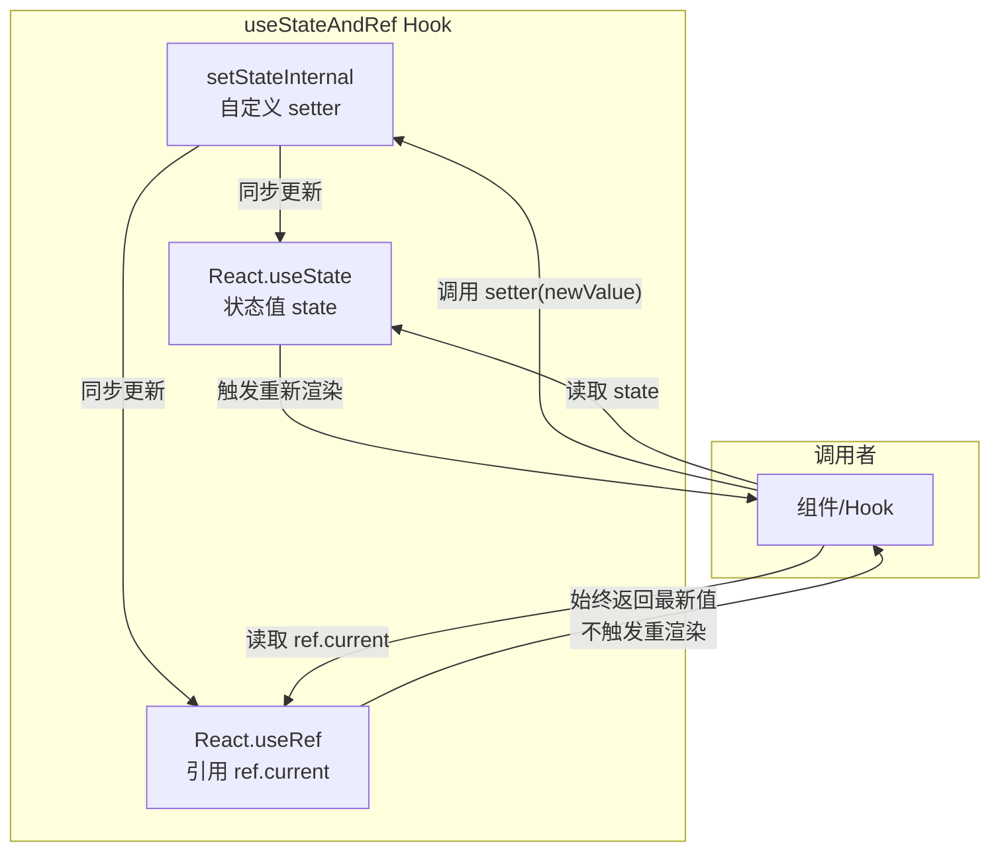
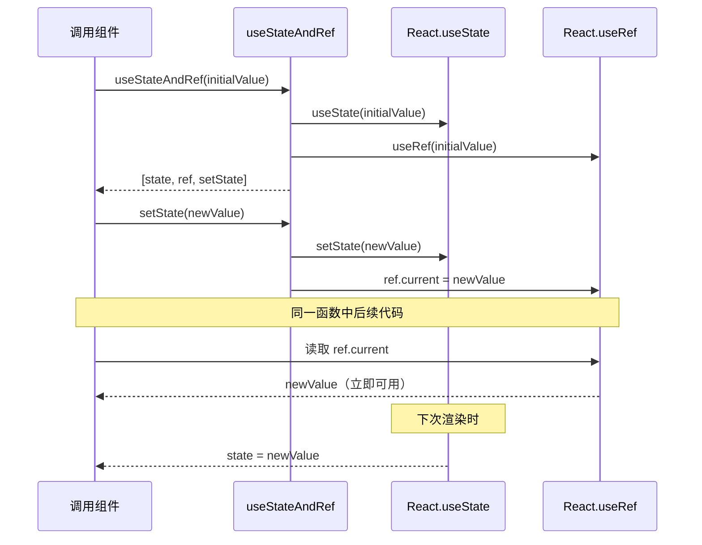

# useStateAndRef.ts

## 概述

`useStateAndRef` 是一个 React 自定义 Hook，用于同时维护一个**状态值（state）** 和一个**始终指向最新值的引用（ref）**。它解决了 React 中一个常见的痛点：在同一个函数中多次调用 `setState` 后，由于 React 的批量更新机制，无法立即读取到更新后的状态值。

通过同步更新 `ref.current`，调用者可以在 `setState` 之后立即通过 `ref.current` 获取到最新的值，而不必等待下一次渲染。

文件位于 `packages/cli/src/ui/hooks/useStateAndRef.ts`，共约 37 行代码，设计极为简洁。

## 架构图（Mermaid）





## 核心组件

### `useStateAndRef` Hook

**签名：**
```typescript
export const useStateAndRef = <
  T extends object | null | undefined | number | string | boolean,
>(
  initialValue: T,
) => [state: T, ref: React.MutableRefObject<T>, setState: React.Dispatch<React.SetStateAction<T>>] as const
```

**泛型约束：**
- `T extends object | null | undefined | number | string | boolean`
- 明确排除了**函数类型**，因为函数值会与 `setState` 的回调形式冲突（`setState` 会将函数参数解释为 updater function 而非直接值）

**参数：**

| 参数 | 类型 | 说明 |
|------|------|------|
| `initialValue` | `T` | 状态的初始值 |

**返回值（元组 `as const`）：**

| 索引 | 名称 | 类型 | 说明 |
|------|------|------|------|
| 0 | `state` | `T` | 当前状态值（触发重渲染） |
| 1 | `ref` | `React.MutableRefObject<T>` | 始终指向最新状态值的引用 |
| 2 | `setState` | `React.Dispatch<React.SetStateAction<T>>` | 自定义 setter，同时更新 state 和 ref |

**自定义 setter（`setStateInternal`）的行为：**

1. 接收直接值或 updater 函数（与标准 `setState` 接口一致）
2. 如果传入函数：使用 `ref.current`（最新值）作为参数调用，得到新值
3. 同时调用 `React.setState(newValue)` 和赋值 `ref.current = newValue`
4. 通过 `useCallback([], ...)` 包裹，确保 setter 引用稳定不变

## 依赖关系

### 内部依赖

无内部依赖。

### 外部依赖

| 包名 | 导入内容 | 用途 |
|------|----------|------|
| `react` | `React`（默认导入，使用 `useState`, `useRef`, `useCallback`） | React 核心 Hooks |

## 关键实现细节

### 1. 解决 React 批量更新中的"读取过期值"问题

在 React 中，`setState` 是异步批量执行的。以下场景会出现问题：

```typescript
// 问题场景（使用普通 useState）
const [count, setCount] = useState(0);

function handleClick() {
  setCount(1);
  console.log(count); // 仍然是 0！
  setCount(count + 1); // 基于过期值计算，结果是 1 而非 2
}
```

使用 `useStateAndRef` 后：

```typescript
// 解决方案
const [count, countRef, setCount] = useStateAndRef(0);

function handleClick() {
  setCount(1);
  console.log(countRef.current); // 立即是 1
  setCount(countRef.current + 1); // 基于最新值计算，结果是 2
}
```

### 2. updater 函数使用 ref.current 而非闭包中的 state

当传入 updater 函数（如 `setState(prev => prev + 1)`）时，`setStateInternal` 使用 `ref.current` 作为 `prev` 参数：

```typescript
if (typeof newStateOrCallback === 'function') {
  newValue = newStateOrCallback(ref.current);
}
```

这确保了即使在同一个事件处理器中连续调用多次 updater function，每次都基于最新的值计算，而不是 React 调度队列中的值。

### 3. 泛型类型排除函数

泛型约束 `T extends object | null | undefined | number | string | boolean` 显式排除了函数类型。这是因为 `React.Dispatch<React.SetStateAction<T>>` 将函数参数视为 updater（`(prevState: T) => T`），如果 `T` 本身是函数类型，则无法区分用户是想传递一个函数值还是一个 updater。

### 4. setter 引用稳定性

`setStateInternal` 通过 `React.useCallback(..., [])` 包裹，依赖数组为空，确保整个组件生命周期内 setter 的引用不变。这得益于 `ref` 的使用——setter 内部通过 `ref.current` 访问最新值，无需将 `state` 放入依赖数组。

### 5. 返回值使用 `as const`

返回 `[state, ref, setStateInternal] as const` 使 TypeScript 将返回类型推断为只读元组而非联合类型数组，使调用者能通过解构获得正确的类型：

```typescript
const [state, ref, setState] = useStateAndRef(0);
// state: number, ref: MutableRefObject<number>, setState: Dispatch<...>
```
