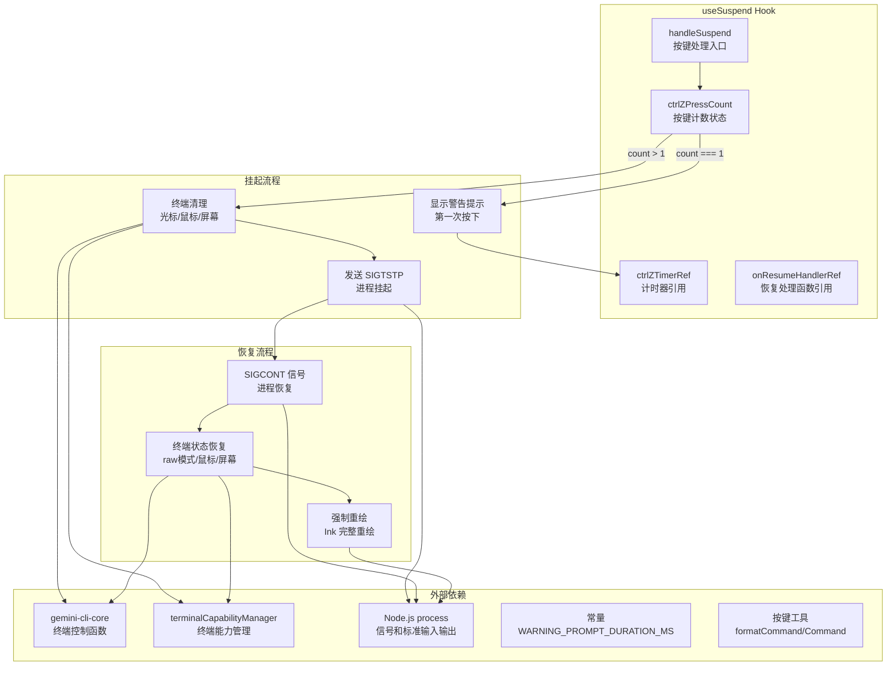
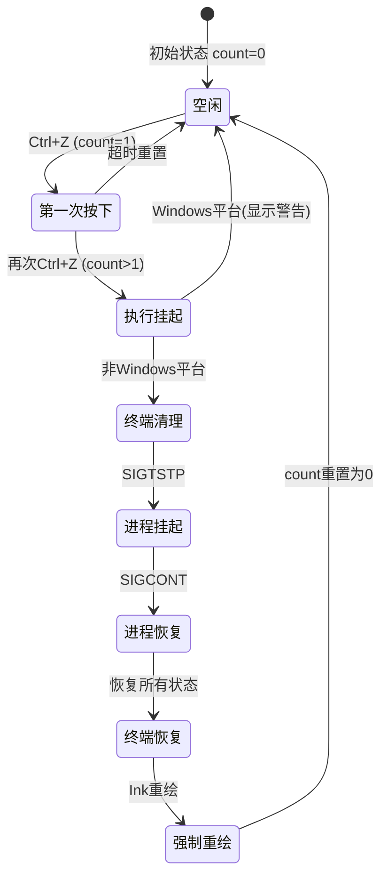
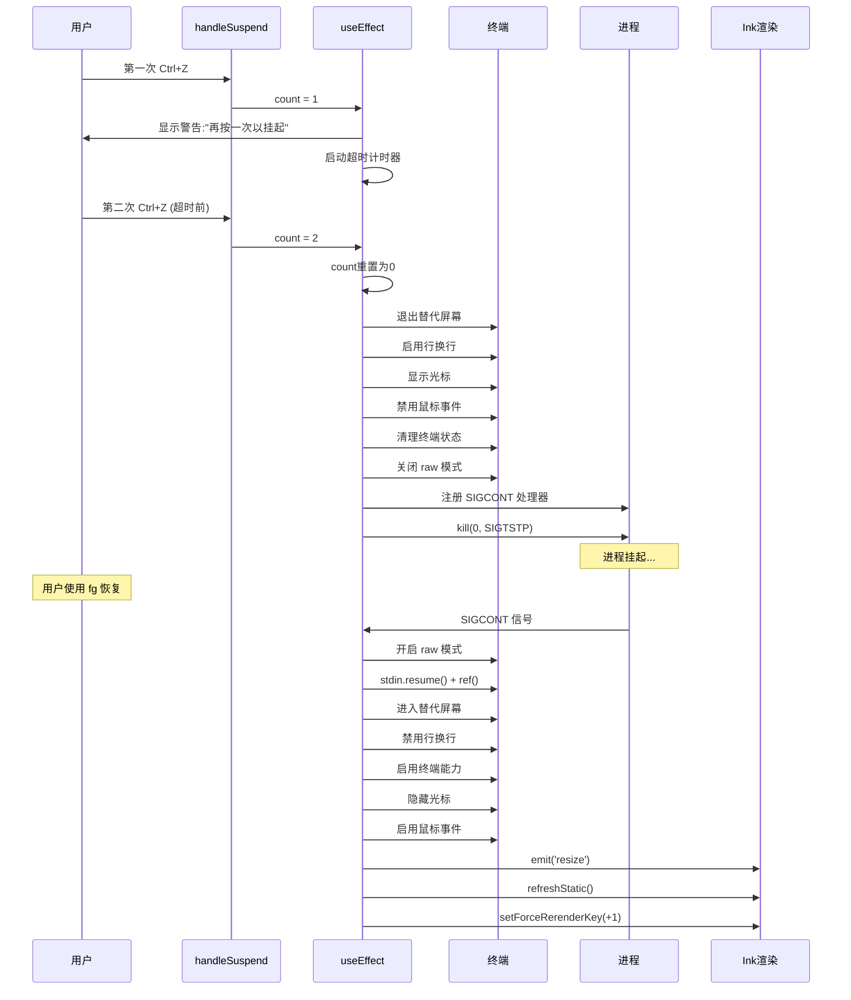

# useSuspend.ts

## 概述

`useSuspend` 是一个 React 自定义 Hook，用于在 Gemini CLI 的终端界面中实现**应用挂起与恢复（Suspend/Resume）** 功能，即 Unix 系统中经典的 `Ctrl+Z` 挂起行为。

该 Hook 实现了以下核心能力：

1. **双击确认机制**：第一次按 `Ctrl+Z` 显示提示警告，第二次才真正执行挂起操作，防止用户误操作
2. **终端状态清理**：挂起前恢复终端到正常状态（显示光标、禁用鼠标事件、退出替代屏幕等）
3. **进程挂起**：通过发送 `SIGTSTP` 信号将进程放入后台
4. **终端状态恢复**：收到 `SIGCONT` 信号后完整恢复终端状态和 Ink 渲染
5. **Windows 兼容处理**：在 Windows 平台上显示不支持的警告

文件位于 `packages/cli/src/ui/hooks/useSuspend.ts`，共约 159 行代码。

## 架构图（Mermaid）







## 核心组件

### `useSuspend` Hook

**签名：**
```typescript
export function useSuspend(props: UseSuspendProps): {
  handleSuspend: () => void;
}
```

**输入属性（`UseSuspendProps`）：**

| 属性 | 类型 | 说明 |
|------|------|------|
| `handleWarning` | `(message: string) => void` | 显示警告消息的回调 |
| `setRawMode` | `(mode: boolean) => void` | 设置 Ink 的 raw 模式 |
| `refreshStatic` | `() => void` | 刷新 Ink 的静态输出区域 |
| `setForceRerenderKey` | `(updater: (prev: number) => number) => void` | 通过更新 key 强制组件重新挂载 |
| `shouldUseAlternateScreen` | `boolean` | 是否使用终端替代屏幕缓冲区 |

**返回值：**

| 字段 | 类型 | 说明 |
|------|------|------|
| `handleSuspend` | `() => void` | 绑定到 Ctrl+Z 按键的处理函数 |

---

### 内部状态

| 状态/引用 | 类型 | 说明 |
|-----------|------|------|
| `ctrlZPressCount` | `number`（state） | Ctrl+Z 按下次数计数器 |
| `ctrlZTimerRef` | `React.MutableRefObject<NodeJS.Timeout \| null>` | 超时重置计时器引用 |
| `onResumeHandlerRef` | `React.MutableRefObject<(() => void) \| null>` | SIGCONT 恢复处理函数引用 |

## 依赖关系

### 内部依赖

| 模块路径 | 导入内容 | 用途 |
|----------|----------|------|
| `@google/gemini-cli-core` | `writeToStdout`, `disableMouseEvents`, `enableMouseEvents`, `enterAlternateScreen`, `exitAlternateScreen`, `enableLineWrapping`, `disableLineWrapping` | 终端控制底层函数 |
| `../utils/terminalCapabilityManager.js` | `cleanupTerminalOnExit`, `terminalCapabilityManager` | 终端能力管理和退出时清理 |
| `../constants.js` | `WARNING_PROMPT_DURATION_MS` | 警告提示持续时间常量 |
| `../key/keybindingUtils.js` | `formatCommand` | 将命令枚举格式化为用户可读的按键描述 |
| `../key/keyBindings.js` | `Command` | 按键命令枚举（`SUSPEND_APP`, `UNDO`） |

### 外部依赖

| 包名 | 导入内容 | 用途 |
|------|----------|------|
| `react` | `useState`, `useRef`, `useEffect`, `useCallback` | React Hooks |
| `node:process` | `process`（默认导入） | 进程信号处理、标准输入控制 |

## 关键实现细节

### 1. 双击确认机制

挂起操作要求用户连续两次按下 Ctrl+Z：

- **第一次按下（`count === 1`）**：
  - 显示警告消息：`"Press Ctrl+Z again to suspend. Undo has moved to {undoKey}."`
  - 启动 `WARNING_PROMPT_DURATION_MS` 毫秒的超时计时器
  - 超时后自动将 `count` 重置为 0

- **第二次按下（`count > 1`）**：
  - 立即执行挂起流程
  - `count` 重置为 0

这个设计兼顾了两个需求：避免误触挂起（之前 `Ctrl+Z` 可能绑定的是撤销操作），同时提示用户撤销操作已移至新按键。

### 2. 挂起前的终端清理

在发送 `SIGTSTP` 之前，必须将终端恢复到正常状态，否则用户回到 shell 时终端会处于不可用状态：

```
1. 退出替代屏幕（如果启用了）
2. 启用行换行
3. 清屏并重置光标位置（\x1b[2J\x1b[H）
4. 显示光标（\x1b[?25h）
5. 禁用鼠标事件
6. 调用 cleanupTerminalOnExit()
7. 关闭 stdin raw 模式
8. 关闭 Ink 的 raw 模式
```

### 3. SIGCONT 恢复流程

当用户在 shell 中使用 `fg` 命令恢复进程后，`SIGCONT` 处理器执行完整的状态恢复：

```
1. 开启 stdin raw 模式
2. stdin.resume() + stdin.ref()（确保事件循环保持活跃）
3. 进入替代屏幕（如果启用了）
4. 禁用行换行
5. 清屏并重置光标
6. 启用终端支持的所有模式（terminalCapabilityManager）
7. 隐藏光标（\x1b[?25l）
8. 启用鼠标事件（如果使用替代屏幕）
9. 发出 resize 事件（触发 Ink 全量重绘）
10. setImmediate 中调用 refreshStatic() 和 setForceRerenderKey(+1)
```

### 4. 进程信号发送

使用 `process.kill(0, 'SIGTSTP')` 发送挂起信号：
- PID 为 `0` 表示发送给当前进程组的所有进程
- `SIGTSTP` 是终端停止信号（Terminal Stop），与 `Ctrl+Z` 在 shell 中的行为一致
- 使用 `process.once('SIGCONT', onResume)` 注册一次性恢复处理器

### 5. Windows 平台处理

Windows 不支持 `SIGTSTP`/`SIGCONT` 信号机制，因此在 Windows 上直接显示警告消息：
```typescript
if (process.platform === 'win32') {
  handleWarning(`${suspendKey} suspend is not supported on Windows.`);
  return;
}
```

### 6. Ink 强制重绘策略

从后台恢复后，Ink 的渲染状态可能已过期。通过三步策略强制完整重绘：

1. **`process.stdout.emit('resize')`**：模拟终端大小变化事件，触发 Ink 内部的全量重绘逻辑
2. **`refreshStatic()`**：刷新 Ink 的静态输出区域（在 `setImmediate` 中执行，等待 resize 事件处理完成）
3. **`setForceRerenderKey(prev => prev + 1)`**：通过递增 key 强制 React 组件重新挂载

### 7. 资源清理

组件卸载时的清理逻辑（通过 `useEffect` 返回的清理函数）：
- 清除超时计时器（`ctrlZTimerRef`）
- 移除 SIGCONT 监听器（`onResumeHandlerRef`）

注册新的 SIGCONT 处理器前，也会先移除旧的处理器，防止多次挂起/恢复导致处理器堆积。

### 8. onResume 处理器的 finally 清理

恢复处理器在 `finally` 块中检查并清理自身引用：
```typescript
finally {
  if (onResumeHandlerRef.current === onResume) {
    onResumeHandlerRef.current = null;
  }
}
```
这防止了过期的处理器引用残留，只有当当前引用确实是自己时才清除。
