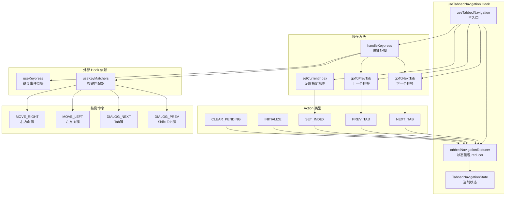
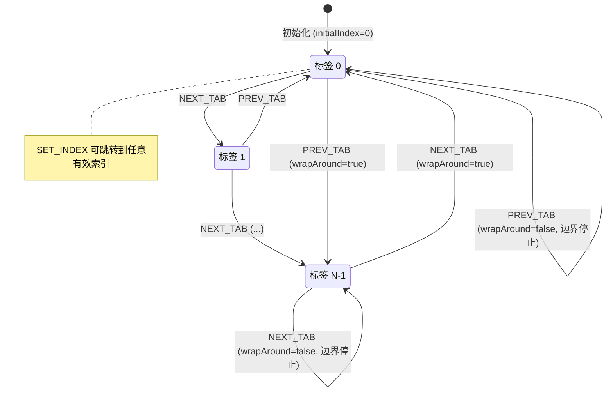
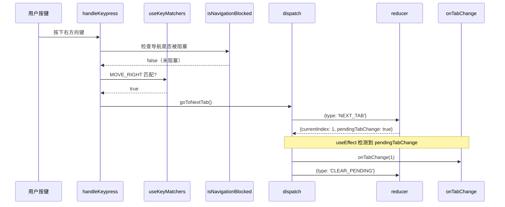

# useTabbedNavigation.ts

## 概述

`useTabbedNavigation` 是一个**无头（headless）** React 自定义 Hook，为 Gemini CLI 终端界面中的标签页导航提供键盘交互逻辑。它不包含任何 UI 渲染，只提供状态和操作方法，由调用者自行决定如何渲染标签页。

核心能力：

1. **键盘导航**：支持左/右方向键和 Tab/Shift+Tab 在标签页之间切换
2. **环绕导航**：可选地允许从最后一个标签跳到第一个（反之亦然）
3. **导航阻塞**：支持外部回调判断是否阻止导航（如用户正在文本输入时）
4. **状态管理**：使用 `useReducer` 实现可预测的状态转换
5. **动态配置**：标签数量、初始索引、环绕设置变更时自动重新初始化
6. **变更通知**：标签切换时触发 `onTabChange` 回调

文件位于 `packages/cli/src/ui/hooks/useTabbedNavigation.ts`，共约 251 行代码。

## 架构图（Mermaid）







## 核心组件

### 1. `useTabbedNavigation`（主入口 Hook）

**签名：**
```typescript
export function useTabbedNavigation(
  options: UseTabbedNavigationOptions
): UseTabbedNavigationResult
```

**输入选项（`UseTabbedNavigationOptions`）：**

| 属性 | 类型 | 默认值 | 说明 |
|------|------|--------|------|
| `tabCount` | `number` | （必填） | 标签总数 |
| `initialIndex` | `number` | `0` | 初始选中的标签索引 |
| `wrapAround` | `boolean` | `false` | 是否允许环绕导航 |
| `enableArrowNavigation` | `boolean` | `true` | 是否启用左右方向键导航 |
| `enableTabKey` | `boolean` | `true` | 是否启用 Tab 键导航 |
| `isNavigationBlocked` | `() => boolean` | `undefined` | 回调函数，返回 `true` 时阻止导航 |
| `isActive` | `boolean` | `true` | Hook 是否激活（响应键盘输入） |
| `onTabChange` | `(index: number) => void` | `undefined` | 标签切换时的回调 |

**返回值（`UseTabbedNavigationResult`）：**

| 字段 | 类型 | 说明 |
|------|------|------|
| `currentIndex` | `number` | 当前选中的标签索引 |
| `setCurrentIndex` | `(index: number) => void` | 直接跳转到指定标签 |
| `goToNextTab` | `() => void` | 切换到下一个标签 |
| `goToPrevTab` | `() => void` | 切换到上一个标签 |
| `isFirstTab` | `boolean` | 是否处于第一个标签 |
| `isLastTab` | `boolean` | 是否处于最后一个标签 |

---

### 2. `tabbedNavigationReducer`（状态 Reducer）

**状态结构（`TabbedNavigationState`）：**

| 字段 | 类型 | 说明 |
|------|------|------|
| `currentIndex` | `number` | 当前标签索引 |
| `tabCount` | `number` | 标签总数 |
| `wrapAround` | `boolean` | 是否环绕导航 |
| `pendingTabChange` | `boolean` | 是否有待触发的 `onTabChange` 回调 |

**Action 类型（`TabbedNavigationAction`）：**

| Action | 负载 | 说明 |
|--------|------|------|
| `NEXT_TAB` | 无 | 切换到下一个标签 |
| `PREV_TAB` | 无 | 切换到上一个标签 |
| `SET_INDEX` | `{ index: number }` | 跳转到指定索引 |
| `INITIALIZE` | `{ tabCount, initialIndex, wrapAround }` | 重新初始化状态 |
| `CLEAR_PENDING` | 无 | 清除 `pendingTabChange` 标记 |

**各 Action 的边界处理：**

| Action | 边界情况 | 处理方式 |
|--------|----------|----------|
| `NEXT_TAB` | `tabCount === 0` | 返回原状态不变 |
| `NEXT_TAB` | `nextIndex >= tabCount` | `wrapAround ? 0 : tabCount - 1` |
| `NEXT_TAB` | `nextIndex === currentIndex` | 返回原状态不变（避免不必要的重渲染） |
| `PREV_TAB` | `tabCount === 0` | 返回原状态不变 |
| `PREV_TAB` | `nextIndex < 0` | `wrapAround ? tabCount - 1 : 0` |
| `SET_INDEX` | `index === currentIndex` | 返回原状态不变 |
| `SET_INDEX` | `index < 0 \|\| index >= tabCount` | 返回原状态不变（越界保护） |
| `INITIALIZE` | `initialIndex` 越界 | `Math.max(0, Math.min(initialIndex, tabCount - 1))` |
| `INITIALIZE` | `tabCount === 0` | `currentIndex` 设为 0 |

---

### 3. 按键处理（`handleKeypress`）

支持两组按键绑定（均可通过选项独立开关）：

| 功能 | 按键命令 | 控制选项 |
|------|----------|----------|
| 下一个标签 | `Command.MOVE_RIGHT`（右方向键） | `enableArrowNavigation` |
| 上一个标签 | `Command.MOVE_LEFT`（左方向键） | `enableArrowNavigation` |
| 下一个标签 | `Command.DIALOG_NEXT`（Tab 键） | `enableTabKey` |
| 上一个标签 | `Command.DIALOG_PREV`（Shift+Tab 键） | `enableTabKey` |

键盘监听通过 `useKeypress` Hook 实现，仅在 `isActive === true` 且 `tabCount > 1` 时激活。

## 依赖关系

### 内部依赖

| 模块路径 | 导入内容 | 用途 |
|----------|----------|------|
| `./useKeypress.js` | `useKeypress`, `Key`（类型） | 终端键盘事件监听 Hook |
| `../key/keyMatchers.js` | `Command` | 按键命令枚举 |
| `./useKeyMatchers.js` | `useKeyMatchers` | 按键匹配函数集合 |

### 外部依赖

| 包名 | 导入内容 | 用途 |
|------|----------|------|
| `react` | `useReducer`, `useCallback`, `useEffect`, `useRef` | React 状态管理和副作用 |

## 关键实现细节

### 1. useReducer 模式的选择

该 Hook 使用 `useReducer` 而非 `useState` 来管理状态，原因包括：

- **多个相关状态**：`currentIndex`、`tabCount`、`wrapAround`、`pendingTabChange` 需要协同更新
- **复杂的状态转换逻辑**：环绕导航、边界检测、重复值检测等逻辑集中在 reducer 中
- **可预测性**：所有状态变更通过明确的 action 触发，便于调试和测试
- **不可变性保证**：reducer 确保每次都返回新对象或原引用（无变化时）

### 2. pendingTabChange 机制

`onTabChange` 回调不在 reducer 内直接调用（reducer 应为纯函数），而是通过一个标志位 + `useEffect` 模式实现：

1. 状态变更时设置 `pendingTabChange: true`
2. `useEffect` 监听 `pendingTabChange`，为 `true` 时调用 `onTabChange`
3. 调用后立即 dispatch `CLEAR_PENDING` 重置标志

这种模式确保了：
- Reducer 保持纯函数特性
- 回调在 React 渲染周期内正确触发
- 不会因为相同索引的设置而重复触发回调

### 3. 配置变更的动态响应

通过 `useRef` + `useEffect` 检测 `tabCount`、`initialIndex`、`wrapAround` 的变化：

```typescript
const prevTabCountRef = useRef(tabCount);
// ...
useEffect(() => {
  if (prevTabCountRef.current !== tabCount || ...) {
    dispatch({ type: 'INITIALIZE', payload: { ... } });
    prevTabCountRef.current = tabCount;
  }
}, [tabCount, initialIndex, wrapAround]);
```

使用 `useRef` 存储前一次的值而非直接在 `useEffect` 依赖中依赖 state，避免了不必要的重新初始化。

### 4. 导航阻塞检查

所有导航操作（`goToNextTab`、`goToPrevTab`、`setCurrentIndex`、`handleKeypress`）在执行前都调用 `isNavigationBlocked?.()`。这是一个通过选项注入的回调，允许调用者根据应用状态（如用户正在输入框中输入文本）动态阻止标签切换。

### 5. 键盘监听的激活条件

```typescript
useKeypress(handleKeypress, { isActive: isActive && tabCount > 1 });
```

两个条件同时满足时才激活：
- `isActive === true`：由调用者控制（例如对话框显示时激活）
- `tabCount > 1`：只有一个标签时无需导航

### 6. 无头设计模式

该 Hook 遵循"无头组件"设计模式：
- 只提供状态（`currentIndex`、`isFirstTab`、`isLastTab`）和操作方法（`goToNextTab` 等）
- 不渲染任何 UI 元素
- 调用者完全控制标签页的视觉呈现
- 同一个 Hook 可以驱动不同样式的标签页组件

### 7. 状态不变性优化

Reducer 在以下情况返回原 state 引用（而非新对象），避免不必要的重渲染：
- `tabCount === 0` 时的 `NEXT_TAB` / `PREV_TAB`
- `nextIndex === currentIndex`（已在边界且未启用环绕时）
- `SET_INDEX` 的目标索引等于当前索引
- `SET_INDEX` 的目标索引越界
- 未知的 action type（default 分支）
