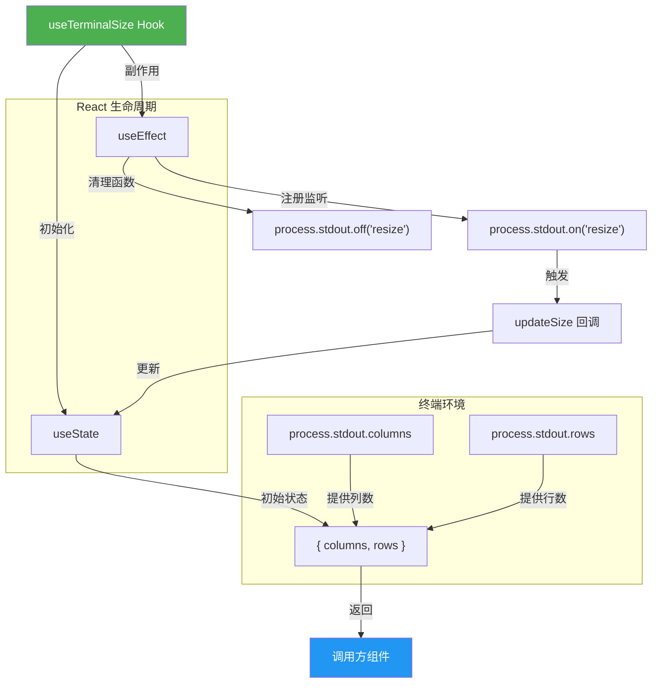

# useTerminalSize.ts

## 概述

`useTerminalSize` 是一个 React 自定义 Hook，用于实时获取终端窗口的尺寸（列数和行数）。它会监听终端的 `resize` 事件，当用户调整终端窗口大小时自动更新状态，使依赖终端尺寸的 UI 组件能够响应式地重新渲染。

**文件路径**: `packages/cli/src/ui/hooks/useTerminalSize.ts`
**许可证**: Apache-2.0 (Copyright 2025 Google LLC)

## 架构图（Mermaid）



## 核心组件

### `useTerminalSize()` 函数

| 属性 | 说明 |
|------|------|
| **类型** | React 自定义 Hook |
| **参数** | 无 |
| **返回值** | `{ columns: number; rows: number }` |

#### 返回值说明

| 字段 | 类型 | 说明 | 默认值 |
|------|------|------|--------|
| `columns` | `number` | 终端当前列数（字符宽度） | `60` |
| `rows` | `number` | 终端当前行数（字符高度） | `20` |

### 内部状态管理

Hook 内部使用 `useState` 管理终端尺寸状态：

```typescript
const [size, setSize] = useState({
  columns: process.stdout.columns || 60,
  rows: process.stdout.rows || 20,
});
```

- 初始值从 `process.stdout.columns` 和 `process.stdout.rows` 读取
- 若值为 `undefined`（例如在非 TTY 环境下），则使用默认值 `60` 列 / `20` 行

### 事件监听机制

通过 `useEffect` 注册 `resize` 事件监听器：

```typescript
useEffect(() => {
  function updateSize() {
    setSize({
      columns: process.stdout.columns || 60,
      rows: process.stdout.rows || 20,
    });
  }
  process.stdout.on('resize', updateSize);
  return () => {
    process.stdout.off('resize', updateSize);
  };
}, []);
```

- **注册时机**: 组件挂载时（依赖数组为空 `[]`，仅执行一次）
- **清理时机**: 组件卸载时自动移除监听器，防止内存泄漏
- **更新回调**: `updateSize` 函数在每次 resize 事件触发时重新读取 `process.stdout` 的 columns 和 rows

## 依赖关系

### 内部依赖

无内部模块依赖。此 Hook 是一个独立的工具 Hook。

### 外部依赖

| 依赖 | 来源 | 用途 |
|------|------|------|
| `useState` | `react` | 管理终端尺寸状态 |
| `useEffect` | `react` | 注册/清理 resize 事件监听器 |
| `process.stdout` | Node.js 内置 | 获取终端尺寸和监听 resize 事件 |

## 关键实现细节

1. **默认值策略**: 当 `process.stdout.columns` 或 `process.stdout.rows` 为 `undefined` 或 `0`（falsy 值）时，使用 `60` 列 / `20` 行作为兜底值。这在非交互式终端（如 CI/CD 环境、管道重定向）中特别重要。

2. **事件驱动更新**: 使用 Node.js 的 `process.stdout` 的 `resize` 事件实现响应式更新。当终端窗口大小变化时，Node.js 运行时会自动触发该事件，同时更新 `process.stdout.columns` 和 `process.stdout.rows` 属性。

3. **清理机制**: 在 `useEffect` 的清理函数中调用 `process.stdout.off('resize', updateSize)` 移除事件监听器。这确保了组件卸载后不会继续响应 resize 事件，避免潜在的内存泄漏和对已卸载组件的状态更新。

4. **Ink 框架兼容**: 此 Hook 设计用于 Ink（基于 React 的终端 UI 框架）环境中。Ink 组件可以使用此 Hook 动态调整布局，以适应不同大小的终端窗口。

5. **仅执行一次的 Effect**: 依赖数组为空数组 `[]`，意味着事件监听器仅在组件首次挂载时注册一次，不会因为状态更新而重复注册。

6. **同步初始值**: 初始状态直接从 `process.stdout` 同步读取，不需要等待 resize 事件，组件首次渲染时就能获得正确的终端尺寸。
