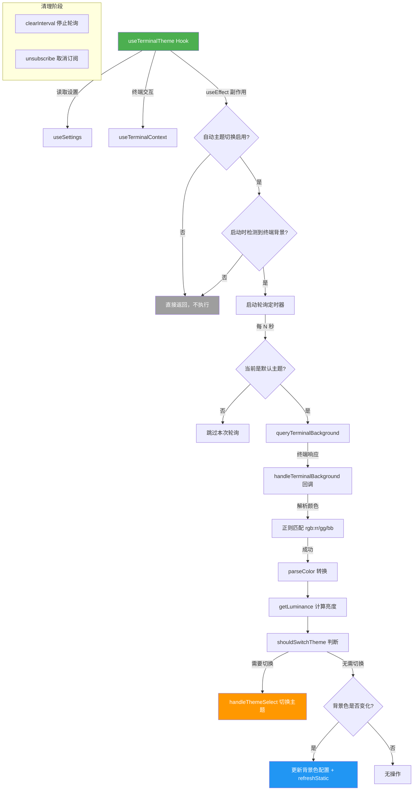

# useTerminalTheme.ts

## 概述

`useTerminalTheme` 是一个 React 自定义 Hook，负责终端主题的**自动检测与切换**。它通过定期轮询终端背景颜色，判断当前终端是亮色还是暗色环境，并自动在亮色主题（`DefaultLight`）和暗色主题（`DEFAULT_THEME`）之间切换，实现主题与终端背景色的自适应匹配。

**文件路径**: `packages/cli/src/ui/hooks/useTerminalTheme.ts`
**许可证**: Apache-2.0 (Copyright 2025 Google LLC)

## 架构图（Mermaid）



## 核心组件

### `useTerminalTheme()` 函数

| 属性 | 说明 |
|------|------|
| **类型** | React 自定义 Hook（无返回值） |
| **作用** | 自动检测终端背景色并切换匹配的主题 |

#### 参数说明

| 参数 | 类型 | 说明 |
|------|------|------|
| `handleThemeSelect` | `UIActions['handleThemeSelect']` | 主题选择处理函数，用于执行实际的主题切换操作 |
| `config` | `Config` | 应用配置对象，用于读写终端背景色配置 |
| `refreshStatic` | `() => void` | 刷新静态 UI 的回调函数，当背景色变化但主题未切换时使用 |

### 内部逻辑流程

#### 1. 前置条件检查

```typescript
if (settings.merged.ui.autoThemeSwitching === false) {
  return; // 自动主题切换被禁用
}
if (config.getTerminalBackground() === undefined) {
  return; // 启动时未检测到终端背景色
}
```

只有在满足以下两个条件时才启动自动主题检测：
- 用户设置中 `autoThemeSwitching` 未被显式关闭
- 应用启动时成功检测到了终端背景色

#### 2. 轮询机制

```typescript
const pollIntervalId = setInterval(() => {
  const currentThemeName = settings.merged.ui.theme;
  if (!themeManager.isDefaultTheme(currentThemeName)) {
    return; // 非默认主题时跳过轮询
  }
  void queryTerminalBackground();
}, settings.merged.ui.terminalBackgroundPollingInterval * 1000);
```

- 使用 `setInterval` 定期查询终端背景色
- 轮询间隔由用户设置 `terminalBackgroundPollingInterval` 控制（单位：秒）
- 仅在使用默认主题时才执行实际查询，用户选择了自定义主题则跳过

#### 3. 背景色处理回调

`handleTerminalBackground` 回调处理终端返回的颜色字符串：

- **颜色解析**: 使用正则 `/^rgb:([0-9a-fA-F]{1,4})\/([0-9a-fA-F]{1,4})\/([0-9a-fA-F]{1,4})$/` 匹配终端返回的 `rgb:rrrr/gggg/bbbb` 格式
- **颜色转换**: 通过 `parseColor` 将分离的 RGB 分量转换为标准十六进制颜色值
- **亮度计算**: 通过 `getLuminance` 计算颜色的亮度值
- **主题判断**: 通过 `shouldSwitchTheme` 决定是否需要切换主题

#### 4. 主题切换决策

```typescript
const newTheme = shouldSwitchTheme(
  currentThemeName, luminance,
  DEFAULT_THEME.name, DefaultLight.name,
);
```

根据亮度值和当前主题，决定是否需要切换到另一个默认主题：
- 亮色背景 → 切换到 `DefaultLight` 主题
- 暗色背景 → 切换到 `DEFAULT_THEME`（暗色默认主题）

#### 5. 背景色变化处理

当背景色发生变化但不需要切换主题时：
- 更新 `config` 中的终端背景色记录
- 更新 `themeManager` 中的终端背景色
- 调用 `refreshStatic()` 刷新已渲染的静态 UI（因为可能有依赖旧背景色的元素）

## 依赖关系

### 内部依赖

| 模块 | 导入内容 | 用途 |
|------|---------|------|
| `../themes/color-utils.js` | `getLuminance`, `parseColor`, `shouldSwitchTheme` | 颜色解析、亮度计算、主题切换判断 |
| `../themes/theme-manager.js` | `themeManager`, `DEFAULT_THEME` | 主题管理器实例和默认暗色主题 |
| `../themes/builtin/light/default-light.js` | `DefaultLight` | 默认亮色主题定义 |
| `../contexts/SettingsContext.js` | `useSettings` | 获取用户设置（主题名、自动切换开关、轮询间隔） |
| `../contexts/TerminalContext.js` | `useTerminalContext` | 终端交互（订阅/取消订阅背景色变化、查询背景色） |
| `../../config/settings.js` | `SettingScope` | 设置作用域枚举（用于指定 User 级别） |

### 外部依赖

| 依赖 | 来源 | 用途 |
|------|------|------|
| `useEffect` | `react` | 管理副作用（轮询、事件订阅） |
| `Config` (类型) | `@google/gemini-cli-core` | 应用配置接口类型 |
| `UIActions` (类型) | `../contexts/UIActionsContext.js` | UI 操作接口类型（获取 `handleThemeSelect` 的类型） |

## 关键实现细节

1. **终端颜色协议**: 终端背景色的检测依赖终端仿真器对 OSC（Operating System Command）序列的支持。终端返回的颜色格式为 `rgb:rrrr/gggg/bbbb`，其中每个分量是 1-4 位十六进制数。

2. **轮询策略**: 采用 `setInterval` 定期轮询而非一次性检测，因为用户可能在应用运行期间切换终端的亮/暗模式。轮询间隔可通过 `terminalBackgroundPollingInterval` 设置项配置。

3. **自定义主题保护**: 当用户使用非默认主题时（`!themeManager.isDefaultTheme(currentThemeName)`），轮询逻辑会跳过查询，避免自动覆盖用户的主题选择。

4. **发布/订阅模式**: 使用 `TerminalContext` 提供的 `subscribe`/`unsubscribe` 机制监听终端背景色的异步响应。`queryTerminalBackground()` 发出查询请求，结果通过订阅回调 `handleTerminalBackground` 异步返回。

5. **双层更新逻辑**:
   - 若背景色未变但主题需要修正（例如初始化时主题与背景不匹配），仅切换主题。
   - 若背景色已变：先更新配置和主题管理器中的背景色记录，再决定是切换主题还是仅刷新静态 UI。

6. **Effect 依赖完整性**: `useEffect` 的依赖数组包含所有在 effect 内部使用的外部值，确保任何相关设置变更都会正确触发 effect 的重新执行（先清理旧的定时器和订阅，再建立新的）。

7. **作用域指定**: 主题切换时使用 `SettingScope.User` 作用域，表明自动切换的主题会持久化到用户级别的设置中，而不是仅在当前会话生效。

8. **静态 UI 刷新**: 当终端背景色微调（未触发主题切换）时，调用 `refreshStatic()` 刷新已经渲染到终端的静态内容，因为这些内容可能使用了旧背景色计算的对比色。
