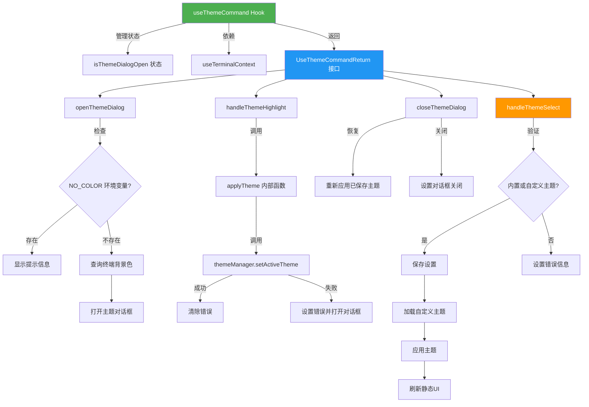

# useThemeCommand.ts

## 概述

`useThemeCommand` 是一个 React 自定义 Hook，封装了主题选择对话框的**完整交互逻辑**，包括打开/关闭主题对话框、预览（高亮）主题、正式选择并应用主题等操作。它是连接用户交互界面与主题管理系统的桥梁，处理了主题切换过程中的验证、持久化、错误处理和 UI 状态管理。

**文件路径**: `packages/cli/src/ui/hooks/useThemeCommand.ts`
**许可证**: Apache-2.0 (Copyright 2025 Google LLC)

## 架构图（Mermaid）



## 核心组件

### `UseThemeCommandReturn` 接口

Hook 的返回值类型定义：

| 字段 | 类型 | 说明 |
|------|------|------|
| `isThemeDialogOpen` | `boolean` | 主题对话框是否处于打开状态 |
| `openThemeDialog` | `() => void` | 打开主题选择对话框 |
| `closeThemeDialog` | `() => void` | 关闭主题选择对话框（并恢复预览前的主题） |
| `handleThemeSelect` | `(themeName: string, scope: LoadableSettingScope) => Promise<void>` | 正式选择并应用主题 |
| `handleThemeHighlight` | `(themeName: string \| undefined) => void` | 预览/高亮指定主题 |

### `useThemeCommand()` 函数

#### 参数说明

| 参数 | 类型 | 说明 |
|------|------|------|
| `loadedSettings` | `LoadedSettings` | 已加载的设置对象，包含 user/workspace 两个级别的设置 |
| `setThemeError` | `(error: string \| null) => void` | 设置主题错误信息的回调 |
| `addItem` | `UseHistoryManagerReturn['addItem']` | 向历史记录/消息列表添加消息的函数 |
| `initialThemeError` | `string \| null` | 初始主题错误（若存在，对话框初始即打开） |
| `refreshStatic` | `() => void` | 刷新静态 UI 内容的回调 |

### 内部函数详解

#### `openThemeDialog` - 打开主题对话框

```typescript
const openThemeDialog = useCallback(async () => {
  if (process.env['NO_COLOR']) {
    addItem({ type: MessageType.INFO, text: '...' }, Date.now());
    return;
  }
  await queryTerminalBackground();
  setIsThemeDialogOpen(true);
}, [addItem, queryTerminalBackground]);
```

- **NO_COLOR 检查**: 遵循 [NO_COLOR](https://no-color.org/) 标准，当环境变量 `NO_COLOR` 存在时，不允许打开主题配置，直接显示提示信息
- **背景色更新**: 在打开对话框前先查询最新的终端背景色，确保主题预览的准确性

#### `applyTheme` - 应用主题（内部函数）

```typescript
const applyTheme = useCallback((themeName: string | undefined) => {
  if (!themeManager.setActiveTheme(themeName)) {
    setIsThemeDialogOpen(true);
    setThemeError(`Theme "${themeName}" not found.`);
  } else {
    setThemeError(null);
  }
}, [setThemeError]);
```

- 调用 `themeManager.setActiveTheme` 设置激活主题
- 失败时自动打开对话框并设置错误信息
- 成功时清除之前的错误

#### `handleThemeHighlight` - 主题预览

```typescript
const handleThemeHighlight = useCallback((themeName: string | undefined) => {
  applyTheme(themeName);
}, [applyTheme]);
```

- 用户在主题列表中悬停/选中某个主题时调用
- 直接调用 `applyTheme` 临时应用该主题以实现实时预览效果

#### `closeThemeDialog` - 关闭对话框

```typescript
const closeThemeDialog = useCallback(() => {
  applyTheme(loadedSettings.merged.ui.theme);
  setIsThemeDialogOpen(false);
}, [applyTheme, loadedSettings]);
```

- 关闭时**恢复**已保存的主题设置，撤销任何预览产生的临时主题变更
- 确保取消操作不会影响当前实际使用的主题

#### `handleThemeSelect` - 正式选择主题

```typescript
const handleThemeSelect = useCallback(
  async (themeName: string, scope: LoadableSettingScope) => {
    try {
      // 1. 合并自定义主题
      const mergedCustomThemes = {
        ...(loadedSettings.user.settings.ui?.customThemes || {}),
        ...(loadedSettings.workspace.settings.ui?.customThemes || {}),
      };
      // 2. 验证主题是否存在
      const isBuiltIn = themeManager.findThemeByName(themeName);
      const isCustom = themeName && mergedCustomThemes[themeName];
      if (!isBuiltIn && !isCustom) {
        setThemeError(`Theme "${themeName}" not found in selected scope.`);
        setIsThemeDialogOpen(true);
        return;
      }
      // 3. 持久化设置
      loadedSettings.setValue(scope, 'ui.theme', themeName);
      // 4. 加载自定义主题
      if (loadedSettings.merged.ui.customThemes) {
        themeManager.loadCustomThemes(loadedSettings.merged.ui.customThemes);
      }
      // 5. 应用主题并刷新
      applyTheme(loadedSettings.merged.ui.theme);
      refreshStatic();
      setThemeError(null);
    } finally {
      setIsThemeDialogOpen(false);
    }
  },
  [applyTheme, loadedSettings, refreshStatic, setThemeError],
);
```

完整的主题选择流程：
1. **合并自定义主题**: 将用户级和工作区级的自定义主题合并
2. **验证可用性**: 检查主题是否为内置主题或已注册的自定义主题
3. **持久化设置**: 通过 `loadedSettings.setValue` 将主题选择保存到指定作用域
4. **加载自定义主题**: 若存在自定义主题，确保 themeManager 已加载
5. **应用并刷新**: 应用主题，刷新静态 UI，清除错误
6. **关闭对话框**: 无论成功或失败，在 `finally` 块中关闭对话框

## 依赖关系

### 内部依赖

| 模块 | 导入内容 | 用途 |
|------|---------|------|
| `../themes/theme-manager.js` | `themeManager` | 主题管理器，负责主题的查找、设置和加载 |
| `../../config/settings.js` | `LoadableSettingScope`, `LoadedSettings` (类型) | 设置作用域和已加载设置的类型定义 |
| `../types.js` | `MessageType` | 消息类型枚举（用于显示 INFO 提示） |
| `./useHistoryManager.js` | `UseHistoryManagerReturn` (类型) | 历史管理器返回值类型（获取 `addItem` 的类型） |
| `../contexts/TerminalContext.js` | `useTerminalContext` | 终端上下文，提供 `queryTerminalBackground` 方法 |

### 外部依赖

| 依赖 | 来源 | 用途 |
|------|------|------|
| `useState` | `react` | 管理主题对话框的开关状态 |
| `useCallback` | `react` | 缓存回调函数，避免不必要的重渲染 |
| `process` | `node:process` | 读取 `NO_COLOR` 环境变量 |

## 关键实现细节

1. **NO_COLOR 标准支持**: 遵循 [no-color.org](https://no-color.org/) 约定，当 `NO_COLOR` 环境变量存在时，不允许进行主题配置。此时不打开对话框，而是通过 `addItem` 显示一条 INFO 类型的提示消息。

2. **预览/回滚机制**: 主题预览通过 `handleThemeHighlight` → `applyTheme` 实现临时主题应用。关闭对话框时通过 `closeThemeDialog` 恢复到 `loadedSettings.merged.ui.theme` 中保存的主题，实现"预览但不提交"的交互模式。

3. **双层主题验证**: 主题选择时同时检查内置主题（`themeManager.findThemeByName`）和自定义主题（从 `loadedSettings` 的 user + workspace 层合并获取），确保只能选择有效的主题。

4. **作用域感知的持久化**: `handleThemeSelect` 接收 `scope` 参数（`LoadableSettingScope` 类型），允许将主题设置保存到不同的作用域（如用户级 / 工作区级），提供灵活的设置管理。

5. **初始错误状态**: 若 `initialThemeError` 非空（例如启动时配置的主题不存在），Hook 初始化时就会将 `isThemeDialogOpen` 设为 `true`，自动弹出主题选择对话框引导用户修复。

6. **终端背景色预查询**: 打开主题对话框前异步调用 `queryTerminalBackground()`，确保在显示主题预览时使用最新的终端背景色信息，提升主题匹配的准确性。

7. **自定义主题热加载**: 在 `handleThemeSelect` 中，每次选择主题后都会调用 `themeManager.loadCustomThemes`，确保最新的自定义主题定义被加载到主题管理器中。

8. **useCallback 优化**: 所有导出的回调函数均使用 `useCallback` 包装，配合正确的依赖数组，避免父组件因引用变化导致的不必要重渲染。
