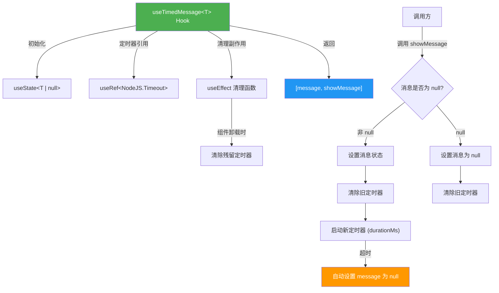

# useTimedMessage.ts

## 概述

`useTimedMessage` 是一个泛型 React 自定义 Hook，用于管理**自动消失的临时消息**。它提供了一个状态值和一个设置函数，当设置一条消息后，该消息会在指定时长后自动重置为 `null`。适用于瞬态 UI 提示，如操作成功提示、警告信息、临时提示等场景。

**文件路径**: `packages/cli/src/ui/hooks/useTimedMessage.ts`
**许可证**: Apache-2.0 (Copyright 2026 Google LLC)

## 架构图（Mermaid）



## 核心组件

### `useTimedMessage<T>(durationMs: number)` 函数

| 属性 | 说明 |
|------|------|
| **类型** | 泛型 React 自定义 Hook |
| **泛型参数** | `T` - 消息的类型，可以是任意类型（字符串、对象等） |
| **参数** | `durationMs: number` - 消息自动消失的时长（毫秒） |
| **返回值** | `readonly [T \| null, (msg: T \| null) => void]` - 元组形式，类似 `useState` 风格 |

#### 返回值说明

| 索引 | 名称 | 类型 | 说明 |
|------|------|------|------|
| `[0]` | `message` | `T \| null` | 当前消息值，无消息时为 `null` |
| `[1]` | `showMessage` | `(msg: T \| null) => void` | 设置消息的函数，传入 `null` 可立即清除消息 |

### 内部状态与引用

#### `message` 状态

```typescript
const [message, setMessage] = useState<T | null>(null);
```

- 初始值为 `null`（无消息）
- 类型为 `T | null`，泛型参数 `T` 由调用方决定

#### `timeoutRef` 引用

```typescript
const timeoutRef = useRef<NodeJS.Timeout | null>(null);
```

- 持有当前活跃的 `setTimeout` 定时器 ID
- 使用 `useRef` 而非 `useState` 存储，因为定时器 ID 的变化不需要触发重渲染
- 初始值为 `null`

### 核心函数详解

#### `showMessage` - 显示/清除消息

```typescript
const showMessage = useCallback(
  (msg: T | null) => {
    setMessage(msg);
    if (timeoutRef.current) {
      clearTimeout(timeoutRef.current);
    }
    if (msg !== null) {
      timeoutRef.current = setTimeout(() => {
        setMessage(null);
      }, durationMs);
    }
  },
  [durationMs],
);
```

执行流程：
1. **立即设置消息**: 调用 `setMessage(msg)` 立即更新 UI
2. **清除旧定时器**: 若存在之前的定时器，先清除，防止旧消息的超时回调覆盖新消息
3. **启动新定时器**: 若消息非 `null`，设置新的超时定时器，在 `durationMs` 毫秒后自动将消息重置为 `null`
4. **传入 `null` 时**: 仅清除消息和旧定时器，不启动新定时器

#### 清理副作用

```typescript
useEffect(
  () => () => {
    if (timeoutRef.current) {
      clearTimeout(timeoutRef.current);
    }
  },
  [],
);
```

- 组件卸载时清除可能残留的定时器
- 防止组件卸载后定时器回调尝试更新已卸载组件的状态（避免内存泄漏和 React 警告）
- 依赖数组为空 `[]`，仅在卸载时执行清理

## 依赖关系

### 内部依赖

无内部模块依赖。此 Hook 是一个完全独立的通用工具 Hook。

### 外部依赖

| 依赖 | 来源 | 用途 |
|------|------|------|
| `useState` | `react` | 管理消息状态 |
| `useCallback` | `react` | 缓存 `showMessage` 函数，避免不必要的重渲染 |
| `useRef` | `react` | 持有定时器 ID 的可变引用 |
| `useEffect` | `react` | 组件卸载时的定时器清理 |

## 关键实现细节

1. **泛型设计**: Hook 使用泛型 `<T>` 定义，使消息类型不受限制。调用方可以传入简单字符串，也可以传入结构化的消息对象（如 `{ text: string, severity: 'warning' | 'error' }`），提供最大的灵活性。

2. **定时器防抖**: 每次调用 `showMessage` 时，首先清除旧的定时器再创建新的。这意味着如果在消息自动消失前再次调用 `showMessage`，消失倒计时会被重置。这实现了类似"防抖"的效果，避免消息闪烁。

3. **`as const` 断言**: 返回值使用 `as const` 断言 `[message, showMessage] as const`，确保 TypeScript 推断为**只读元组类型** `readonly [T | null, (msg: T | null) => void]`，而非 `(T | null | ((msg: T | null) => void))[]` 的联合数组类型。这使调用方可以直接解构使用，无需类型断言。

4. **useRef 存储定时器**: 使用 `useRef` 而非 `useState` 存储定时器 ID，因为定时器 ID 的更新不需要触发组件重渲染。`useRef` 提供了一个跨渲染周期持久的可变引用，且不会触发额外的渲染循环。

5. **显式 null 清除支持**: `showMessage(null)` 可以立即清除当前显示的消息并取消自动消失的定时器。这为调用方提供了手动提前关闭消息的能力。

6. **组件卸载安全**: 通过 `useEffect` 返回的清理函数确保组件卸载时清除所有残留定时器。这是一个重要的内存泄漏防护措施，防止定时器回调在组件卸载后尝试调用 `setMessage`。

7. **依赖数组精确性**: `showMessage` 的 `useCallback` 依赖数组仅包含 `[durationMs]`，因为 `setMessage` 和 `timeoutRef` 的引用在整个组件生命周期内保持稳定。清理 `useEffect` 的依赖数组为空 `[]`，因为它仅依赖 `timeoutRef`（ref 引用稳定）。
