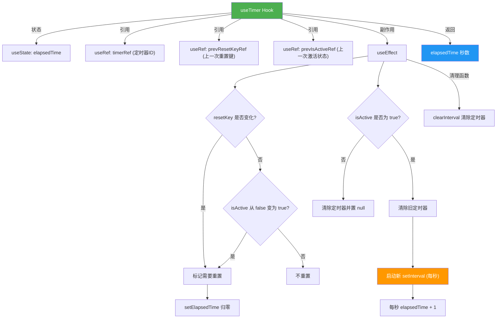

# useTimer.ts

## 概述

`useTimer` 是一个 React 自定义 Hook，实现了一个**可控的秒级递增计时器**。它支持启动/停止控制和外部重置，每秒递增一次计数。典型用途包括显示操作耗时、请求等待时间、会话持续时间等需要实时秒数显示的场景。

**文件路径**: `packages/cli/src/ui/hooks/useTimer.ts`
**许可证**: Apache-2.0 (Copyright 2025 Google LLC)

## 架构图（Mermaid）



## 核心组件

### `useTimer(isActive, resetKey)` 函数

| 属性 | 说明 |
|------|------|
| **类型** | React 自定义 Hook |
| **返回值** | `number` - 已经过的秒数 |

#### 参数说明

| 参数 | 类型 | 说明 |
|------|------|------|
| `isActive` | `boolean` | 控制计时器是否运行。`true` 启动计时，`false` 停止计时 |
| `resetKey` | `unknown` | 重置键，值发生变化时计时器归零并重新开始。可传入任意类型的值 |

### 内部状态与引用

#### `elapsedTime` 状态

```typescript
const [elapsedTime, setElapsedTime] = useState(0);
```

- 记录已经过的秒数，初始值为 `0`
- 每秒由 `setInterval` 回调递增 `1`

#### `timerRef` 引用

```typescript
const timerRef = useRef<NodeJS.Timeout | null>(null);
```

- 持有当前活跃的 `setInterval` 定时器 ID
- 用于在停止、重置或卸载时清除定时器

#### `prevResetKeyRef` 引用

```typescript
const prevResetKeyRef = useRef(resetKey);
```

- 记录上一次的 `resetKey` 值
- 通过与当前 `resetKey` 比较来检测是否需要重置计时器

#### `prevIsActiveRef` 引用

```typescript
const prevIsActiveRef = useRef(isActive);
```

- 记录上一次的 `isActive` 值
- 用于检测 `isActive` 从 `false` 到 `true` 的状态转换（重新激活时需要重置）

### Effect 逻辑详解

```typescript
useEffect(() => {
  let shouldResetTime = false;

  // 检测重置条件
  if (prevResetKeyRef.current !== resetKey) {
    shouldResetTime = true;
    prevResetKeyRef.current = resetKey;
  }
  if (prevIsActiveRef.current === false && isActive) {
    shouldResetTime = true;
  }

  // 执行重置
  if (shouldResetTime) {
    setElapsedTime(0);
  }
  prevIsActiveRef.current = isActive;

  // 管理定时器
  if (isActive) {
    if (timerRef.current) {
      clearInterval(timerRef.current);
    }
    timerRef.current = setInterval(() => {
      setElapsedTime((prev) => prev + 1);
    }, 1000);
  } else {
    if (timerRef.current) {
      clearInterval(timerRef.current);
      timerRef.current = null;
    }
  }

  // 清理函数
  return () => {
    if (timerRef.current) {
      clearInterval(timerRef.current);
      timerRef.current = null;
    }
  };
}, [isActive, resetKey]);
```

#### 重置逻辑（两种触发条件）

1. **`resetKey` 变化**: 当外部传入的 `resetKey` 与上一次不同时，计时器归零。这允许调用方通过改变 `resetKey`（例如传入新的请求 ID）来重置计时器。
2. **`isActive` 从 `false` 变为 `true`**: 当计时器重新激活时，自动归零重新计时。这确保了每次"开始"都是从 0 开始。

#### 定时器管理

- **激活状态 (`isActive === true`)**:
  - 无条件清除旧的 `setInterval`（处理 `resetKey` 变化但 `isActive` 保持 `true` 的情况）
  - 创建新的 `setInterval`，每 1000 毫秒递增 `elapsedTime`
- **非激活状态 (`isActive === false`)**:
  - 清除定时器并将引用置为 `null`
  - 不重置 `elapsedTime`（停止时保留最后的计时值）

#### 清理函数

Effect 返回的清理函数在依赖变化或组件卸载时执行，确保旧的定时器被正确清除。

## 依赖关系

### 内部依赖

无内部模块依赖。此 Hook 是一个完全独立的通用工具 Hook。

### 外部依赖

| 依赖 | 来源 | 用途 |
|------|------|------|
| `useState` | `react` | 管理 `elapsedTime` 秒数状态 |
| `useEffect` | `react` | 管理定时器的创建、重置和清理 |
| `useRef` | `react` | 存储定时器 ID、前一次 resetKey 和 isActive 值 |

## 关键实现细节

1. **双重重置触发机制**: 计时器通过两种方式触发重置：`resetKey` 变化或 `isActive` 从 `false` 转为 `true`。这两种条件在同一个 effect 中处理，确保重置逻辑的原子性。

2. **useRef 追踪前值**: 使用 `useRef` 手动追踪 `resetKey` 和 `isActive` 的前一次值，而不是使用额外的 `useEffect`。这是 React 中检测"值变化方向"的常见模式（如检测从 `false` 到 `true` 的转换）。

3. **停止不归零**: 当 `isActive` 变为 `false` 时，计时器停止但 `elapsedTime` 保持最后的值。只有在重新激活（`false` -> `true`）或 `resetKey` 变化时才会归零。这使得调用方可以在停止后仍然显示最终的计时值。

4. **无条件清除旧定时器**: 在激活状态下，每次 effect 执行时都会先清除旧的 `setInterval` 再创建新的。这处理了一个边界情况：当计时器已经在运行时 `resetKey` 发生变化（`isActive` 保持 `true`），需要重建定时器以确保计时从 0 开始的一致性。

5. **函数式状态更新**: `setElapsedTime((prev) => prev + 1)` 使用函数式更新，确保即使 `setInterval` 闭包捕获的是旧的 `elapsedTime` 值，递增操作也是基于最新状态的。这避免了闭包陷阱（stale closure）问题。

6. **`resetKey` 的 `unknown` 类型**: 参数类型设计为 `unknown`，意味着调用方可以传入任意类型（字符串、数字、对象引用等）作为重置键。Hook 使用 `!==` 严格比较来检测变化，因此对于对象类型，需要传入新的引用才能触发重置。

7. **精度说明**: 使用 `setInterval` 实现的计时器精度为约 1 秒。由于 JavaScript 事件循环的特性，实际间隔可能会略有偏差（特别是在 CPU 负载较高时），但对于 UI 展示秒数的场景已足够精确。

8. **Effect 依赖数组**: 依赖数组 `[isActive, resetKey]` 精确包含了所有影响 effect 行为的外部值。`timerRef`、`prevResetKeyRef`、`prevIsActiveRef` 和 `setElapsedTime` 在组件生命周期内引用稳定，无需加入依赖数组。
