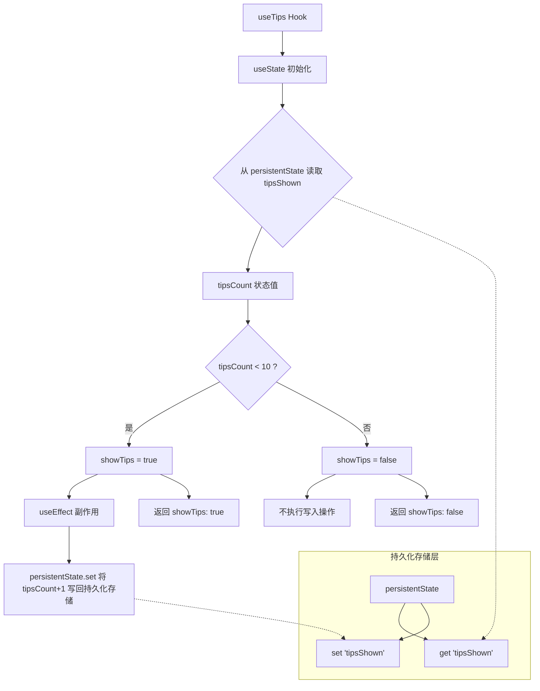

# useTips.ts

## 概述

`useTips` 是一个 React 自定义 Hook，用于控制"使用提示（Tips）"的显示逻辑。它基于持久化状态来追踪提示已经被展示的次数，并在展示次数达到上限（10 次）后自动停止显示提示。该 Hook 的设计目的是为新用户提供引导性的使用提示，同时避免对老用户造成打扰。

## 架构图（Mermaid）

## 核心组件

### 接口 `UseTipsResult`

| 属性 | 类型 | 说明 |
|------|------|------|
| `showTips` | `boolean` | 是否应该显示使用提示 |

### 函数 `useTips(): UseTipsResult`

这是该文件唯一导出的函数，是一个标准的 React 自定义 Hook。

#### 内部状态

| 变量 | 类型 | 说明 |
|------|------|------|
| `tipsCount` | `number` | 提示已展示的次数，通过 `useState` 惰性初始化从持久化存储中读取，默认值为 `0` |
| `showTips` | `boolean` | 派生状态，当 `tipsCount < 10` 时为 `true` |

#### 副作用逻辑

- 当 `showTips` 为 `true` 时，通过 `useEffect` 将 `tipsCount + 1` 写回持久化存储
- 依赖数组为 `[tipsCount, showTips]`，确保仅在这两个值变化时触发
- 这意味着每次组件挂载并且 `showTips` 为 `true` 时，计数器会自增 1

#### 返回值

返回一个对象 `{ showTips }`，调用方据此决定是否渲染提示内容。

## 依赖关系

### 内部依赖

| 模块路径 | 说明 |
|----------|------|
| `../../utils/persistentState.js` | 持久化状态管理工具，提供 `get` 和 `set` 方法，用于跨会话存储提示展示次数 |

### 外部依赖

| 包名 | 导入内容 | 说明 |
|------|----------|------|
| `react` | `useEffect`, `useState` | React 核心 Hooks |

## 关键实现细节

1. **惰性初始化**：`useState` 使用函数形式 `() => persistentState.get('tipsShown') ?? 0` 进行惰性初始化，确保 `persistentState.get` 只在组件首次挂载时执行一次，避免不必要的重复读取。

2. **空值合并运算符**：使用 `?? 0` 处理 `persistentState.get('tipsShown')` 返回 `null` 或 `undefined` 的情况（即首次使用时尚无存储值），默认从 0 开始计数。

3. **展示上限为 10 次**：硬编码的阈值 `10` 控制提示最多展示 10 次。一旦 `tipsCount` 达到 10，`showTips` 变为 `false`，副作用不再触发，计数器也不会继续增长。

4. **单向递增**：该 Hook 没有提供重置计数器的接口，提示展示次数只会单调递增直到达到上限。

5. **只读状态设计**：`useState` 解构时只取了 `tipsCount`，未暴露 `setTipsCount`，说明该状态在 Hook 生命周期内不会被修改，仅作为初始化时的快照使用。

6. **持久化存储键名**：使用 `'tipsShown'` 作为持久化存储的键名，这个键在 `persistentState` 模块的全局存储空间中必须是唯一的。
