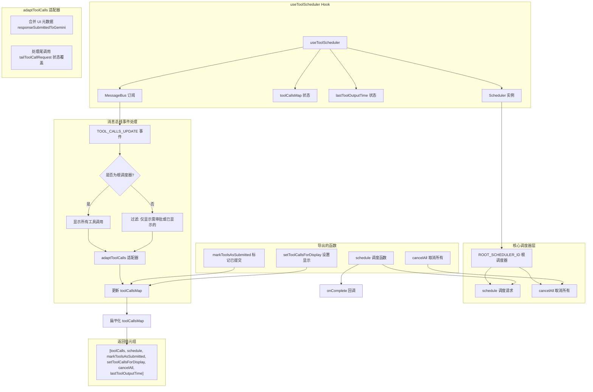

# useToolScheduler.ts

## 概述

`useToolScheduler` 是一个核心的 React 自定义 Hook，负责管理工具调用（Tool Call）的完整生命周期调度。它封装了 `@google/gemini-cli-core` 中的 `Scheduler` 类，提供了事件驱动的工具调用状态管理机制。该 Hook 支持多调度器架构（根调度器 + 子代理调度器），通过消息总线（MessageBus）订阅工具调用状态更新事件，并将核心层的工具调用状态适配为 UI 层可消费的追踪状态。

主要职责包括：
- 创建和管理根调度器（Root Scheduler）实例
- 调度工具调用请求并等待执行结果
- 通过消息总线实时跟踪工具调用状态变化
- 管理多调度器（含子代理调度器）的工具调用状态映射
- 过滤子代理的工具调用以避免 UI 闪烁
- 提供取消所有工具调用的能力
- 标记已提交给 Gemini 的工具调用响应

## 架构图（Mermaid）



## 核心组件

### 类型定义

#### `ScheduleFn`

```typescript
type ScheduleFn = (
  request: ToolCallRequestInfo | ToolCallRequestInfo[],
  signal: AbortSignal,
) => Promise<CompletedToolCall[]>;
```

调度函数类型，接收单个或多个工具调用请求以及中止信号，返回已完成的工具调用结果数组。

#### `MarkToolsAsSubmittedFn`

```typescript
type MarkToolsAsSubmittedFn = (callIds: string[]) => void;
```

标记指定 ID 的工具调用已提交给 Gemini 的函数类型。

#### `CancelAllFn`

```typescript
type CancelAllFn = (signal: AbortSignal) => void;
```

取消所有工具调用的函数类型。

#### `TrackedToolCall`

```typescript
type TrackedToolCall = ToolCall & {
  responseSubmittedToGemini?: boolean;
};
```

在核心 `ToolCall` 基础上扩展了 UI 元数据标志 `responseSubmittedToGemini`，用于标识该工具调用的响应是否已经重新提交给 Gemini 模型。

#### 窄化类型

基于 `TrackedToolCall` 的 `status` 字段，使用 `Extract` 工具类型派生出以下窄化类型，供 `useGeminiStream` 等消费方使用：

| 类型 | 对应状态 | 说明 |
|------|----------|------|
| `TrackedScheduledToolCall` | `'scheduled'` | 已调度等待执行 |
| `TrackedValidatingToolCall` | `'validating'` | 正在验证中 |
| `TrackedWaitingToolCall` | `'awaiting_approval'` | 等待用户审批 |
| `TrackedExecutingToolCall` | `'executing'` | 正在执行 |
| `TrackedCompletedToolCall` | `'success' \| 'error'` | 已完成（成功或失败） |
| `TrackedCancelledToolCall` | `'cancelled'` | 已取消 |

### 主函数 `useToolScheduler`

#### 参数

| 参数 | 类型 | 说明 |
|------|------|------|
| `onComplete` | `(tools: CompletedToolCall[]) => Promise<void>` | 所有工具调用完成后的回调函数，用于将结果重新注入 Gemini 流 |
| `config` | `Config` | 配置对象，提供消息总线和其他上下文 |
| `getPreferredEditor` | `() => EditorType \| undefined` | 获取用户偏好编辑器类型的函数 |

#### 返回值（元组）

| 索引 | 类型 | 说明 |
|------|------|------|
| 0 | `TrackedToolCall[]` | 当前所有被追踪的工具调用（已扁平化） |
| 1 | `ScheduleFn` | 调度工具调用的函数 |
| 2 | `MarkToolsAsSubmittedFn` | 标记工具调用已提交的函数 |
| 3 | `React.Dispatch<React.SetStateAction<TrackedToolCall[]>>` | 设置工具调用显示列表的函数（兼容遗留接口） |
| 4 | `CancelAllFn` | 取消所有工具调用的函数 |
| 5 | `number` | 最后一次工具输出的时间戳 |

### 辅助函数 `adaptToolCalls`

```typescript
function adaptToolCalls(
  coreCalls: ToolCall[],
  prevTracked: TrackedToolCall[],
): TrackedToolCall[]
```

适配器函数，将核心层的 `ToolCall[]` 转换为 UI 层的 `TrackedToolCall[]`。主要职责：

1. **保留 UI 元数据**：从之前的追踪状态中恢复 `responseSubmittedToGemini` 标志
2. **尾调用状态覆盖**：如果工具调用已完成（`Success` 或 `Error`）但存在尾调用请求（`tailToolCallRequest`），则强制将状态覆盖为 `Executing`，让 UI 将其渲染为仍在执行中

## 依赖关系

### 内部依赖

| 模块 | 导入内容 | 说明 |
|------|----------|------|
| `@google/gemini-cli-core` | `Config`, `ToolCallRequestInfo`, `ToolCall`, `CompletedToolCall`, `MessageBusType`, `ROOT_SCHEDULER_ID`, `Scheduler`, `EditorType`, `ToolCallsUpdateMessage`, `CoreToolCallStatus` | 核心调度器和相关类型定义 |

### 外部依赖

| 包名 | 导入内容 | 说明 |
|------|----------|------|
| `react` | `useCallback`, `useState`, `useMemo`, `useEffect`, `useRef` | React 核心 Hooks |

## 关键实现细节

1. **事件驱动架构**：该 Hook 不直接轮询工具调用状态，而是通过 `MessageBus` 订阅 `TOOL_CALLS_UPDATE` 事件来被动接收状态变化通知。这种模式解耦了核心调度逻辑和 UI 渲染逻辑。

2. **多调度器状态映射**：内部使用 `Record<string, TrackedToolCall[]>` 结构（`toolCallsMap`）按 `schedulerId` 分组管理工具调用。这支持了子代理（Sub-Agent）场景中多个调度器并存的需求。对外暴露时通过 `Object.values(toolCallsMap).flat()` 扁平化为单一列表。

3. **子代理工具调用过滤**：对于非根调度器的工具调用更新，仅保留处于 `AwaitingApproval` 状态的或之前已经显示过的工具调用。这是为了避免子代理内部的"思考类"工具调用（如读取/搜索操作）在 UI 中闪烁出现又消失。

4. **Ref 模式避免陈旧闭包**：`onComplete` 和 `getPreferredEditor` 两个回调通过 `useRef` + `useEffect` 模式保持最新引用，避免了 `useCallback`/`useMemo` 依赖数组中包含这些回调导致的不必要重创建。

5. **尾调用（Tail Call）处理**：`adaptToolCalls` 函数检测完成状态的工具调用是否存在 `tailToolCallRequest`，如果存在则强制将 UI 状态覆盖为 `Executing`。这处理了工具调用链式执行的过渡状态，确保 UI 不会过早显示完成状态。

6. **调度器生命周期管理**：通过 `useEffect(() => () => scheduler.dispose(), [scheduler])` 确保在调度器实例变化或组件卸载时正确清理调度器资源。

7. **兼容遗留接口**：`setToolCallsForDisplay` 函数接收扁平化的工具调用列表作为输入，内部自动按 `schedulerId` 重新分组存入 `toolCallsMap`，从而兼容了之前使用单一列表的遗留代码。

8. **输出时间戳追踪**：`lastToolOutputTime` 记录最近一次有工具处于执行中或存在尾调用的时间戳，用于 UI 中 Spinner 动画的控制。

9. **调度时清空状态**：每次调用 `schedule` 函数时，先通过 `setToolCallsMap({})` 清空之前的状态，确保新一轮调度不会受到旧状态的干扰。
