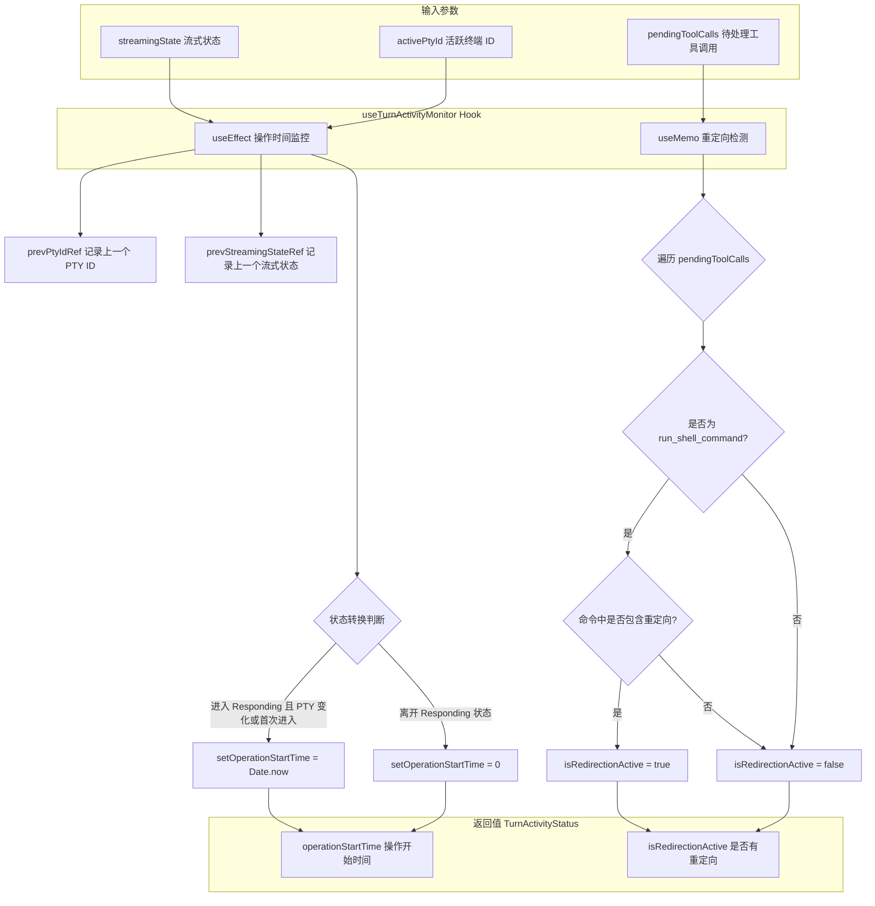

# useTurnActivityMonitor.ts

## 概述

`useTurnActivityMonitor` 是一个 React 自定义 Hook，用于监控 Gemini 对话回合（Turn）中的活动状态。它的主要职责有两个：

1. **检测新操作的开始时间**：当进入"响应中（Responding）"状态或活跃的 PTY（伪终端）发生变化时，记录操作开始的时间戳。
2. **检测 Shell 重定向**：扫描当前正在执行的工具调用中的 `run_shell_command`，判断是否包含 Shell 重定向操作（如管道、输出重定向等），以便在存在重定向时抑制"无活动"提示。

这两个信息共同帮助 UI 层判断当前回合是否处于活跃状态、是否应该显示不活跃超时警告等。

## 架构图（Mermaid）

## 核心组件

### 接口 `TurnActivityStatus`

| 属性 | 类型 | 说明 |
|------|------|------|
| `operationStartTime` | `number` | 当前操作开始的时间戳（毫秒）。为 `0` 表示当前无活跃操作 |
| `isRedirectionActive` | `boolean` | 当前是否有工具调用包含 Shell 重定向 |

### 函数 `useTurnActivityMonitor`

#### 参数

| 参数 | 类型 | 默认值 | 说明 |
|------|------|--------|------|
| `streamingState` | `StreamingState` | - | 当前的流式传输状态（如 Idle、Responding 等） |
| `activePtyId` | `number \| string \| null \| undefined` | - | 当前活跃的伪终端 ID |
| `pendingToolCalls` | `TrackedToolCall[]` | `[]` | 当前待处理/执行中的工具调用列表 |

#### 返回值

返回 `TurnActivityStatus` 对象，包含操作开始时间和重定向活跃状态。

### 内部 Ref 状态

| Ref | 类型 | 说明 |
|-----|------|------|
| `prevPtyIdRef` | `number \| string \| null \| undefined` | 记录上一次的 PTY ID，用于检测 PTY 变化 |
| `prevStreamingStateRef` | `StreamingState \| undefined` | 记录上一次的流式状态，用于检测状态转换 |

## 依赖关系

### 内部依赖

| 模块路径 | 导入内容 | 说明 |
|----------|----------|------|
| `../types.js` | `StreamingState` | 流式传输状态枚举 |
| `@google/gemini-cli-core` | `hasRedirection` | 判断命令字符串是否包含 Shell 重定向的工具函数 |
| `./useToolScheduler.js` | `TrackedToolCall` | 被追踪的工具调用类型 |

### 外部依赖

| 包名 | 导入内容 | 说明 |
|------|----------|------|
| `react` | `useState`, `useEffect`, `useRef`, `useMemo` | React 核心 Hooks |

## 关键实现细节

1. **操作开始时间的重置逻辑**：`operationStartTime` 会在以下两种情况下被设置为 `Date.now()`：
   - 从非 Responding 状态转入 Responding 状态（新操作开始）
   - 在 Responding 状态下 `activePtyId` 发生变化（同一回合内启动了新命令）

   当从 Responding 状态转出时，`operationStartTime` 被重置为 `0`，表示当前无活跃操作。

2. **Ref 记录前值模式**：使用 `prevPtyIdRef` 和 `prevStreamingStateRef` 两个 Ref 来记录上一次的值，以便在 `useEffect` 中进行"当前值 vs 前值"的对比，从而检测状态转换。这是 React 中常见的"记录上一个值"模式。

3. **重定向检测的渲染时计算**：`isRedirectionActive` 使用 `useMemo` 在渲染阶段同步计算，而非在 `useEffect` 中异步计算。注释中特别说明这是为了"确保从第一帧起就是准确的"（accurate from the first frame），避免因 Effect 延迟导致的一帧不一致。

4. **Shell 重定向的判断范围**：仅检查工具调用名称为 `run_shell_command` 的调用，从其参数中提取 `command` 字符串，然后委托给核心层的 `hasRedirection` 函数进行判断。`hasRedirection` 负责检测管道（`|`）、输出重定向（`>`、`>>`）等操作。

5. **抑制不活跃提示**：当 `isRedirectionActive` 为 `true` 时，调用方应该抑制不活跃超时提示。这是因为 Shell 重定向（如长时间运行的管道命令）可能导致长时间无输出，但这不意味着操作已经停滞。

6. **默认参数**：`pendingToolCalls` 有默认值 `[]`，使得调用方在没有待处理工具调用时可以省略该参数。
