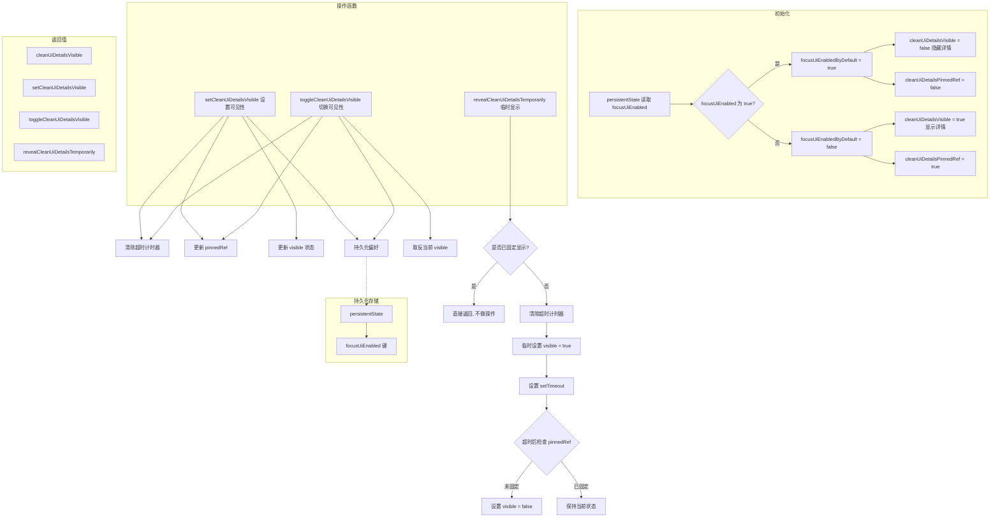

# useVisibilityToggle.ts

## 概述

`useVisibilityToggle` 是一个 React 自定义 Hook，用于管理 UI 详细信息面板的可见性切换逻辑。它实现了一个"焦点模式（Focus UI）"功能，允许用户在简洁视图和详细视图之间切换，并将用户偏好持久化存储。

该 Hook 的核心特性包括：
- **持久化偏好**：通过 `persistentState` 记住用户是否启用了焦点模式，跨会话保持一致
- **固定/临时显示**：支持将详细信息"固定"显示（用户主动切换）和"临时"显示（如审批模式下短暂显示后自动隐藏）
- **自动超时隐藏**：临时显示模式下，经过指定时长（默认 1200ms）后自动恢复隐藏状态

## 架构图（Mermaid）

## 核心组件

### 导出常量

| 常量 | 值 | 说明 |
|------|-----|------|
| `APPROVAL_MODE_REVEAL_DURATION_MS` | `1200` | 审批模式下临时显示详细信息的默认持续时间（毫秒） |

### 内部常量

| 常量 | 值 | 说明 |
|------|-----|------|
| `FOCUS_UI_ENABLED_STATE_KEY` | `'focusUiEnabled'` | 持久化存储中焦点模式偏好的键名 |

### 函数 `useVisibilityToggle`

#### 参数

无参数。

#### 内部状态

| 状态/Ref | 类型 | 说明 |
|----------|------|------|
| `focusUiEnabledByDefault` | `boolean`（只读） | 从持久化存储中读取的焦点模式默认偏好值 |
| `cleanUiDetailsVisible` | `boolean` | 当前详细信息面板是否可见 |
| `modeRevealTimeoutRef` | `NodeJS.Timeout \| null` | 临时显示模式的超时计时器引用 |
| `cleanUiDetailsPinnedRef` | `boolean` | 详细信息面板是否被"固定"显示（区别于临时显示） |

#### 返回值

| 属性 | 类型 | 说明 |
|------|------|------|
| `cleanUiDetailsVisible` | `boolean` | 当前详细信息面板是否可见 |
| `setCleanUiDetailsVisible` | `(visible: boolean) => void` | 直接设置可见性（同时固定状态并持久化） |
| `toggleCleanUiDetailsVisible` | `() => void` | 切换可见性（同时固定状态并持久化） |
| `revealCleanUiDetailsTemporarily` | `(durationMs?: number) => void` | 临时显示详细信息面板，到期后自动隐藏 |

### 内部辅助函数

#### `clearModeRevealTimeout`

清除当前的临时显示超时计时器。在每次设置新的可见性状态或新的临时显示之前调用，确保不会有残留的计时器干扰行为。

#### `persistFocusUiPreference`

将焦点模式偏好写入持久化存储。注意存储值的语义是"焦点模式是否启用"（即详细信息隐藏），与 `isFullUiVisible` 参数相反，因此使用 `!isFullUiVisible` 进行转换。

## 依赖关系

### 内部依赖

| 模块路径 | 导入内容 | 说明 |
|----------|----------|------|
| `../../utils/persistentState.js` | `persistentState` | 持久化状态管理工具，提供 `get` 和 `set` 方法 |

### 外部依赖

| 包名 | 导入内容 | 说明 |
|------|----------|------|
| `react` | `useState`, `useRef`, `useCallback`, `useEffect` | React 核心 Hooks |

## 关键实现细节

1. **"固定"与"临时"的区分机制**：使用 `cleanUiDetailsPinnedRef`（Ref）来区分两种显示模式。当用户主动调用 `setCleanUiDetailsVisible` 或 `toggleCleanUiDetailsVisible` 时，`pinnedRef` 会被设为对应的值，表示用户主动控制了可见性。而 `revealCleanUiDetailsTemporarily` 不会修改 `pinnedRef`，仅临时改变可见状态。

2. **临时显示的安全保护**：
   - 如果详细信息已经被"固定"显示（`cleanUiDetailsPinnedRef.current === true`），调用 `revealCleanUiDetailsTemporarily` 会直接返回，不做任何操作，避免固定显示的面板被意外隐藏。
   - 超时回调中再次检查 `pinnedRef`，确保在临时显示期间如果用户主动固定了面板，超时后不会将其隐藏。

3. **持久化语义转换**：存储键 `focusUiEnabled` 的语义是"焦点模式是否启用"，而 Hook 返回的 `cleanUiDetailsVisible` 语义是"详细信息是否可见"，两者恰好相反。`persistFocusUiPreference(isFullUiVisible)` 内部使用 `!isFullUiVisible` 做了转换。

4. **惰性初始化**：`focusUiEnabledByDefault` 使用 `useState` 的函数形式初始化，确保 `persistentState.get` 只在首次挂载时执行一次。同时使用严格等于 `=== true` 进行比较，确保非布尔值（如 `null`、`undefined`）被当作 `false` 处理。

5. **计时器清理**：通过 `useEffect` 的清理函数在组件卸载时调用 `clearModeRevealTimeout()`，防止组件卸载后仍然触发 `setTimeout` 回调导致的内存泄漏或对已卸载组件的状态更新。

6. **超时前清除旧计时器**：每次 `revealCleanUiDetailsTemporarily` 调用时都会先 `clearModeRevealTimeout()`，确保多次快速调用不会叠加多个计时器，只保留最后一次的超时。

7. **临时显示不持久化**：临时显示（`revealCleanUiDetailsTemporarily`）不会调用 `persistFocusUiPreference`，因此不会影响用户的持久化偏好。只有用户主动操作（`set` 或 `toggle`）才会持久化。
