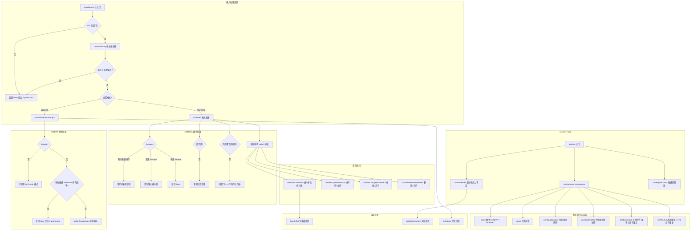

# vim.ts

## 概述

`vim.ts` 是一个实现了完整 Vim 风格文本编辑功能的 React 自定义 Hook 模块。它为 CLI 的文本输入组件提供了模态编辑（INSERT/NORMAL 两种模式）能力，支持 Vim 中常见的导航、编辑、删除、修改、复制粘贴、字符查找、撤销和命令重复等操作。

该模块使用 `useReducer` 管理复杂的 Vim 编辑器状态机，通过 `TextBuffer` 接口与底层文本缓冲区交互，并通过 `VimModeContext` 与全局 Vim 模式设置保持同步。

### 支持的 Vim 功能一览

| 功能类别 | 支持的命令 |
|----------|-----------|
| 模式切换 | `i`, `a`, `o`, `O`, `I`, `A`, `Escape` |
| 光标移动 | `h`, `j`, `k`, `l`, `w`, `W`, `b`, `B`, `e`, `E`, `0`, `$`, `^`, `gg`, `G`, 方向键 |
| 删除操作 | `x`, `X`, `dd`, `dw`, `dW`, `db`, `dB`, `de`, `dE`, `D`, `d0`, `d^`, `dh/dj/dk/dl`, `dgg`, `dG` |
| 修改操作 | `cc`, `cw`, `cW`, `cb`, `cB`, `ce`, `cE`, `C`, `c0`, `c^`, `ch/cj/ck/cl`, `cgg`, `cG` |
| 复制粘贴 | `yy`, `yw`, `yW`, `ye`, `yE`, `y$`, `Y`, `p`, `P` |
| 字符操作 | `r` (替换), `~` (大小写切换) |
| 字符查找 | `f`, `F`, `t`, `T`, `;`, `,` |
| 计数前缀 | 数字 `1-9`（支持多位数），如 `3dw`, `5j` |
| 命令重复 | `.`（点命令，重复上一次编辑操作） |
| 撤销 | `u` |
| 双击 Escape | 清空输入缓冲区 |

## 架构图（Mermaid）



## 核心组件

### 类型定义

#### `VimMode`

```typescript
type VimMode = 'NORMAL' | 'INSERT';
```

Vim 的两种编辑模式。

#### `PendingFindOp`

```typescript
type PendingFindOp = {
  op: 'f' | 'F' | 't' | 'T' | 'r';
  operator: 'd' | 'c' | undefined;
  count: number;
};
```

表示等待用户输入下一个字符的查找/替换操作。`op` 是操作类型，`operator` 表示是否与删除/修改组合（如 `df`, `ct`），`count` 是在按键时捕获的计数值。

#### `VimState`

```typescript
type VimState = {
  mode: VimMode;
  count: number;
  pendingOperator: 'g' | 'd' | 'c' | 'y' | 'dg' | 'cg' | null;
  pendingFindOp: PendingFindOp | undefined;
  lastCommand: { type: string; count: number; char?: string } | null;
  lastFind: { op: 'f' | 'F' | 't' | 'T'; char: string } | undefined;
};
```

Vim 编辑器的完整状态，由 `useReducer` 管理。

| 字段 | 说明 |
|------|------|
| `mode` | 当前模式 |
| `count` | 正在输入的数字前缀（如 `3dw` 中的 `3`） |
| `pendingOperator` | 等待后续动作的操作符（`d` 等待 `w/b/e/d` 等，`g` 等待第二个 `g`） |
| `pendingFindOp` | 等待目标字符的查找/替换操作 |
| `lastCommand` | 上一次执行的编辑命令，供 `.` 命令重复使用 |
| `lastFind` | 上一次的字符查找操作，供 `;` 和 `,` 重复使用 |

#### `VimAction`

联合类型，包含 10 种 Action，用于驱动 `vimReducer` 状态转换：

| Action 类型 | 说明 |
|-------------|------|
| `SET_MODE` | 设置模式 |
| `SET_COUNT` | 设置计数 |
| `INCREMENT_COUNT` | 追加数字位到计数（`count * 10 + digit`） |
| `CLEAR_COUNT` | 清零计数 |
| `SET_PENDING_OPERATOR` | 设置待处理操作符 |
| `SET_PENDING_FIND_OP` | 设置待处理查找操作 |
| `SET_LAST_FIND` | 记录上次查找 |
| `SET_LAST_COMMAND` | 记录上次命令 |
| `CLEAR_PENDING_STATES` | 清除所有待处理状态（计数、操作符、查找） |
| `ESCAPE_TO_NORMAL` | Escape 键回到 NORMAL 模式（同时清除待处理状态） |

### 常量

| 常量 | 值 | 说明 |
|------|-----|------|
| `DIGIT_MULTIPLIER` | `10` | 数字前缀的进位乘数 |
| `DEFAULT_COUNT` | `1` | 未输入数字前缀时的默认计数值 |
| `DIGIT_1_TO_9` | `/^[1-9]$/` | 匹配数字 1-9 的正则 |
| `DOUBLE_ESCAPE_TIMEOUT_MS` | `500` | 双击 Escape 的超时时间（毫秒） |

### `CMD_TYPES` 命令类型常量

一个 `as const` 对象，定义了所有可重复执行的编辑命令的字符串标识符。这些标识符用于：
1. `executeCommand` 函数的 switch 分发
2. `lastCommand.type` 记录以供 `.` 命令重复

包含以下类别：
- 删除词/大词相关：`dw`, `db`, `de`, `dW`, `dB`, `dE`
- 修改词/大词相关：`cw`, `cb`, `ce`, `cW`, `cB`, `cE`
- 字符操作：`x`, `X`, `~`, `r`
- 行操作：`dd`, `cc`, `D`, `C`
- 方向操作：`ch/cj/ck/cl`, `dh/dj/dk/dl`
- 行首/行尾：`d0`, `d^`, `c0`, `c^`
- 跳转操作：`dgg`, `dG`, `cgg`, `cG`
- 复制粘贴：`yy`, `yw`, `yW`, `ye`, `yE`, `y$`, `p`, `P`

### 主函数 `useVim`

#### 参数

| 参数 | 类型 | 说明 |
|------|------|------|
| `buffer` | `TextBuffer` | 文本缓冲区实例，提供所有 Vim 操作方法（如 `vimMoveLeft`, `vimDeleteWord` 等） |
| `onSubmit` | `(value: string) => void` (可选) | 在 INSERT 模式下按 Enter 提交命令时的回调 |

#### 返回值

| 属性 | 类型 | 说明 |
|------|------|------|
| `mode` | `VimMode` | 当前 Vim 模式 |
| `vimModeEnabled` | `boolean` | Vim 模式是否全局启用 |
| `handleInput` | `(key: Key) => boolean` | 按键输入处理函数，返回 `true` 表示已处理，`false` 表示交给其他处理器 |

### 内部关键函数

#### `vimReducer`

纯函数 Reducer，根据 `VimAction` 更新 `VimState`。`CLEAR_PENDING_STATES` 和 `ESCAPE_TO_NORMAL` 共用 `createClearPendingState()` 来生成清空后的部分状态。

#### `executeCommand(cmdType, count, char?)`

统一的命令执行器，接收命令类型标识符和计数，通过 switch 语句分发到对应的 `buffer.vim*` 方法。所有 `change` 类命令在执行后会自动切换到 INSERT 模式。返回 `boolean` 表示是否成功匹配命令。

该函数的设计目的是消除 `.` 点命令重复时的代码重复——初始执行和重复执行都通过同一个函数完成。

#### `handleInsertModeInput(normalizedKey)`

INSERT 模式的按键处理：
- **Escape**：切换到 NORMAL 模式，同时记录 Escape 时间戳用于双击检测
- **Tab/Enter/Up/Down/Ctrl+R**：返回 `false`，交给 `InputPrompt` 处理补全相关功能
- **Ctrl+U/Ctrl+K**：返回 `false`，交给 `InputPrompt` 处理行删除
- **Ctrl+V**：返回 `false`，交给 `InputPrompt` 处理剪贴板图片粘贴
- **`!` 在空缓冲区**：返回 `false`，交给 `InputPrompt` 处理 Shell 命令
- **Enter（无修饰键）**：如果有文本则提交命令
- **其他按键**：委托给 `buffer.handleInput`

#### `handleChangeMovement(movement)` 和 `handleDeleteMovement(movement)`

处理 `ch/cj/ck/cl` 和 `dh/dj/dk/dl` 组合命令。两者都调用 `buffer.vimChangeMovement`，区别在于 `change` 版本会在删除后切换到 INSERT 模式。

#### `handleOperatorMotion(operator, motion)`

处理 `dw/cw/db/cb/de/ce` 等操作符+动作组合命令，通过查表映射到对应的 `CMD_TYPES` 标识符后委托给 `executeCommand`。

#### `normalizeKey(key)`

将原始按键输入标准化，确保所有属性（`name`, `sequence`, `shift`, `alt`, `ctrl`, `cmd`, `insertable`）都有默认值。

#### `checkDoubleEscape()`

通过比较当前时间和上次 Escape 时间戳来判断是否为双击 Escape。如果两次 Escape 间隔在 `DOUBLE_ESCAPE_TIMEOUT_MS`（500ms）以内，则返回 `true` 并重置时间戳。

## 依赖关系

### 内部依赖

| 模块路径 | 导入内容 | 说明 |
|----------|----------|------|
| `./useKeypress.js` | `Key` 类型 | 按键事件的类型定义 |
| `../components/shared/text-buffer.js` | `TextBuffer` 类型 | 文本缓冲区接口，提供所有 Vim 文本操作方法 |
| `../contexts/VimModeContext.js` | `useVimMode` | Vim 模式全局上下文 Hook，提供 `vimEnabled`、`vimMode`、`setVimMode` |
| `@google/gemini-cli-core` | `debugLogger` | 调试日志工具 |
| `../key/keyMatchers.js` | `Command` | 按键命令枚举 |
| `./useKeyMatchers.js` | `useKeyMatchers` | 按键匹配器 Hook |
| `../utils/textUtils.js` | `toCodePoints` | 文本转 Unicode 码点工具函数 |

### 外部依赖

| 包名 | 导入内容 | 说明 |
|------|----------|------|
| `react` | `useCallback`, `useReducer`, `useEffect`, `useRef` | React 核心 Hooks |

## 关键实现细节

1. **状态机设计**：使用 `useReducer` 而非多个 `useState` 来管理 Vim 状态，这是因为 Vim 的状态转换涉及多个相互关联的字段（模式、计数、待处理操作符等），单一 Reducer 可以保证状态转换的原子性和一致性。

2. **操作符-动作（Operator-Motion）模式**：实现了 Vim 的经典"操作符等待动作"模式。当用户按下 `d`、`c` 或 `y` 时，设置 `pendingOperator`，然后等待后续的动作键（如 `w`、`b`、`e`、`h/j/k/l` 等）。这需要两次按键才能完成一个完整命令。

3. **三级操作符组合**：支持 `dgg` 和 `cgg` 等三级组合命令。当 `pendingOperator` 为 `d` 时按 `g` 会变为 `dg`，再按 `g` 才执行 `dgg`。这通过 `pendingOperator` 的 `'dg'`/`'cg'` 中间状态实现。

4. **字符查找的组合**：`f/F/t/T` 查找操作可以与 `d/c` 操作符组合使用（如 `df,` 删除到逗号，`ct"` 修改到引号前）。`pendingFindOp` 中记录了操作符上下文和捕获时的计数值。

5. **双击 Escape 清空输入**：在 NORMAL 模式下，单击 Escape 如果没有待处理操作则返回 `false` 交给 UI；如果在 500ms 内再次按 Escape，则清空整个输入缓冲区。这是一个便利功能，类似于在 Vim 中连续按 Escape 确保回到干净状态。

6. **点命令（`.`）重复**：通过 `lastCommand` 记录上次执行的命令类型、计数和可选字符。`.` 命令可以使用当前输入的计数覆盖原始计数，也可以不输入计数而使用原始计数，完全符合 Vim 的行为。

7. **查找重复（`;` 和 `,`）**：通过 `lastFind` 记录上次的查找方向和目标字符。`;` 重复同方向查找，`,` 重复反方向查找。

8. **模式同步**：Vim 模式同时存在于本地 Reducer 状态和全局 `VimModeContext` 中。`updateMode` 函数同时更新两处，而 `useEffect` 监听全局上下文的变化并同步回本地状态，确保双向一致。

9. **INSERT 模式的按键穿透**：INSERT 模式下，多种特殊按键（Tab、Ctrl+R、方向键等）被设计为"穿透"到 `InputPrompt` 组件处理，因为这些按键与补全、历史记录等 UI 功能相关，不应被 Vim Hook 拦截。

10. **计数前缀的进位逻辑**：数字前缀通过 `count * 10 + digit` 累积，支持多位数输入（如输入 `123` 得到 count=123）。`0` 在 `count > 0` 时被当作数字（即输入 `10` 中的 `0`），在 `count === 0` 时被当作"移动到行首"命令，与 Vim 行为一致。

11. **大小词（Word vs WORD）区分**：支持 Vim 中的小写 `w/b/e`（按标点分隔的词）和大写 `W/B/E`（仅按空白分隔的大词），分别映射到不同的 `buffer.vim*` 方法。

12. **`Y` 的语义**：`Y` 被实现为 `y$`（复制到行尾），而非 `yy`（复制整行）。这符合现代 Vim 的推荐配置（很多用户会配置 `nnoremap Y y$`）。

13. **错误处理**：`normalizeKey` 调用包裹在 `try-catch` 中，格式错误的按键输入会被优雅地忽略并通过 `debugLogger.warn` 记录日志。

14. **`TextBuffer` 接口依赖**：该 Hook 高度依赖 `TextBuffer` 提供的大量 `vim*` 方法（约 40+ 个方法），实际的文本操作逻辑全部委托给 `TextBuffer`，Hook 本身只负责按键解析、状态管理和命令分发。
