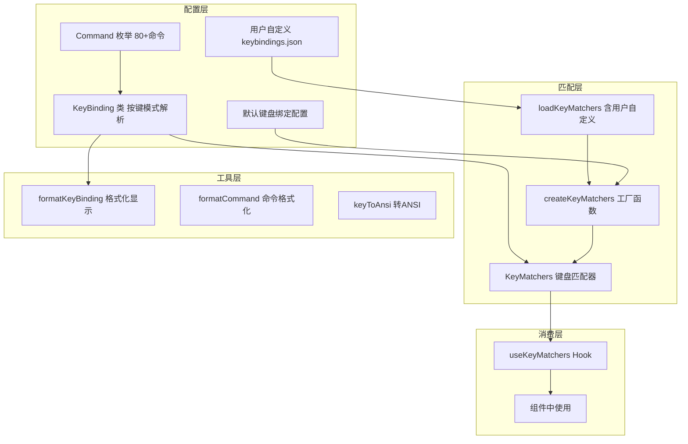

# key

## 概述

`key` 目录实现了 Gemini CLI 的键盘绑定系统。它提供了一个数据驱动的快捷键配置机制，定义了 80+ 个键盘命令（涵盖基本控制、光标移动、编辑、滚动、历史搜索、导航、补全、文本输入、应用控制、后台 Shell 控制等类别），支持用户通过 `keybindings.json` 文件自定义快捷键。

## 目录结构

```
key/
├── keyBindings.ts       # Command 枚举、KeyBinding 类、默认绑定配置、自定义加载
├── keyMatchers.ts       # 键盘匹配器创建和查询
├── keybindingUtils.ts   # 快捷键格式化（人类可读字符串）
└── keyToAnsi.ts         # Key 对象到 ANSI 转义序列的转换
```

## 架构图



## 核心组件

### `Command` 枚举 (`keyBindings.ts`)

定义了所有可绑定的键盘命令，分为 10 个类别：

| 类别 | 示例命令 | 说明 |
|------|----------|------|
| 基本控制 | `RETURN`, `ESCAPE`, `QUIT`, `EXIT` | 确认、取消、退出 |
| 光标移动 | `HOME`, `END`, `MOVE_WORD_LEFT` | 光标导航 |
| 编辑 | `KILL_LINE_RIGHT`, `UNDO`, `REDO` | 文本编辑 |
| 滚动 | `SCROLL_UP`, `PAGE_DOWN` | 内容滚动 |
| 历史搜索 | `HISTORY_UP`, `REVERSE_SEARCH` | 输入历史 |
| 导航 | `NAVIGATION_UP`, `DIALOG_NEXT` | 列表/对话框导航 |
| 补全 | `ACCEPT_SUGGESTION`, `COMPLETION_UP` | 自动补全 |
| 文本输入 | `SUBMIT`, `NEWLINE`, `PASTE_CLIPBOARD` | 提交和输入 |
| 应用控制 | `TOGGLE_MARKDOWN`, `TOGGLE_YOLO`, `CLEAR_SCREEN` | 全局控制 |
| 后台Shell | `TOGGLE_BACKGROUND_SHELL`, `KILL_BACKGROUND_SHELL` | 后台 Shell 操作 |

### `KeyBinding` 类 (`keyBindings.ts`)

解析和匹配按键模式的类：

```typescript
class KeyBinding {
  constructor(pattern: string)  // 如 "ctrl+c", "shift+tab", "alt+enter"
  matches(key: Key): boolean    // 判断按键是否匹配
  equals(other: KeyBinding): boolean  // 判断两个绑定是否相同
}
```

支持的修饰符：`ctrl+`、`shift+`、`alt+`（`option+`/`opt+`）、`cmd+`（`meta+`）

### `defaultKeyBindingConfig` (`keyBindings.ts`)

默认键盘绑定配置（`Map<Command, KeyBinding[]>`），示例：
- `QUIT` -> `[ctrl+c]`
- `SUBMIT` -> `[enter]`
- `NEWLINE` -> `[ctrl+enter, cmd+enter, alt+enter, shift+enter, ctrl+j]`
- `UNDO` -> `[cmd+z, alt+z]`
- `TOGGLE_YOLO` -> `[ctrl+y]`

### `loadCustomKeybindings()` (`keyBindings.ts`)

从 `~/.gemini/keybindings.json` 加载用户自定义绑定：
- 支持添加新绑定（正常格式）
- 支持移除现有绑定（命令前加 `-`）
- 使用 Zod 进行数据验证
- 支持 JSON 注释

### `createKeyMatchers()` / `KeyMatchers` (`keyMatchers.ts`)

创建键盘匹配器对象，为每个 Command 生成匹配函数：

```typescript
type KeyMatchers = { [C in Command]: (key: Key) => boolean }
```

### `formatKeyBinding()` / `formatCommand()` (`keybindingUtils.ts`)

将按键绑定格式化为人类可读字符串，适配不同操作系统：
- macOS: `Option+B`
- Windows: `Alt+B`
- Linux: `Alt+B`

### `keyToAnsi()` (`keyToAnsi.ts`)

将 `Key` 对象转换为 ANSI 转义序列，用于发送控制字符到伪终端（PTY）。

## 依赖关系

### 内部依赖
- `../hooks/useKeypress.ts`: Key 接口定义
- `../contexts/KeypressContext.tsx`: Key 类型（keyToAnsi 中引用）
- `@google/gemini-cli-core`: Storage（获取 keybindings.json 路径）

### 外部依赖
- `zod`: 配置文件数据验证
- `comment-json`: 解析带注释的 JSON
- `node:fs/promises`: 文件读取

## 数据流

### 快捷键匹配流程
1. 应用启动时 `useKeyMatchers` hook 调用 `loadKeyMatchers()`
2. 读取 `~/.gemini/keybindings.json`（如存在）
3. 合并用户自定义绑定和默认绑定
4. 创建 `KeyMatchers` 对象
5. 组件通过 `useKeyMatchers()` 获取匹配器
6. 在 `useKeypress` handler 中调用 `keyMatchers[Command.XXX](key)` 判断

### 用户自定义绑定格式
```json
[
  { "command": "input.submit", "key": "ctrl+enter" },
  { "command": "-basic.quit", "key": "ctrl+c" }  // 移除绑定
]
```
