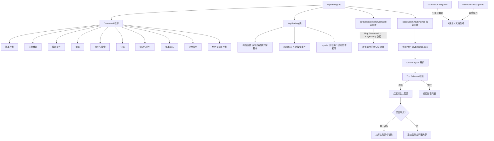

# keyBindings.ts

## 概述

`keyBindings.ts` 是 Gemini CLI 键盘快捷键系统的核心模块，负责定义所有可用的键盘命令（`Command` 枚举）、键绑定数据结构（`KeyBinding` 类）、默认快捷键配置（`defaultKeyBindingConfig`）以及用户自定义快捷键的加载逻辑（`loadCustomKeybindings`）。

该模块实现了一套完整的、可扩展的快捷键管理体系：
- 通过枚举定义了约 60 个键盘命令，涵盖基本控制、光标移动、编辑、滚动、历史搜索、导航、建议补全、文本输入、应用控制和后台 Shell 控制等类别
- `KeyBinding` 类能解析如 `ctrl+shift+a` 这样的组合键字符串，并提供匹配和比较功能
- 支持用户通过 JSON 配置文件自定义快捷键，可以新增绑定或移除默认绑定

## 架构图（Mermaid）

## 核心组件

### 1. `Command` 枚举

定义了所有可用的键盘命令，共分为 10 个类别：

| 类别 | 前缀 | 命令数量 | 示例 |
|------|------|---------|------|
| 基本控制 | `basic.*` | 4 | `RETURN`, `ESCAPE`, `QUIT`, `EXIT` |
| 光标移动 | `cursor.*` | 8 | `HOME`, `END`, `MOVE_UP`, `MOVE_WORD_LEFT` |
| 编辑操作 | `edit.*` | 9 | `KILL_LINE_RIGHT`, `DELETE_WORD_BACKWARD`, `UNDO`, `REDO` |
| 滚动 | `scroll.*` | 6 | `SCROLL_UP`, `SCROLL_DOWN`, `PAGE_UP` |
| 历史与搜索 | `history.*` | 5 | `HISTORY_UP`, `REVERSE_SEARCH` |
| 导航 | `nav.*` | 6 | `NAVIGATION_UP`, `DIALOG_NEXT` |
| 建议与补全 | `suggest.*` | 5 | `ACCEPT_SUGGESTION`, `COMPLETION_UP` |
| 文本输入 | `input.*` | 4 | `SUBMIT`, `NEWLINE`, `PASTE_CLIPBOARD` |
| 应用控制 | `app.*` | 16 | `TOGGLE_MARKDOWN`, `CLEAR_SCREEN`, `RESTART_APP` |
| 后台 Shell | `background.*` | 8 | `TOGGLE_BACKGROUND_SHELL`, `KILL_BACKGROUND_SHELL` |

### 2. `KeyBinding` 类

负责解析按键模式字符串，并提供按键匹配功能。

#### 静态属性

- `VALID_LONG_KEYS`：包含所有合法的长键名集合，包括：
  - 功能键：`f1` ~ `f35`
  - 数字小键盘：`numpad0` ~ `numpad9`
  - 导航键：`left`, `up`, `right`, `down`, `home`, `end`, `pageup`, `pagedown`
  - 特殊键：`tab`, `enter`, `escape`, `space`, `backspace`, `delete`, `insert` 等
  - 小键盘操作键：`numpad_multiply`, `numpad_add` 等

#### 实例属性

| 属性 | 类型 | 说明 |
|------|------|------|
| `name` | `string` | 键名（小写），如 `'a'`, `'enter'`, `'tab'` |
| `shift` | `boolean` | 是否需要 Shift 修饰键 |
| `alt` | `boolean` | 是否需要 Alt/Option 修饰键 |
| `ctrl` | `boolean` | 是否需要 Ctrl 修饰键 |
| `cmd` | `boolean` | 是否需要 Cmd/Meta 修饰键 |

#### 构造函数 `constructor(pattern: string)`

解析按键模式字符串，支持以下修饰符前缀（大小写不敏感）：
- `ctrl+` → 设置 `ctrl = true`
- `shift+` → 设置 `shift = true`
- `alt+` / `option+` / `opt+` → 设置 `alt = true`
- `cmd+` / `meta+` → 设置 `cmd = true`

修饰符可以组合使用，例如 `ctrl+shift+z`。解析完修饰符后，剩余部分为键名。

特殊的 Shift 检测逻辑：如果键名是单个字符且解析前后大小写不同（例如 `'A'` 变为 `'a'`），则自动设置 `shift = true`。

如果键名既不是单个字符也不在 `VALID_LONG_KEYS` 中，则抛出错误。

#### `matches(key: Key): boolean`

判断给定的按键事件是否与此绑定匹配。匹配条件为键名和所有修饰键状态完全一致。使用双重取反 `!!` 将 `undefined` 视为 `false`。

#### `equals(other: KeyBinding): boolean`

判断两个 `KeyBinding` 实例是否等价，比较所有属性。

### 3. `defaultKeyBindingConfig`

类型为 `KeyBindingConfig`（即 `Map<Command, readonly KeyBinding[]>`），定义了所有命令的默认快捷键映射。每个命令可以绑定多个快捷键。

一些典型映射示例：

| 命令 | 默认快捷键 |
|------|-----------|
| `ESCAPE` | `escape`, `ctrl+[` |
| `HOME` | `ctrl+a`, `home` |
| `DELETE_WORD_BACKWARD` | `ctrl+backspace`, `alt+backspace`, `ctrl+w` |
| `NEWLINE` | `ctrl+enter`, `cmd+enter`, `alt+enter`, `shift+enter`, `ctrl+j` |
| `UNDO` | `cmd+z`, `alt+z` |
| `PASTE_CLIPBOARD` | `ctrl+v`, `cmd+v`, `alt+v` |

### 4. `commandCategories`

类型为 `readonly CommandCategory[]`，定义了命令的分类展示结构，用于 UI 展示或文档生成。每个类别包含标题和所属命令列表。

### 5. `commandDescriptions`

类型为 `Readonly<Record<Command, string>>`，为每个命令提供人类可读的描述文本。例如：
- `Command.UNDO` → `"Undo the most recent text edit."`
- `Command.TOGGLE_YOLO` → `"Toggle YOLO (auto-approval) mode for tool calls."`

### 6. `keybindingsSchema`（Zod Schema）

用于校验用户自定义快捷键 JSON 文件的数据结构。预期格式为数组，每个元素包含：
- `command`：字符串，对应 `Command` 枚举值。可以以 `-` 前缀表示移除绑定
- `key`：字符串，按键模式（如 `"ctrl+a"`）

### 7. `loadCustomKeybindings()` 异步函数

从用户配置目录加载自定义快捷键文件 `keybindings.json`，并与默认配置合并。

**流程**：
1. 通过 `Storage.getUserKeybindingsPath()` 获取用户快捷键配置文件路径
2. 使用 `comment-json` 解析文件内容（支持 JSON 注释）
3. 使用 Zod Schema 校验数据格式
4. 对每个有效的自定义绑定：
   - 如果 `command` 以 `-` 开头（取反），则从对应命令的绑定列表中移除匹配的绑定
   - 否则，将新绑定**插入到列表头部**（使其成为 UI 中显示的主要绑定）
5. 如果文件不存在（`ENOENT`），静默使用默认配置
6. 返回 `{ config, errors }`，`errors` 收集所有解析和校验错误

## 依赖关系

### 内部依赖

| 模块路径 | 导入内容 | 用途 |
|---------|---------|------|
| `../hooks/useKeypress.js` | `Key`（类型） | 按键事件类型定义，用于 `KeyBinding.matches()` |
| `@google/gemini-cli-core` | `isNodeError`, `Storage` | Node 错误类型判断；获取用户配置文件路径 |

### 外部依赖

| 包名 | 导入内容 | 用途 |
|------|---------|------|
| `node:fs/promises` | `fs` | 异步读取用户快捷键配置文件 |
| `zod` | `z` | 用户配置文件 JSON 结构的运行时校验 |
| `comment-json` | `parse` (别名 `parseIgnoringComments`) | 解析带注释的 JSON 文件 |

## 关键实现细节

1. **修饰键解析循环**：构造函数使用 `do...while` 循环解析修饰符前缀，允许任意顺序的修饰符组合。循环在没有匹配到新修饰符时终止。同一个修饰符被多次使用不会报错，只是被忽略。

2. **Shift 的隐式检测**：对于单字符按键，如果输入的字符是大写字母（如 `'A'`），经过 `toLowerCase()` 转换后键名变为 `'a'`，此时通过比较 `this.name !== key` 自动设置 `shift = true`。这意味着用户可以直接写 `"A"` 而不需要写 `"shift+a"`。

3. **取反绑定机制**：用户配置中的 command 字段以 `-` 前缀表示移除某个默认绑定。如果尝试移除一个不存在的绑定，会产生错误信息但不会阻止其他配置的加载。

4. **新绑定的优先级**：用户自定义的新绑定通过 `[keyBinding, ...currentBindings]` 插入到数组头部，确保在 UI 中显示为该命令的主要快捷键。

5. **容错设计**：
   - 文件不存在时静默回退到默认配置
   - 单条配置错误不阻止其他配置的加载
   - 所有错误收集到 `errors` 数组中返回给调用方

6. **支持 JSON 注释**：使用 `comment-json` 库解析配置文件，允许用户在 JSON 中添加 `//` 或 `/* */` 风格的注释。

7. **同一快捷键可绑定到多个命令**：由于 `KeyBindingConfig` 是 `Map<Command, KeyBinding[]>`，不同命令可以共享相同的快捷键（如 `enter` 既绑定 `RETURN` 又绑定 `SUBMIT`），具体由上层使用场景决定哪个命令被触发。
