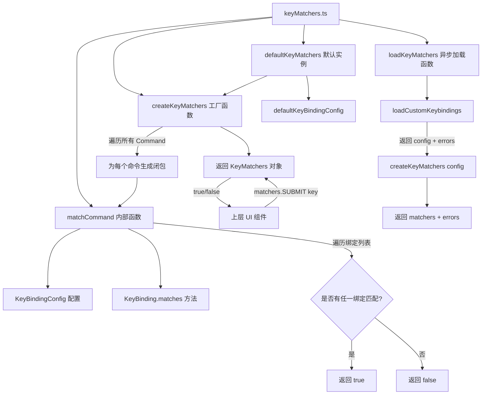

# keyMatchers.ts

## 概述

`keyMatchers.ts` 是键盘快捷键系统的匹配器工厂模块，负责将 `KeyBindingConfig`（命令到键绑定的映射配置）转换为 `KeyMatchers` 对象——一个以 `Command` 枚举值为键、以匹配函数为值的查找表。这样，上层 UI 组件只需调用 `matchers[Command.SUBMIT](key)` 即可判断某个按键事件是否触发了特定命令，极大简化了按键处理逻辑。

该模块提供：
- **`createKeyMatchers(config)`**：从键绑定配置创建匹配器对象
- **`defaultKeyMatchers`**：基于默认配置的预创建匹配器实例
- **`loadKeyMatchers()`**：异步加载用户自定义配置并创建匹配器

## 架构图（Mermaid）



## 核心组件

### 1. `matchCommand(command, key, config?)` 内部函数

私有函数，判断一个按键事件是否匹配某个命令的任意绑定。

**参数**：
- `command: Command`：目标命令
- `key: Key`：按键事件对象
- `config: KeyBindingConfig`：键绑定配置，默认为 `defaultKeyBindingConfig`

**逻辑**：
1. 从配置中获取命令的绑定列表
2. 如果没有绑定，返回 `false`
3. 使用 `Array.some()` 遍历绑定列表，只要有任一绑定匹配即返回 `true`

### 2. `KeyMatcher` 类型

```typescript
type KeyMatcher = (key: Key) => boolean;
```

单个命令的匹配函数类型，接收一个按键事件，返回是否匹配。

### 3. `KeyMatchers` 类型

```typescript
export type KeyMatchers = {
  readonly [C in Command]: KeyMatcher;
};
```

一个映射类型，将每个 `Command` 枚举成员映射到对应的 `KeyMatcher` 函数。使用 `readonly` 修饰，防止运行时被意外修改。

这种设计使得使用方可以通过属性访问的方式调用匹配器：
```typescript
if (matchers[Command.SUBMIT](key)) {
  // 处理提交命令
}
```

### 4. `createKeyMatchers(config?)` 工厂函数

从键绑定配置创建完整的 `KeyMatchers` 对象。

**逻辑**：
1. 创建空对象
2. 遍历 `Command` 枚举的所有值
3. 为每个命令创建一个闭包函数，该闭包捕获 `command` 和 `config`，调用时委托给 `matchCommand`
4. 返回完成的匹配器对象

**关键设计**：每个匹配器函数都是一个闭包，在创建时绑定了对应的 `command` 和 `config`，后续调用时只需传入 `key` 参数。

### 5. `defaultKeyMatchers` 常量

```typescript
export const defaultKeyMatchers: KeyMatchers = createKeyMatchers(
  defaultKeyBindingConfig,
);
```

基于默认键绑定配置预创建的匹配器实例。在模块加载时即生成，适用于不需要用户自定义配置的场景。

### 6. `loadKeyMatchers()` 异步函数

异步加载用户自定义快捷键配置并创建匹配器。

**流程**：
1. 调用 `loadCustomKeybindings()` 加载用户配置（含错误收集）
2. 使用返回的 `config` 调用 `createKeyMatchers` 创建匹配器
3. 返回 `{ matchers, errors }`

**返回值**：
- `matchers: KeyMatchers`：包含用户自定义配置的匹配器
- `errors: string[]`：加载过程中收集的错误信息

### 7. 重导出 `Command`

```typescript
export { Command };
```

为了使用方便，该模块重新导出了 `Command` 枚举，使得消费方可以只从 `keyMatchers.ts` 导入所需的全部内容。

## 依赖关系

### 内部依赖

| 模块路径 | 导入内容 | 用途 |
|---------|---------|------|
| `../hooks/useKeypress.js` | `Key`（类型） | 按键事件类型定义 |
| `./keyBindings.js` | `Command`, `KeyBindingConfig`（类型）, `defaultKeyBindingConfig`, `loadCustomKeybindings` | 命令枚举、配置类型、默认配置、自定义配置加载 |

### 外部依赖

无直接外部依赖。所有外部依赖通过 `keyBindings.js` 间接使用。

## 关键实现细节

1. **闭包工厂模式**：`createKeyMatchers` 为每个命令生成一个闭包函数。这种设计将配置查找逻辑封装在闭包内部，使得上层调用方无需关心配置细节，只需调用 `matchers[command](key)` 即可。

2. **惰性 vs 预计算**：`defaultKeyMatchers` 在模块加载时立即创建（预计算），避免每次使用时重复创建。而 `loadKeyMatchers` 是异步的，需要在应用初始化阶段显式调用。

3. **类型安全的映射**：`KeyMatchers` 使用映射类型 `{ readonly [C in Command]: KeyMatcher }` 确保每个 `Command` 枚举成员都有对应的匹配器，编译期即可发现遗漏。

4. **`eslint-disable` 注释**：由于 TypeScript 无法直接创建满足映射类型约束的对象字面量（需要动态键），代码中使用了 `as` 类型断言并禁用了 `@typescript-eslint/no-unsafe-type-assertion` 规则。这是一种常见的类型安全权衡。

5. **单一职责分离**：该模块不负责键绑定的存储和解析（由 `keyBindings.ts` 负责），也不负责格式化显示（由 `keybindingUtils.ts` 负责），只专注于"匹配"这一个职责。

6. **错误传递**：`loadKeyMatchers` 将 `loadCustomKeybindings` 返回的错误信息透传给调用方，不做吞并或额外处理，保持了错误处理链的完整性。
