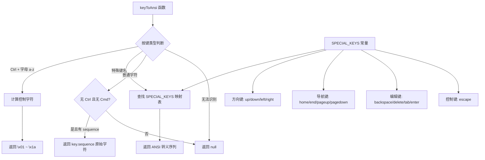

# keyToAnsi.ts

## 概述

`keyToAnsi.ts` 是一个按键到 ANSI 转义序列的转换模块，负责将 `Key` 对象翻译为对应的 ANSI 转义序列字符串。这在将用户的键盘输入转发到伪终端（pseudo-terminal / PTY）时非常有用，例如当 Gemini CLI 内嵌一个 Shell 会话时，需要将用户按键转换为终端可理解的控制字符。

模块功能简洁但关键：
- 处理 `Ctrl + 字母` 组合键，转换为对应的控制字符（`\x01` ~ `\x1a`）
- 处理方向键、功能键等特殊键的 ANSI 转义序列
- 处理普通字符输入的直通传递
- 对无法映射的按键返回 `null`

## 架构图（Mermaid）



## 核心组件

### 1. `SPECIAL_KEYS` 常量

类型为 `Record<string, string>`，定义了特殊键名到 ANSI 转义序列的映射表。

| 键名 | ANSI 序列 | 十六进制表示 | 说明 |
|------|----------|-------------|------|
| `up` | `\x1b[A` | `ESC [ A` | 上箭头 |
| `down` | `\x1b[B` | `ESC [ B` | 下箭头 |
| `right` | `\x1b[C` | `ESC [ C` | 右箭头 |
| `left` | `\x1b[D` | `ESC [ D` | 左箭头 |
| `escape` | `\x1b` | `ESC` | Escape 键 |
| `tab` | `\t` | `0x09` | Tab 键（水平制表符） |
| `backspace` | `\x7f` | `DEL` | 退格键 |
| `delete` | `\x1b[3~` | `ESC [ 3 ~` | Delete 键 |
| `home` | `\x1b[H` | `ESC [ H` | Home 键 |
| `end` | `\x1b[F` | `ESC [ F` | End 键 |
| `pageup` | `\x1b[5~` | `ESC [ 5 ~` | Page Up 键 |
| `pagedown` | `\x1b[6~` | `ESC [ 6 ~` | Page Down 键 |
| `enter` | `\r` | `0x0D` | 回车键（CR） |

这些序列遵循 VT100/xterm 终端标准。

### 2. `keyToAnsi(key: Key): string | null` 函数

将 `Key` 对象转换为 ANSI 转义序列字符串。

**参数**：
- `key: Key`：按键事件对象，包含 `name`、`ctrl`、`cmd`、`sequence` 等属性

**返回值**：
- `string`：对应的 ANSI 转义序列
- `null`：无法映射时返回 null

**转换逻辑**（按优先级从高到低）：

#### 优先级 1：Ctrl + 字母组合
当 `key.ctrl` 为 `true` 且 `key.name` 在 `'a'` ~ `'z'` 范围内时，通过字符编码计算得到控制字符：

```
控制字符 = key.name 的字符码 - 'a' 的字符码 + 1
```

映射关系：
| 按键 | 计算过程 | 控制字符 | 常见用途 |
|------|---------|---------|---------|
| Ctrl+A | 97 - 97 + 1 = 1 | `\x01` (SOH) | 行首 |
| Ctrl+C | 99 - 97 + 1 = 3 | `\x03` (ETX) | 中断信号 |
| Ctrl+D | 100 - 97 + 1 = 4 | `\x04` (EOT) | EOF |
| Ctrl+Z | 122 - 97 + 1 = 26 | `\x1a` (SUB) | 挂起 |

#### 优先级 2：特殊键名查表
如果 `key.name` 在 `SPECIAL_KEYS` 映射表中存在，直接返回对应的 ANSI 序列。

#### 优先级 3：普通字符直通
当 `key.ctrl` 和 `key.cmd` 都为 `false`，且 `key.sequence` 存在时，直接返回 `key.sequence`。这处理了普通字母、数字、符号等可打印字符的输入。

#### 兜底：返回 null
如果以上都不匹配（例如 `Cmd+某个键` 组合但不是字母），返回 `null`，表示无法转换。

### 3. 类型重导出

```typescript
export type { Key };
```

从 `KeypressContext.js` 导入 `Key` 类型并重新导出，方便消费方使用。

## 依赖关系

### 内部依赖

| 模块路径 | 导入内容 | 用途 |
|---------|---------|------|
| `../contexts/KeypressContext.js` | `Key`（类型） | 按键事件类型定义 |

### 外部依赖

无。该模块是纯计算模块，不依赖任何外部包。

## 关键实现细节

1. **Ctrl + 字母的控制字符计算**：这是 ASCII 编码标准的设计。ASCII 控制字符 `\x01` 到 `\x1a` 正好对应 `Ctrl+A` 到 `Ctrl+Z`，计算方式为字母的 ASCII 码减去 `'a'` 的 ASCII 码再加 1。例如 `Ctrl+C` 对应 `\x03`，这也是终端中发送 SIGINT 信号的标准方式。

2. **优先级设计**：Ctrl + 字母组合的判断优先于特殊键名查表。这意味着如果某个特殊键恰好有与字母相同的名称，Ctrl 组合会优先处理。不过在实际使用中，特殊键名（如 `up`、`down`）不会与单字母冲突。

3. **普通字符的过滤条件**：返回 `key.sequence` 时额外检查了 `!key.ctrl && !key.cmd`，确保不会将带修饰键的组合误当作普通字符处理。例如 `Cmd+V`（粘贴）不会被当作字母 `v` 传入终端。注意 `key.alt` 和 `key.shift` 没有被排除，因为 Alt 组合和 Shift 组合在某些终端场景中有实际意义。

4. **Backspace 使用 DEL 字符**：`backspace` 映射为 `\x7f`（DEL）而不是 `\x08`（BS）。这是现代终端的标准行为——大多数终端模拟器将 Backspace 键发送为 DEL 字符。

5. **Enter 使用 CR**：`enter` 映射为 `\r`（CR，回车）而不是 `\n`（LF，换行）。终端中 Enter 键默认发送 CR，由终端的 `icrnl` 设置决定是否将其转换为 LF。

6. **Key 类型来源差异**：值得注意的是，此模块的 `Key` 类型从 `../contexts/KeypressContext.js` 导入，而其他键绑定模块（如 `keyBindings.ts`、`keyMatchers.ts`）从 `../hooks/useKeypress.js` 导入。这两个来源可能定义了相同或兼容的 `Key` 类型，但来源不同，需注意版本同步。

7. **不支持的按键组合**：以下情况会返回 `null`：
   - `Ctrl` + 非字母键（如 `Ctrl+1`）且不在 `SPECIAL_KEYS` 中
   - `Cmd` + 任何键
   - 没有 `sequence` 属性的非特殊键
   - 功能键（`F1` ~ `F12`）未在 `SPECIAL_KEYS` 中定义
