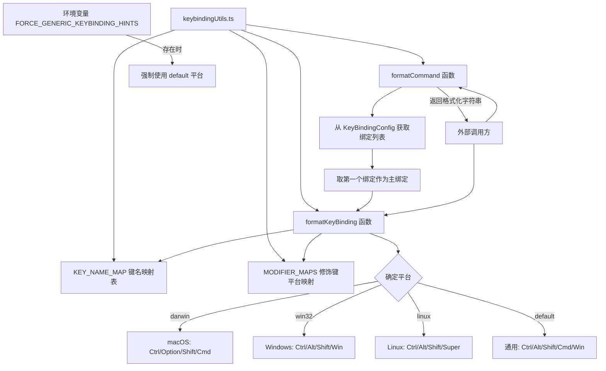

# keybindingUtils.ts

## 概述

`keybindingUtils.ts` 是一个键绑定格式化工具模块，负责将内部的 `KeyBinding` 对象转换为人类可读的快捷键显示字符串（如 `"Ctrl+C"`、`"Option+Enter"`）。该模块具备跨平台适配能力，能根据操作系统（macOS、Windows、Linux）自动使用不同的修饰键名称。

主要功能：
- **`formatKeyBinding`**：将单个 `KeyBinding` 实例格式化为友好的显示字符串
- **`formatCommand`**：获取某个命令的主要（第一个）快捷键绑定并格式化显示

该模块主要服务于 UI 层，用于在状态栏、帮助提示、快捷键说明等场景中展示快捷键信息。

## 架构图（Mermaid）

## 核心组件

### 1. `KEY_NAME_MAP` 常量

类型为 `Record<string, string>`，将内部键名映射为用户友好的显示名称。

| 内部键名 | 显示名称 |
|---------|---------|
| `enter` | `Enter` |
| `escape` | `Esc` |
| `backspace` | `Backspace` |
| `delete` | `Delete` |
| `up` | `Up` |
| `down` | `Down` |
| `left` | `Left` |
| `right` | `Right` |
| `pageup` | `Page Up` |
| `pagedown` | `Page Down` |
| `home` | `Home` |
| `end` | `End` |
| `tab` | `Tab` |
| `space` | `Space` |

对于不在映射表中的键名（如单字符键 `a`、`z` 等），会直接调用 `toUpperCase()` 转为大写。

### 2. `ModifierMap` 接口与 `MODIFIER_MAPS` 常量

定义了各平台下修饰键的显示名称：

| 平台 | Ctrl | Alt | Shift | Cmd/Meta |
|------|------|-----|-------|----------|
| `darwin`（macOS） | `Ctrl` | `Option` | `Shift` | `Cmd` |
| `win32`（Windows） | `Ctrl` | `Alt` | `Shift` | `Win` |
| `linux` | `Ctrl` | `Alt` | `Shift` | `Super` |
| `default`（兜底） | `Ctrl` | `Alt` | `Shift` | `Cmd/Win` |

### 3. `formatKeyBinding(binding, platform?)` 函数

将单个 `KeyBinding` 对象格式化为可读字符串。

**参数**：
- `binding: KeyBinding`：要格式化的键绑定对象
- `platform?: string`：可选，指定目标平台。不指定时自动检测

**平台确定逻辑**：
1. 如果传入了 `platform` 参数，直接使用
2. 如果环境变量 `FORCE_GENERIC_KEYBINDING_HINTS` 存在，使用 `'default'` 平台
3. 否则使用 `process.platform` 的实际值

**格式化流程**：
1. 根据平台选择对应的修饰键映射表
2. 按顺序检查 `ctrl` → `alt` → `shift` → `cmd` 修饰键，将激活的修饰键名加入数组
3. 将键名通过 `KEY_NAME_MAP` 转换（不在映射表中则直接大写化）
4. 用 `+` 连接所有部分

**输出示例**：
- `ctrl+c` 在 macOS 上 → `"Ctrl+C"`
- `alt+enter` 在 macOS 上 → `"Option+Enter"`
- `cmd+shift+z` 在 Windows 上 → `"Shift+Win+Z"`

### 4. `formatCommand(command, config?, platform?)` 函数

格式化指定命令的主要快捷键显示字符串。

**参数**：
- `command: Command`：目标命令
- `config: KeyBindingConfig`：可选，键绑定配置，默认使用 `defaultKeyBindingConfig`
- `platform?: string`：可选，目标平台

**逻辑**：
1. 从配置中查找命令对应的绑定列表
2. 如果没有绑定或列表为空，返回空字符串
3. 取列表中的**第一个绑定**作为主绑定（这也是为什么用户自定义绑定会插入到列表头部的原因）
4. 调用 `formatKeyBinding` 进行格式化

## 依赖关系

### 内部依赖

| 模块路径 | 导入内容 | 用途 |
|---------|---------|------|
| `./keyBindings.js` | `Command`（类型）, `KeyBinding`（类型）, `KeyBindingConfig`（类型）, `defaultKeyBindingConfig` | 命令枚举、键绑定类型及默认配置 |

### 外部依赖

| 包名 | 导入内容 | 用途 |
|------|---------|------|
| `node:process` | `process` | 获取当前操作系统平台和环境变量 |

## 关键实现细节

1. **平台自适应**：模块会自动根据 `process.platform` 选择合适的修饰键名称。macOS 上 Alt 显示为 `Option`、Meta 显示为 `Cmd`；Windows 上 Meta 显示为 `Win`；Linux 上 Meta 显示为 `Super`。

2. **测试友好设计**：通过环境变量 `FORCE_GENERIC_KEYBINDING_HINTS` 可以强制使用通用平台名称，方便在测试和 CI 环境中获得一致的输出。

3. **修饰键排列顺序**：格式化时修饰键按固定顺序排列：`Ctrl` → `Alt/Option` → `Shift` → `Cmd/Win/Super`，这符合各操作系统的惯例。

4. **主绑定优先策略**：`formatCommand` 始终只显示命令的第一个绑定。这与 `loadCustomKeybindings` 中将用户自定义绑定插入列表头部的设计配合，确保用户自定义的绑定在 UI 中作为主要快捷键显示。

5. **兜底处理**：对于不在 `KEY_NAME_MAP` 中的键名，使用 `toUpperCase()` 作为兜底显示策略。对于不在 `MODIFIER_MAPS` 中的平台，使用 `default` 映射。
