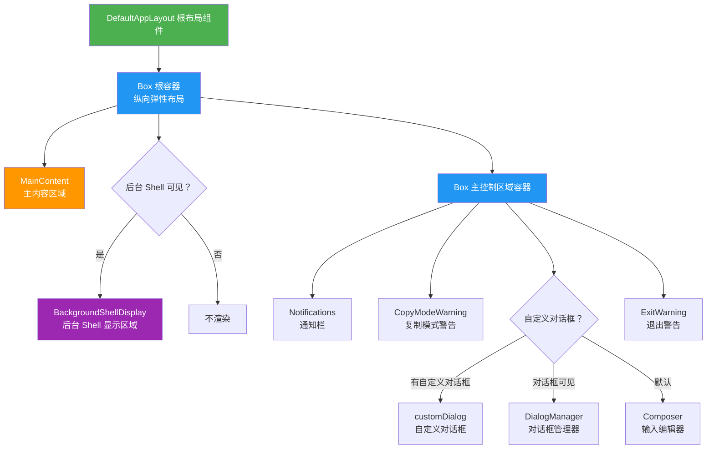
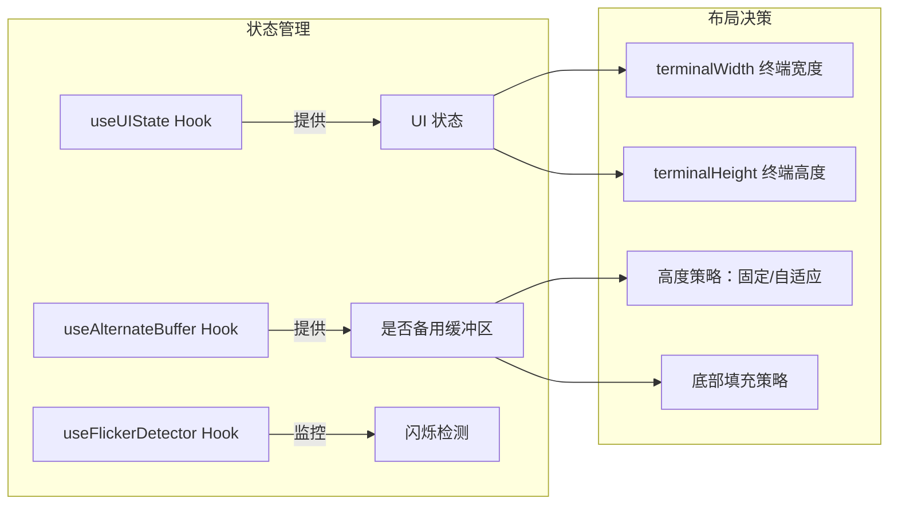

# DefaultAppLayout.tsx

## 概述

`DefaultAppLayout` 是 Gemini CLI 终端交互界面的**默认布局组件**。它是整个 CLI 应用程序的根级 UI 容器，负责将所有核心 UI 子组件（主内容区、通知栏、对话框管理器、输入编辑器、退出警告等）按照垂直方向进行编排和渲染。该组件基于 [Ink](https://github.com/vadimdemedes/ink) 框架（React 终端渲染库）构建，使用 React 函数式组件模式。

**文件路径**: `packages/cli/src/ui/layouts/DefaultAppLayout.tsx`

## 架构图（Mermaid）

## 核心组件

### 1. 根容器 Box

- **布局方向**: `flexDirection="column"` — 所有子元素垂直排列
- **宽度**: 绑定到 `uiState.terminalWidth`，占满终端宽度
- **高度策略**:
  - 当处于**备用缓冲区模式**时：高度固定为 `terminalHeight`，并添加 `paddingBottom=1` 为滚动条预留空间
  - 当处于**普通模式**时：高度为 `undefined`（自适应）
- **溢出处理**: `overflow="hidden"` 隐藏超出部分
- **弹性属性**: `flexShrink={0}` 和 `flexGrow={0}` — 不参与弹性伸缩，保持固定尺寸
- **ref 绑定**: 绑定到 `uiState.rootUiRef`，用于外部访问 DOM 节点

### 2. MainContent（主内容区域）

无条件渲染的核心组件，显示 AI 对话的主要内容（包括消息历史、流式输出等）。

### 3. BackgroundShellDisplay（后台 Shell 显示区域）

条件渲染组件，仅在以下**所有条件同时满足**时显示：
- `uiState.isBackgroundShellVisible` — 后台 Shell 面板可见
- `uiState.backgroundShells.size > 0` — 存在后台 Shell 实例
- `uiState.activeBackgroundShellPid` — 有活跃的后台 Shell PID
- `uiState.backgroundShellHeight > 0` — 后台 Shell 区域高度大于 0
- `uiState.streamingState !== StreamingState.WaitingForConfirmation` — 不在等待用户确认状态

传入的 props：
| Prop | 说明 |
|------|------|
| `shells` | 所有后台 Shell 实例的 Map |
| `activePid` | 当前活跃 Shell 的 PID |
| `width` | 终端宽度 |
| `height` | Shell 显示区域高度 |
| `isFocused` | 是否聚焦（嵌入式 Shell 聚焦且对话框未显示时为 true） |
| `isListOpenProp` | Shell 列表是否展开 |

### 4. 主控制区域容器 Box

包含通知栏、复制模式警告、输入/对话框区域和退出警告。其高度在**复制模式**启用时固定为 `uiState.stableControlsHeight`，否则自适应。

#### 4.1 Notifications（通知栏）
无条件渲染，显示系统通知消息。

#### 4.2 CopyModeWarning（复制模式警告）
无条件渲染，在复制模式下显示相关警告提示。

#### 4.3 对话框/输入编辑器区域（三选一渲染）

采用三元表达式实现互斥渲染逻辑：
1. **`uiState.customDialog`** — 若存在自定义对话框，优先渲染
2. **`uiState.dialogsVisible`** — 若对话框可见，渲染 `DialogManager`（传入终端宽度和历史管理器的 `addItem` 方法）
3. **默认** — 渲染 `Composer` 输入编辑器（`isFocused={true}`）

#### 4.4 ExitWarning（退出警告）
无条件渲染，在用户尝试退出时显示警告。

## 依赖关系

### 内部依赖

| 模块 | 路径 | 用途 |
|------|------|------|
| `Notifications` | `../components/Notifications.js` | 通知消息显示组件 |
| `MainContent` | `../components/MainContent.js` | 主内容区域组件 |
| `DialogManager` | `../components/DialogManager.js` | 对话框管理组件 |
| `Composer` | `../components/Composer.js` | 用户输入编辑器组件 |
| `ExitWarning` | `../components/ExitWarning.js` | 退出警告组件 |
| `CopyModeWarning` | `../components/CopyModeWarning.js` | 复制模式警告组件 |
| `BackgroundShellDisplay` | `../components/BackgroundShellDisplay.js` | 后台 Shell 显示组件 |
| `useUIState` | `../contexts/UIStateContext.js` | UI 全局状态 Hook |
| `useFlickerDetector` | `../hooks/useFlickerDetector.js` | 闪烁检测 Hook |
| `useAlternateBuffer` | `../hooks/useAlternateBuffer.js` | 备用缓冲区检测 Hook |
| `StreamingState` | `../types.js` | 流式状态枚举类型 |

### 外部依赖

| 模块 | 用途 |
|------|------|
| `react` | React 类型定义（`React.FC`） |
| `ink` | 终端 UI 框架，提供 `Box` 布局组件 |

## 关键实现细节

### 1. 备用缓冲区适配

终端有两个缓冲区：**主缓冲区**和**备用缓冲区**。备用缓冲区常用于全屏应用（如 vim、less）。当检测到处于备用缓冲区时：
- 布局高度固定为终端高度（`terminalHeight`），实现全屏效果
- 底部添加 1 行 padding，为右侧滚动条留出空间
- 在普通模式下高度设为 `undefined`，内容自然流动

### 2. 闪烁检测机制

通过 `useFlickerDetector(rootUiRef, terminalHeight)` 监控根 UI 元素的渲染闪烁。该 Hook 接收根元素的 ref 和终端高度，用于检测和缓解高频重绘导致的视觉闪烁问题。

### 3. 后台 Shell 条件渲染的多重守卫

后台 Shell 显示使用了 5 个条件的逻辑与（`&&`）进行严格守卫，确保只有在所有必要条件都满足时才渲染。特别值得注意的是 `StreamingState.WaitingForConfirmation` 检查——当 AI 正在等待用户确认（如工具调用确认）时，隐藏后台 Shell 面板以避免视觉干扰。

### 4. 复制模式下的高度锁定

当 `copyModeEnabled` 为 true 时，主控制区域的高度锁定为 `stableControlsHeight`，防止在复制模式下内容高度变化导致布局跳动，提升复制操作的稳定性。

### 5. 对话框优先级渲染策略

三层渲染优先级：`customDialog` > `DialogManager` > `Composer`。这确保自定义对话框（如特殊提示、配置界面）始终具有最高渲染优先级，其次是标准对话框系统，最后才是默认的输入编辑器。
