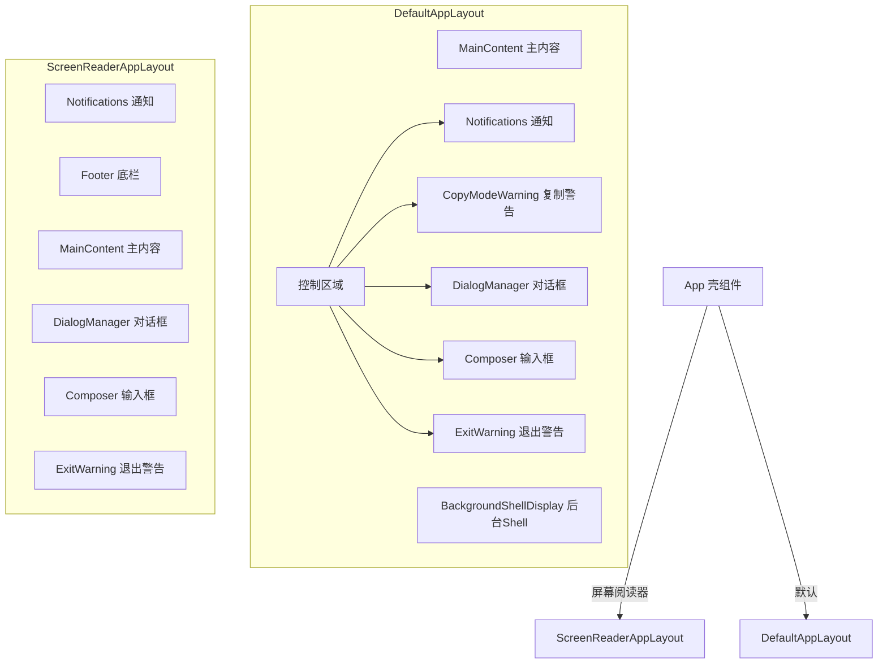

# layouts

## 概述

`layouts` 目录定义了 Gemini CLI 的页面布局组件。应用支持两种布局：默认布局（`DefaultAppLayout`）和屏幕阅读器布局（`ScreenReaderAppLayout`）。布局组件负责组织主内容区域、输入区域、通知栏、对话框管理器等核心区域的空间排列。

## 目录结构

```
layouts/
├── DefaultAppLayout.tsx         # 默认布局（标准终端）
├── ScreenReaderAppLayout.tsx    # 屏幕阅读器无障碍布局
└── __snapshots__/               # 测试快照
```

## 架构图



## 核心组件

### `DefaultAppLayout`

默认的终端布局，自上而下排列：
1. **MainContent**: 可滚动的消息历史区域
2. **BackgroundShellDisplay**: 后台 Shell 展示区（条件显示）
3. **控制区域**:
   - Notifications: 横幅通知
   - CopyModeWarning: 复制模式提示
   - DialogManager 或 Composer: 对话框或输入区域（互斥显示）
   - ExitWarning: 退出确认提示

关键特性：
- 支持备用缓冲区模式（`useAlternateBuffer`），在全屏模式下限制高度
- 使用 `useFlickerDetector` 检测 UI 闪烁
- 后台 Shell 区域仅在有活跃后台 Shell 且非确认状态时显示

### `ScreenReaderAppLayout`

为屏幕阅读器优化的布局：
1. **Notifications**: 通知（置顶，优先朗读）
2. **Footer**: 状态栏（包含上下文信息）
3. **MainContent**: 消息区域
4. **Composer / DialogManager**: 输入或对话框
5. **ExitWarning**: 退出提示

与默认布局的差异：
- 宽度使用 `90%` 而非精确像素
- Footer 提前显示（屏幕阅读器需要先读取状态信息）
- 不支持备用缓冲区模式
- 不显示后台 Shell 和复制模式警告

## 依赖关系

### 内部依赖
- `../components/`: MainContent、Composer、DialogManager、ExitWarning、Notifications 等
- `../contexts/`: UIStateContext（获取 UI 状态）
- `../hooks/`: useAlternateBuffer、useFlickerDetector
- `../types.ts`: StreamingState

### 外部依赖
- `ink`: Box 布局容器
- `react`: FC 组件类型

## 数据流

### 布局选择流程
1. `App.tsx` 通过 Ink 的 `useIsScreenReaderEnabled()` 检测屏幕阅读器
2. 如果启用 -> 渲染 `ScreenReaderAppLayout`
3. 否则 -> 渲染 `DefaultAppLayout`

### 内容区域高度计算（默认布局）
1. 终端总高度通过 `useTerminalSize` 获取
2. 减去控制区域高度（通过 `mainControlsRef` 测量）
3. 减去后台 Shell 高度
4. 剩余空间分配给 `MainContent`
5. 备用缓冲区模式下精确设置高度，普通模式下自动伸缩
