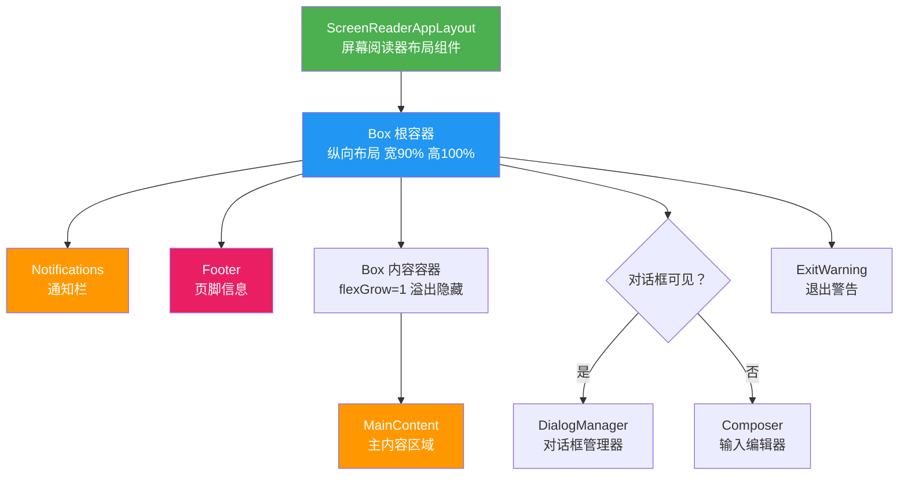
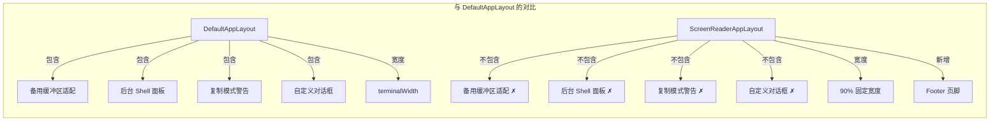

# ScreenReaderAppLayout.tsx

## 概述

`ScreenReaderAppLayout` 是 Gemini CLI 的**屏幕阅读器专用布局组件**，专为视觉障碍用户设计的无障碍（Accessibility）布局方案。与 `DefaultAppLayout` 相比，它做了以下关键简化：

1. **去除了备用缓冲区适配**（不使用 `useAlternateBuffer`），因为屏幕阅读器通常不支持备用缓冲区切换
2. **去除了后台 Shell 面板**（`BackgroundShellDisplay`），简化交互流程
3. **去除了复制模式警告**（`CopyModeWarning`），屏幕阅读器用户使用不同的复制机制
4. **去除了自定义对话框支持**，简化对话框渲染逻辑为二选一
5. **新增了 Footer 组件**，提供额外的导航/状态信息
6. **固定宽度为 90%**，留出边距，提升屏幕阅读器的内容识别效果
7. **调整了组件渲染顺序**，将通知和页脚放在顶部，更符合屏幕阅读器的线性阅读顺序

**文件路径**: `packages/cli/src/ui/layouts/ScreenReaderAppLayout.tsx`

## 架构图（Mermaid）

## 核心组件

### 1. 根容器 Box

| 属性 | 值 | 说明 |
|------|------|------|
| `flexDirection` | `"column"` | 垂直方向排列子元素 |
| `width` | `"90%"` | 占终端宽度的 90%，留边距提升可读性 |
| `height` | `"100%"` | 占满终端全部高度 |
| `ref` | `uiState.rootUiRef` | 绑定根元素引用 |

与 `DefaultAppLayout` 不同，这里没有 `flexShrink`、`flexGrow`、`overflow`、`paddingBottom` 等属性，布局策略更加简洁。

### 2. Notifications（通知栏）

放置在布局**最顶部**（与 `DefaultAppLayout` 不同，后者将其放在主控制区域内）。这样屏幕阅读器能首先读取到通知信息。

### 3. Footer（页脚）

`ScreenReaderAppLayout` **独有**的组件，放在通知栏下方、主内容区上方。用于显示底部状态信息或导航提示。这是与 `DefaultAppLayout` 最大的结构性差异之一。

### 4. MainContent（主内容区域）

被包裹在一个 `Box` 容器中：
- `flexGrow={1}` — 占据剩余所有可用空间
- `overflow="hidden"` — 隐藏溢出内容

### 5. 对话框/输入编辑器区域（二选一）

简化为二元选择（不支持 `customDialog`）：
- **`uiState.dialogsVisible` 为 true** → 渲染 `DialogManager`
- **否则** → 渲染 `Composer`（注意此处 `Composer` 未传入 `isFocused` prop，与 `DefaultAppLayout` 中 `isFocused={true}` 不同）

### 6. ExitWarning（退出警告）

放在布局最底部，与 `DefaultAppLayout` 一致。

## 依赖关系

### 内部依赖

| 模块 | 路径 | 用途 |
|------|------|------|
| `Notifications` | `../components/Notifications.js` | 通知消息显示组件 |
| `MainContent` | `../components/MainContent.js` | 主内容区域组件 |
| `DialogManager` | `../components/DialogManager.js` | 对话框管理组件 |
| `Composer` | `../components/Composer.js` | 用户输入编辑器组件 |
| `Footer` | `../components/Footer.js` | 页脚组件（屏幕阅读器布局独有） |
| `ExitWarning` | `../components/ExitWarning.js` | 退出警告组件 |
| `useUIState` | `../contexts/UIStateContext.js` | UI 全局状态 Hook |
| `useFlickerDetector` | `../hooks/useFlickerDetector.js` | 闪烁检测 Hook |

### 外部依赖

| 模块 | 用途 |
|------|------|
| `react` | React 类型定义（`React.FC`） |
| `ink` | 终端 UI 框架，提供 `Box` 布局组件 |

## 关键实现细节

### 1. 无障碍设计理念

该组件的设计遵循了屏幕阅读器的工作特点：

- **线性阅读顺序优化**：通知 → 页脚 → 主内容 → 输入区 → 退出警告。屏幕阅读器按 DOM 顺序线性读取，因此将通知和状态信息放在前面，确保用户首先获取到最重要的上下文信息。
- **简化的交互层**：移除了后台 Shell、复制模式、自定义对话框等视觉交互密集型功能，这些功能对屏幕阅读器用户意义不大且可能造成混淆。
- **90% 宽度策略**：留出 10% 的边距，避免内容紧贴终端边缘，某些屏幕阅读器在读取边缘内容时可能出现问题。

### 2. 不使用备用缓冲区

与 `DefaultAppLayout` 不同，此组件不导入也不使用 `useAlternateBuffer` Hook。屏幕阅读器通常依赖主缓冲区中的文本内容进行朗读，切换到备用缓冲区可能导致屏幕阅读器丢失上下文或无法正确追踪内容变化。

### 3. Composer 组件的 isFocused 差异

在 `DefaultAppLayout` 中 `Composer` 显式传入 `isFocused={true}`，而在此布局中未传入该 prop。这意味着 `Composer` 将使用其内部默认的聚焦行为，可能与屏幕阅读器的焦点管理机制配合得更好。

### 4. 固定 100% 高度

根容器的 `height="100%"` 使布局始终占满终端窗口，无论是否处于备用缓冲区。这提供了一致的全屏体验，简化了屏幕阅读器的内容边界识别。

### 5. 闪烁检测保留

尽管是简化布局，仍保留了 `useFlickerDetector` 闪烁检测机制，确保即使在屏幕阅读器模式下也能监控和缓解渲染闪烁问题。
