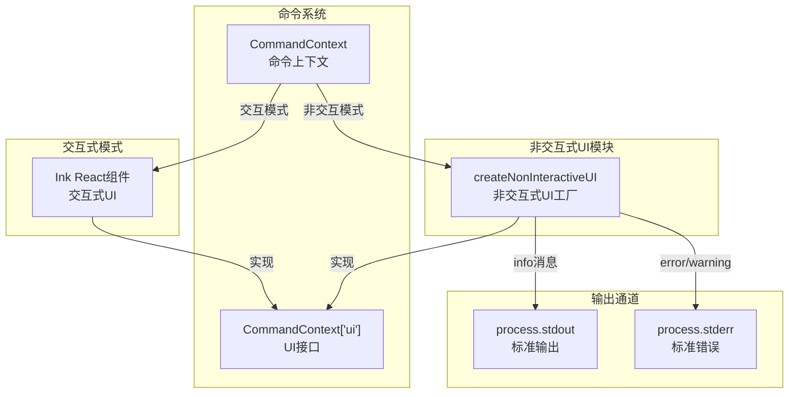
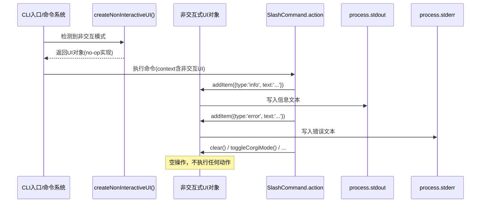

# noninteractive - 非交互式 UI 模块

## 概述

`noninteractive` 目录提供了 Gemini CLI 在非交互式环境（如 CI/CD 管道、脚本自动化、无终端模式）下运行时的 UI 上下文实现。该模块通过创建一组空操作（no-op）函数来替代交互式 UI 组件，确保命令在无终端交互能力的场景下仍能正常执行，同时将关键信息（错误、警告、信息）通过标准输出/错误流进行输出。

## 目录结构

```
noninteractive/
└── nonInteractiveUi.ts    # 非交互式 UI 上下文工厂函数
```

## 架构图



## 核心组件

### nonInteractiveUi.ts - 非交互式 UI 工厂

导出 `createNonInteractiveUI()` 工厂函数，返回符合 `CommandContext['ui']` 接口的对象。

**有效输出行为（addItem）：**
- `error` 类型消息 → 写入 `process.stderr`，前缀 `Error: `
- `warning` 类型消息 → 写入 `process.stderr`，前缀 `Warning: `
- `info` 类型消息 → 写入 `process.stdout`

**空操作函数（no-op）：**

以下 UI 操作在非交互模式下不执行任何动作：
| 函数 | 原交互式用途 |
|------|-------------|
| `clear()` | 清屏 |
| `setDebugMessage()` | 设置调试信息 |
| `loadHistory()` | 加载历史记录 |
| `setPendingItem()` | 设置待处理条目 |
| `toggleCorgiMode()` | 切换柯基模式 |
| `toggleDebugProfiler()` | 切换调试分析器 |
| `toggleVimEnabled()` | 切换 Vim 模式（返回 false） |
| `reloadCommands()` | 重载命令 |
| `openAgentConfigDialog()` | 打开 Agent 配置对话框 |
| `setConfirmationRequest()` | 设置确认请求 |
| `removeComponent()` | 移除组件 |
| `toggleBackgroundShell()` | 切换后台 Shell |
| `toggleShortcutsHelp()` | 切换快捷键帮助 |
| `dispatchExtensionStateUpdate()` | 分发扩展状态更新 |
| `addConfirmUpdateExtensionRequest()` | 添加扩展更新确认 |

## 依赖关系

| 依赖 | 用途 |
|------|------|
| `../commands/types.js` | `CommandContext` 类型定义，确保 UI 接口契约一致 |
| `../state/extensions.js` | `ExtensionUpdateAction` 类型 |

## 数据流


