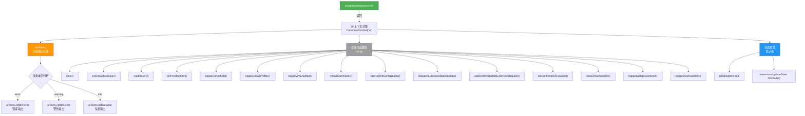
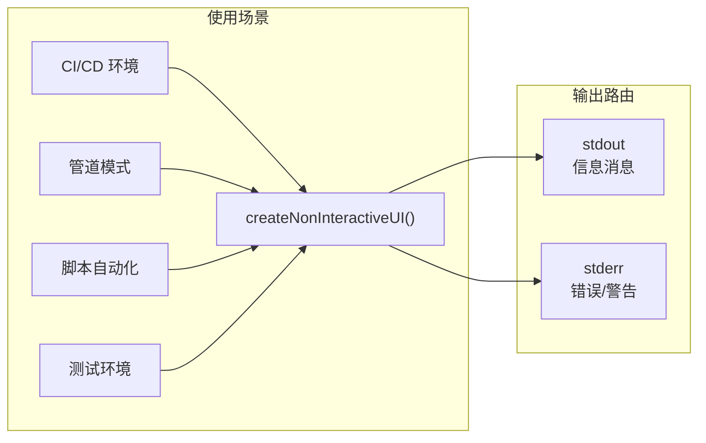

# nonInteractiveUi.ts

## 概述

`nonInteractiveUi.ts` 提供了一个**非交互式 UI 上下文工厂函数** `createNonInteractiveUI()`，用于在**无终端交互环境**（如 CI/CD 管道、脚本自动化、管道输入模式等）中创建一个符合 `CommandContext['ui']` 接口的 UI 代理对象。

该对象中大多数 UI 操作函数都是**空操作（no-op）**，因为非交互环境下没有终端 UI 可供渲染。只有 `addItem` 方法实现了有意义的逻辑——将错误和警告写入 `stderr`，将信息消息写入 `stdout`，确保非交互模式下关键消息仍然能够输出到合适的标准流。

**文件路径**: `packages/cli/src/ui/noninteractive/nonInteractiveUi.ts`

## 架构图（Mermaid）

## 核心组件

### 1. createNonInteractiveUI() 工厂函数

**返回类型**: `CommandContext['ui']`

该函数返回一个完整的 UI 上下文对象，满足 `CommandContext` 中 `ui` 字段的接口约束。所有字段和方法如下：

#### 1.1 有实际逻辑的方法

| 方法 | 签名 | 行为 |
|------|------|------|
| `addItem` | `(item, _timestamp) => number` | 根据 item 类型将文本输出到对应标准流，返回 `0` |

`addItem` 的详细逻辑：
1. 首先检查 item 是否包含 `text` 属性且 `text` 非空
2. 根据 `item.type` 路由到不同的输出流：
   - `"error"` → `process.stderr.write("Error: {text}\n")`
   - `"warning"` → `process.stderr.write("Warning: {text}\n")`
   - `"info"` → `process.stdout.write("{text}\n")`
3. 始终返回 `0`（表示添加到索引 0 的位置，在非交互模式下实际无意义）

#### 1.2 空操作（no-op）方法

| 方法 | 返回值 | 说明 |
|------|--------|------|
| `clear()` | `void` | 清空 UI 内容（no-op） |
| `setDebugMessage(_message)` | `void` | 设置调试消息（no-op） |
| `loadHistory(_newHistory)` | `void` | 加载历史记录（no-op） |
| `setPendingItem(_item)` | `void` | 设置待处理项（no-op） |
| `toggleCorgiMode()` | `void` | 切换 Corgi 模式（no-op） |
| `toggleDebugProfiler()` | `void` | 切换调试性能分析器（no-op） |
| `toggleVimEnabled()` | `Promise<false>` | 切换 Vim 模式，始终返回 `false` |
| `reloadCommands()` | `void` | 重新加载命令（no-op） |
| `openAgentConfigDialog()` | `void` | 打开代理配置对话框（no-op） |
| `dispatchExtensionStateUpdate(_action)` | `void` | 分发扩展状态更新（no-op） |
| `addConfirmUpdateExtensionRequest(_request)` | `void` | 添加扩展更新确认请求（no-op） |
| `setConfirmationRequest(_request)` | `void` | 设置确认请求（no-op） |
| `removeComponent()` | `void` | 移除组件（no-op） |
| `toggleBackgroundShell()` | `void` | 切换后台 Shell（no-op） |
| `toggleShortcutsHelp()` | `void` | 切换快捷键帮助（no-op） |

#### 1.3 状态属性

| 属性 | 初始值 | 说明 |
|------|--------|------|
| `pendingItem` | `null` | 当前待处理的 UI 项目 |
| `extensionsUpdateState` | `new Map()` | 扩展更新状态的映射表 |

## 依赖关系

### 内部依赖

| 模块 | 路径 | 用途 |
|------|------|------|
| `CommandContext` | `../commands/types.js` | 命令上下文类型定义，`ui` 字段的类型约束来源 |
| `ExtensionUpdateAction` | `../state/extensions.js` | 扩展更新操作类型定义 |

### 外部依赖

| 模块 | 用途 |
|------|------|
| Node.js `process` | 全局对象，使用 `process.stdout.write` 和 `process.stderr.write` 进行输出 |

## 关键实现细节

### 1. 空对象模式（Null Object Pattern）

该模块是经典的**空对象设计模式**的实现。`createNonInteractiveUI()` 返回的对象与真实的交互式 UI 对象具有相同的接口，但大多数方法不执行任何操作。这使得上层业务代码无需判断是否处于交互/非交互模式，直接调用 UI 方法即可，大大减少了条件分支。

### 2. 标准流分离策略

`addItem` 方法遵循 Unix 的标准流约定：
- **错误和警告** → `stderr`（标准错误流），这样即使 `stdout` 被管道重定向，用户仍能在终端看到错误/警告
- **信息消息** → `stdout`（标准输出流），可以被管道、重定向等机制正常处理

错误消息额外添加了 `"Error: "` 前缀，警告消息添加了 `"Warning: "` 前缀，方便用户快速识别消息级别。

### 3. 使用 write 而非 console.log

代码使用 `process.stdout.write()` 和 `process.stderr.write()` 而非 `console.log()` / `console.error()`。这是因为：
- `write` 不会自动添加额外的换行（由代码自行控制 `\n`）
- `write` 是更底层的 API，避免了 `console` 可能引入的额外格式化
- 在管道场景下行为更加可预测

### 4. toggleVimEnabled 的异步返回

`toggleVimEnabled` 是唯一一个返回 `Promise` 的方法（`async () => false`），保持与交互式 UI 的接口一致。在非交互模式下始终返回 `false`，表示 Vim 模式未启用也无法启用。

### 5. 类型安全

函数的返回类型显式标注为 `CommandContext['ui']`，利用 TypeScript 的索引类型确保返回对象必须完整实现 UI 接口的所有字段。如果 `CommandContext['ui']` 接口新增了方法或属性，此处会立即产生编译错误，强制保持同步更新。
