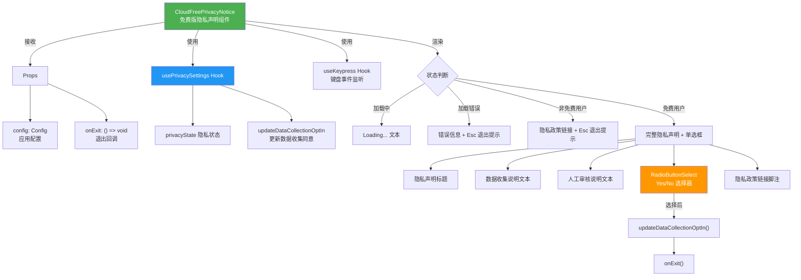
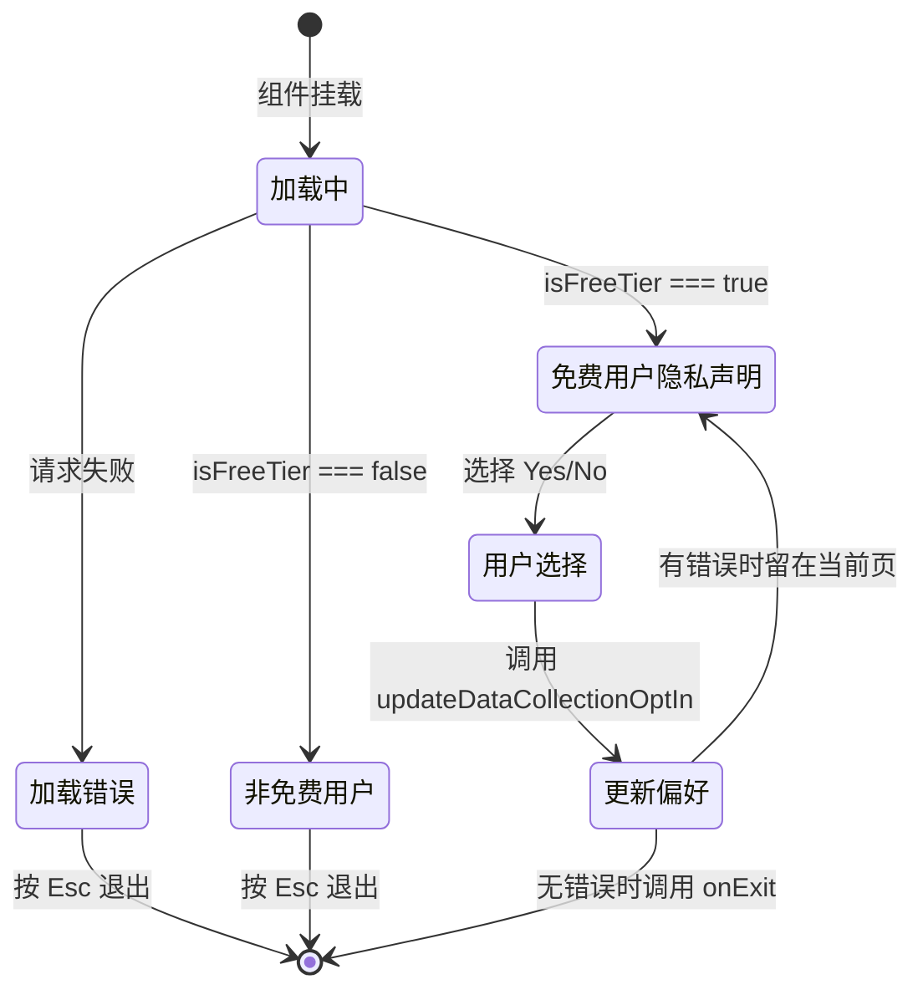

# CloudFreePrivacyNotice.tsx

## 概述

`CloudFreePrivacyNotice` 是 Gemini CLI 中用于展示**免费版（Cloud Free Tier）用户隐私声明**的 React 组件。该组件根据用户的账户层级（免费/付费）显示不同的隐私声明内容，并允许免费用户选择是否同意 Google 使用其数据来改进产品。

组件的核心功能：
1. **加载状态显示**：在隐私设置加载时显示 "Loading..." 提示
2. **错误处理**：加载失败时显示错误信息并允许用户按 Esc 退出
3. **付费用户识别**：如果检测到用户不是免费版，仅显示隐私政策链接（而非完整声明）
4. **免费用户隐私声明**：展示完整的数据收集声明文本，并提供 Yes/No 单选框让用户选择是否同意数据收集
5. **键盘交互**：支持 Esc 退出和 Enter 确认选择

**文件路径**: `packages/cli/src/ui/privacy/CloudFreePrivacyNotice.tsx`

## 架构图（Mermaid）





## 核心组件

### 1. Props 接口

```typescript
interface CloudFreePrivacyNoticeProps {
  config: Config;      // 应用配置对象
  onExit: () => void;  // 退出隐私声明界面的回调函数
}
```

### 2. 状态管理 — usePrivacySettings Hook

通过 `usePrivacySettings(config)` 获取两个关键值：

| 返回值 | 类型 | 说明 |
|--------|------|------|
| `privacyState` | 对象 | 包含 `isLoading`、`error`、`isFreeTier`、`dataCollectionOptIn` 等字段 |
| `updateDataCollectionOptIn` | `(value: boolean) => Promise<void>` | 更新用户数据收集同意偏好的异步函数 |

### 3. 键盘事件处理 — useKeypress Hook

监听全局按键，当满足以下条件时按 Esc 触发 `onExit()`：
- 存在加载错误（`privacyState.error` 为真值）
- **或者**用户不是免费版（`privacyState.isFreeTier === false`）

返回 `true` 表示事件已消费，`false` 表示事件未消费继续冒泡。`isActive: true` 表示此监听器始终激活。

### 4. 渲染分支

#### 4.1 加载中状态
```
Loading...    （次要文本颜色）
```

#### 4.2 错误状态
```
Error loading Opt-in settings: {错误信息}    （错误颜色）
Press Esc to exit.                            （次要文本颜色）
```

#### 4.3 非免费用户状态
```
Gemini Code Assist Privacy Notice             （加粗，强调色）

https://developers.google.com/gemini-code-assist/resources/privacy-notices

Press Esc to exit.                            （次要文本颜色）
```

#### 4.4 免费用户状态（核心渲染）

完整的隐私声明界面，包含以下部分：
1. **标题**: "Gemini Code Assist for Individuals Privacy Notice"（加粗，强调色）
2. **数据收集说明**: 说明 Google 会收集提示词、相关代码、生成输出、代码编辑、功能使用信息和用户反馈
3. **人工审核说明**: 说明人工审核员可能会读取和注释收集的数据，数据会与 Google 账户断开关联，断开后的副本最多保存 18 个月
4. **数据收集同意选择器**: `RadioButtonSelect` 组件，提供 "Yes" 和 "No" 两个选项
5. **隐私政策链接脚注**: `[1] https://policies.google.com/privacy`
6. **操作提示**: "Press Enter to choose an option and exit."

### 5. RadioButtonSelect 选择器

| 配置项 | 值 | 说明 |
|--------|------|------|
| `items` | `[{label: "Yes", value: true}, {label: "No", value: false}]` | 两个选项 |
| `initialIndex` | `privacyState.dataCollectionOptIn ? 0 : 1` | 根据当前偏好预选 |
| `onSelect` | 回调函数 | 选择后更新偏好并退出 |

## 依赖关系

### 内部依赖

| 模块 | 路径 | 用途 |
|------|------|------|
| `RadioButtonSelect` | `../components/shared/RadioButtonSelect.js` | 单选按钮选择器组件 |
| `usePrivacySettings` | `../hooks/usePrivacySettings.js` | 隐私设置管理 Hook |
| `useKeypress` | `../hooks/useKeypress.js` | 键盘事件监听 Hook |
| `theme` | `../semantic-colors.js` | 语义化颜色主题配置 |

### 外部依赖

| 模块 | 用途 |
|------|------|
| `ink` | 终端 UI 框架，提供 `Box`、`Newline`、`Text` 组件 |
| `@google/gemini-cli-core` | 核心库，提供 `Config` 类型定义 |

## 关键实现细节

### 1. 免费/付费用户的差异化隐私声明

- **免费用户**（`isFreeTier === true`）：显示完整的数据收集声明，包含详细的数据使用说明和人工审核流程，并要求用户明确选择是否同意数据收集
- **付费用户**（`isFreeTier === false`）：仅显示隐私政策链接，不需要额外同意。这是因为付费用户的隐私条款通常已在服务协议中涵盖

### 2. 选择后的退出逻辑

在 `onSelect` 回调中：
```typescript
updateDataCollectionOptIn(value);
if (!privacyState.error) {
  onExit();
}
```
注意 `updateDataCollectionOptIn` 是异步函数但这里**没有 await**（有 eslint-disable 注释确认这是有意为之）。这意味着偏好更新在后台异步执行，UI 立即响应退出，提供更流畅的用户体验。只有在没有错误的情况下才调用 `onExit()`，如果有错误则停留在当前界面。

### 3. Esc 退出的条件限制

Esc 键只在**错误状态**或**非免费用户状态**下可用。在免费用户的正常隐私声明界面中，Esc 不会触发退出——用户**必须**通过 RadioButtonSelect 做出明确选择才能退出。这确保了免费用户不会跳过隐私同意步骤。

### 4. HTML 实体转义

代码中使用 `&apos;` 来表示单引号（`'`），这是 JSX 中的标准做法，确保在 XML 解析环境中不会产生歧义。出现在 "don't" 和 "wouldn't" 两处。

### 5. 主题颜色语义化

组件使用语义化的颜色主题变量而非硬编码颜色：
- `theme.text.secondary` — 次要文本（加载提示、操作提示）
- `theme.status.error` — 错误状态文本
- `theme.text.accent` — 强调文本（标题）
- `theme.text.primary` — 主要文本（正文内容）
- `theme.text.link` — 链接文本（脚注引用标记 `[1]`）
