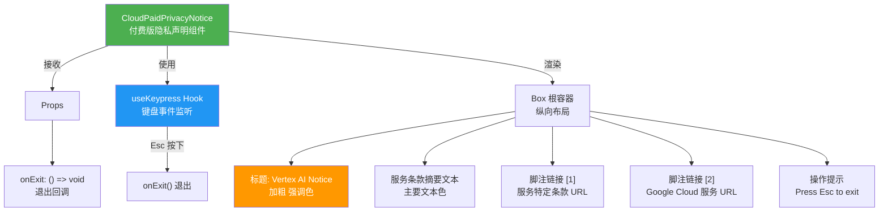
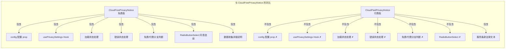
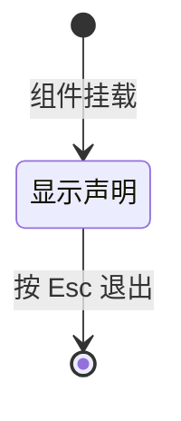

# CloudPaidPrivacyNotice.tsx

## 概述

`CloudPaidPrivacyNotice` 是 Gemini CLI 中用于展示**付费版（Vertex AI / Google Cloud Platform）用户隐私和服务条款声明**的 React 组件。与面向免费用户的 `CloudFreePrivacyNotice` 不同，此组件**不包含数据收集同意选择器**，因为付费用户的数据处理条款已在 Google Cloud Platform 服务协议中涵盖。

该组件结构简洁：仅展示 Vertex AI 服务特定条款的摘要文本、两个参考链接，以及 Esc 退出的操作提示。

**文件路径**: `packages/cli/src/ui/privacy/CloudPaidPrivacyNotice.tsx`

## 架构图（Mermaid）







## 核心组件

### 1. Props 接口

```typescript
interface CloudPaidPrivacyNoticeProps {
  onExit: () => void;  // 退出隐私声明界面的回调函数
}
```

相比 `CloudFreePrivacyNotice` 的 Props，此处**没有 `config` 参数**。因为付费版声明不需要查询隐私偏好设置、也不需要判断用户层级——调用方已确定用户是付费版。

### 2. 键盘事件处理 — useKeypress Hook

无条件监听 Esc 键（无额外守卫条件）：
- 按 Esc → 调用 `onExit()` → 返回 `true`（事件已消费）
- 其他按键 → 返回 `false`（事件未消费）
- `isActive: true` 表示监听器始终激活

与 `CloudFreePrivacyNotice` 不同，此处 Esc 没有任何前置条件限制，用户**随时**可以按 Esc 退出。

### 3. 渲染结构

组件只有一个渲染分支（无加载/错误/条件判断），结构为：

```
Vertex AI Notice                               （加粗，强调色）

Service Specific Terms[1] are incorporated      （主要文本色，包含法律条款摘要）
into the agreement under which Google has
agreed to provide Google Cloud Platform[2]
to Customer (the "Agreement")...

[1] https://cloud.google.com/terms/service-terms
[2] https://cloud.google.com/terms/services

Press Esc to exit.                             （次要文本色）
```

#### 3.1 标题区

- 文本: "Vertex AI Notice"
- 样式: `bold` + `theme.text.accent`（加粗强调色）

#### 3.2 法律条款摘要

一段完整的法律文本，说明：
- 服务特定条款（Service Specific Terms）被纳入 Google 同意提供 Google Cloud Platform 给客户的协议（"Agreement"）
- 如果协议授权在 Google Cloud 合作伙伴或经销商计划下转售或提供 Google Cloud Platform，则条款中对"客户"的引用改为"合作伙伴或经销商"，对"客户数据"的引用改为"合作伙伴数据"
- 未在服务特定条款中定义的大写术语具有协议中赋予的含义

文本中内嵌了两个引用标记：
- `[1]` — 使用 `theme.text.link` 颜色（链接色）
- `[2]` — 使用 `theme.status.success` 颜色（成功/绿色）

#### 3.3 脚注链接

| 标记 | 颜色 | URL |
|------|------|-----|
| `[1]` | `theme.text.link` | https://cloud.google.com/terms/service-terms |
| `[2]` | `theme.status.success` | https://cloud.google.com/terms/services |

#### 3.4 操作提示

"Press Esc to exit." — 使用 `theme.text.secondary` 次要文本颜色。

## 依赖关系

### 内部依赖

| 模块 | 路径 | 用途 |
|------|------|------|
| `theme` | `../semantic-colors.js` | 语义化颜色主题配置 |
| `useKeypress` | `../hooks/useKeypress.js` | 键盘事件监听 Hook |

### 外部依赖

| 模块 | 用途 |
|------|------|
| `ink` | 终端 UI 框架，提供 `Box`、`Newline`、`Text` 组件 |

## 关键实现细节

### 1. 极简设计——无状态管理

与 `CloudFreePrivacyNotice` 相比，此组件**没有**使用 `usePrivacySettings` Hook，**没有**加载状态、错误处理、用户层级判断等逻辑。整个组件是一个纯展示组件，唯一的交互就是按 Esc 退出。这种极简设计反映了付费用户隐私声明的本质差异——付费用户不需要做出数据收集同意选择。

### 2. 无 config 依赖

组件不需要 `Config` 对象，因为：
- 不需要查询用户的隐私偏好设置
- 不需要判断用户是否为免费版
- 不需要持久化任何用户选择

调用方在路由到此组件前已完成了用户类型的判断。

### 3. 脚注颜色不一致

值得注意的是，两个脚注引用标记使用了**不同的颜色**：
- `[1]` 使用 `theme.text.link`（链接色，通常为蓝色）
- `[2]` 使用 `theme.status.success`（成功色，通常为绿色）

这种颜色差异用于帮助用户在视觉上区分两个不同的引用来源，增强可读性。

### 4. marginBottom 而非 marginY

根容器使用 `marginBottom={1}` 而非 `CloudFreePrivacyNotice` 中的 `marginY={1}`。这意味着只在底部留白，顶部不留白。这可能是因为付费版声明在 UI 上下文中的位置与免费版不同，或者是为了更紧凑的布局。

### 5. 与 CloudFreePrivacyNotice 的关键差异总结

| 特性 | CloudFreePrivacyNotice | CloudPaidPrivacyNotice |
|------|----------------------|----------------------|
| Props | `config` + `onExit` | 仅 `onExit` |
| 状态管理 Hook | `usePrivacySettings` | 无 |
| 加载状态 | 有 | 无 |
| 错误处理 | 有 | 无 |
| 用户层级判断 | 有（免费/付费分支） | 无 |
| 数据收集同意 | RadioButtonSelect Yes/No | 无 |
| Esc 退出条件 | 仅在错误/非免费状态下 | 无条件可退出 |
| 标题 | "Gemini Code Assist for Individuals Privacy Notice" | "Vertex AI Notice" |
| 内容性质 | 数据收集与使用说明 | 服务条款法律文本 |
| 外部链接数 | 1 个（隐私政策） | 2 个（服务条款 + 服务列表） |
| 根容器间距 | `marginY={1}` | `marginBottom={1}` |
| 渲染分支数 | 4 个（加载/错误/付费/免费） | 1 个（直接渲染） |
