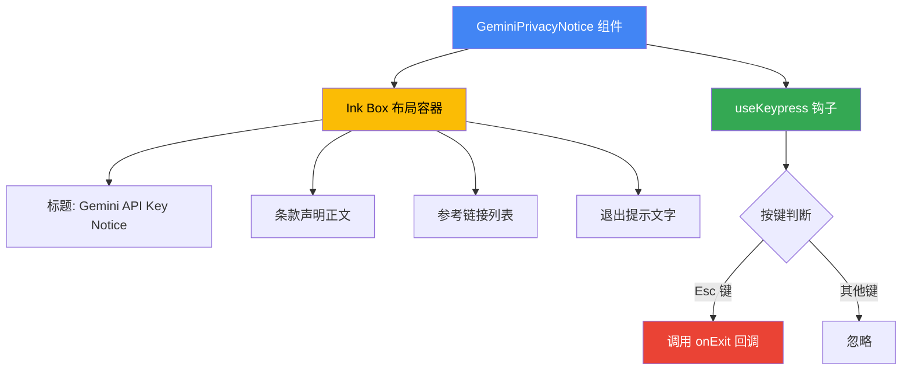

# GeminiPrivacyNotice.tsx

## 概述

`GeminiPrivacyNotice` 是一个 React (Ink) 组件，用于在终端界面中展示 **Gemini API 密钥隐私声明**。该组件向用户展示使用 Gemini API、Google AI Studio 及其他 Google 开发者服务时需要遵守的服务条款信息，并提供相关链接。用户可以通过按下 `Esc` 键退出该通知界面。

## 架构图（Mermaid）



## 核心组件

### 1. GeminiPrivacyNoticeProps 接口

```typescript
interface GeminiPrivacyNoticeProps {
  onExit: () => void;
}
```

| 属性 | 类型 | 说明 |
|------|------|------|
| `onExit` | `() => void` | 当用户按下 Esc 键时触发的回调函数，用于退出隐私声明界面 |

### 2. GeminiPrivacyNotice 函数组件

这是一个无状态的函数组件，接收 `onExit` 回调作为属性。

#### 功能分解

- **键盘监听**：通过 `useKeypress` 钩子监听键盘事件，当检测到 `Esc` 键时调用 `onExit()` 回调退出界面。
- **布局结构**：使用 Ink 的 `Box` 组件进行纵向布局（`flexDirection="column"`），底部留有一行间距（`marginBottom={1}`）。
- **内容展示**：
  - **标题**：加粗显示 "Gemini API Key Notice"，使用 `theme.text.accent` 强调色。
  - **条款正文**：说明使用 Gemini API 即表示同意 Google APIs 服务条款和 Gemini API 附加服务条款，各条款用带颜色编号的引用标记标注。
  - **参考链接**：以编号列表形式展示 4 个相关链接。
  - **退出提示**：以次要文字颜色（`theme.text.secondary`）显示 "Press Esc to exit."。

#### 引用链接列表

| 编号 | 颜色 | 链接 | 说明 |
|------|------|------|------|
| [1] | `theme.text.link` | https://ai.google.dev/docs/gemini_api_overview | Gemini API 概览 |
| [2] | `theme.status.error` | https://aistudio.google.com/ | Google AI Studio |
| [3] | `theme.status.success` | https://developers.google.com/terms | Google APIs 服务条款 |
| [4] | `theme.text.accent` | https://ai.google.dev/gemini-api/terms | Gemini API 附加服务条款 |

## 依赖关系

### 内部依赖

| 模块 | 路径 | 用途 |
|------|------|------|
| `theme` | `../semantic-colors.js` | 提供语义化的颜色主题配置，用于文本着色 |
| `useKeypress` | `../hooks/useKeypress.js` | 自定义钩子，用于监听终端键盘按键事件 |

### 外部依赖

| 包名 | 导入项 | 用途 |
|------|--------|------|
| `ink` | `Box`, `Newline`, `Text` | Ink 框架的基础 UI 组件，用于终端界面渲染 |

## 关键实现细节

1. **useKeypress 钩子的使用方式**：钩子接收一个回调函数和一个配置对象 `{ isActive: true }`。回调函数返回 `true` 表示按键事件已被处理（仅在 Esc 键时），返回 `false` 表示未处理（其他按键时）。

2. **HTML 实体编码**：组件中使用 `&quot;` 来渲染双引号字符（`"`），这是 JSX 中的标准做法，用于在文本中安全地展示引号。

3. **颜色编码系统**：每个引用编号使用不同的主题颜色进行区分，这样用户可以在终端中直观地将正文中的编号与底部的链接列表对应起来。

4. **组件导出方式**：使用具名导出（`export const`），而非默认导出，符合项目的模块导出约定。

5. **纯展示组件**：该组件不包含任何内部状态（`useState`），是一个纯展示型组件，唯一的交互是通过 `useKeypress` 监听 Esc 键退出。
